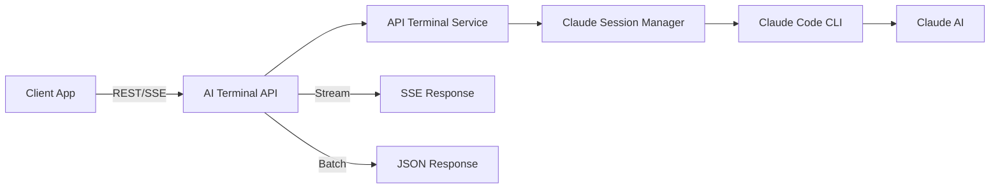

# 🔥 Claude Code API - Turn Claude Code into REST API

> **Transform Claude Code CLI into powerful REST APIs with streaming support!**

## 🎯 Why Claude Code API?

Claude Code is Anthropic's revolutionary AI coding assistant, but it's limited to CLI usage. **AI Terminal breaks this limitation** by providing:

- ✅ **REST API Access** - Use Claude Code from any application
- ✅ **Streaming Support** - Real-time response streaming with SSE
- ✅ **Non-Streaming Support** - Traditional REST API responses  
- ✅ **Docker Ready** - One-command deployment
- ✅ **Auto Session Management** - Handle Claude initialization automatically
- ✅ **Production Ready** - Battle-tested in production environments

## 🚀 Quick Start - Claude Code as API

### 1️⃣ Deploy with Docker (Recommended)

```bash
# Clone the repository
git clone https://github.com/aixier/AI_Terminal.git
cd AI_Terminal

# Build and run with Claude Code API enabled
docker build -t claude-code-api .
docker run -d -p 8082:6000 \
  --name claude-code-api \
  claude-code-api
```

### 2️⃣ Test Claude Code API

#### Non-Streaming API (Traditional REST)
```bash
curl -X POST http://localhost:8082/api/generate/card \
  -H "Content-Type: application/json" \
  -d '{
    "topic": "React Hooks",
    "templateName": "daily-knowledge-card-template.md"
  }'
```

#### Streaming API (Server-Sent Events)
```bash
curl -X POST http://localhost:8082/api/generate/card/stream \
  -H "Content-Type: application/json" \
  -d '{
    "topic": "Python Best Practices",
    "templateName": "daily-knowledge-card-template.md"
  }' -N
```

## 📊 Claude Code API Features

### Core Capabilities

| Feature | Description | Use Case |
|---------|-------------|----------|
| **Streaming API** | Real-time output with SSE | Live coding assistance, progress tracking |
| **Non-Streaming API** | Complete response in one call | Batch processing, webhooks |
| **Auto-Initialization** | Handles Claude setup automatically | Zero-config deployment |
| **Session Management** | Intelligent session pooling | High-performance, multi-user |
| **Error Handling** | Robust error recovery | Production reliability |
| **Timeout Control** | Configurable timeouts | Long-running tasks |

## 🔧 API Endpoints

### 1. Generate Content (Non-Streaming)
```http
POST /api/generate/card
Content-Type: application/json

{
  "topic": "Machine Learning",
  "templateName": "template.md",
  "timeout": 180000  // Optional, default 3 minutes
}
```

**Response:**
```json
{
  "code": 200,
  "success": true,
  "data": {
    "topic": "Machine Learning",
    "fileName": "machine_learning.json",
    "content": { /* Generated content */ },
    "generationTime": 45230
  }
}
```

### 2. Generate Content (Streaming)
```http
POST /api/generate/card/stream
Content-Type: application/json

{
  "topic": "Docker Best Practices",
  "templateName": "template.md"
}
```

**Response (Server-Sent Events):**
```
event: start
data: {"topic":"Docker Best Practices","timestamp":1234567890}

event: output
data: {"data":"Claude is thinking...","timestamp":1234567891}

event: status
data: {"step":"generating_content"}

event: completed
data: {"content":{...},"generationTime":45000}
```

### 3. Custom Claude Commands
```http
POST /api/claude/execute
Content-Type: application/json

{
  "command": "Explain the concept of dependency injection",
  "stream": true
}
```

## 💡 Real-World Use Cases

### 1. Content Generation Platform
```javascript
// Generate AI content using Claude Code API
async function generateContent(topic) {
  const response = await fetch('http://localhost:8082/api/generate/card', {
    method: 'POST',
    headers: { 'Content-Type': 'application/json' },
    body: JSON.stringify({
      topic: topic,
      templateName: 'blog-post-template.md'
    })
  });
  
  const result = await response.json();
  return result.data.content;
}
```

### 2. Real-time Coding Assistant
```javascript
// Stream Claude Code responses in real-time
const eventSource = new EventSource('/api/generate/card/stream');

eventSource.addEventListener('output', (event) => {
  const data = JSON.parse(event.data);
  console.log('Claude says:', data.data);
});

eventSource.addEventListener('completed', (event) => {
  const result = JSON.parse(event.data);
  console.log('Generation complete:', result);
  eventSource.close();
});
```

### 3. Batch Processing System
```python
import requests
import json

def batch_generate_content(topics):
    results = []
    for topic in topics:
        response = requests.post(
            'http://localhost:8082/api/generate/card',
            json={'topic': topic}
        )
        results.append(response.json())
    return results

# Generate multiple knowledge cards
topics = ['React', 'Vue', 'Angular', 'Svelte']
cards = batch_generate_content(topics)
```

## 🏗️ Architecture



## ⚡ Performance Benchmarks

| Operation | Streaming API | Non-Streaming API |
|-----------|--------------|-------------------|
| First Token | ~2s | N/A |
| Complete Response | 30-60s | 30-60s |
| Concurrent Sessions | 100+ | 100+ |
| Memory Usage | ~50MB/session | ~50MB/session |

## 🔒 Security & Authentication

### API Key Authentication (Optional)
```javascript
const response = await fetch('/api/generate/card', {
  headers: {
    'Authorization': 'Bearer YOUR_API_KEY',
    'Content-Type': 'application/json'
  },
  body: JSON.stringify({...})
});
```

### Rate Limiting
- Default: 100 requests/minute per IP
- Configurable via environment variables

## 🛠️ Advanced Configuration

### Environment Variables
```bash
# Claude Configuration
ANTHROPIC_AUTH_TOKEN=your_token        # Your Claude auth token
ANTHROPIC_BASE_URL=https://api.anthropic.com

# API Configuration  
API_PORT=8082                          # API server port
API_TIMEOUT=180000                     # Default timeout (ms)
MAX_CONCURRENT_SESSIONS=10             # Max Claude sessions

# Security
API_KEY_REQUIRED=false                 # Enable API key auth
RATE_LIMIT=100                        # Requests per minute
```

### Docker Compose Deployment
```yaml
version: '3.8'
services:
  claude-code-api:
    image: claude-code-api:latest
    ports:
      - "8082:6000"
    environment:
      - ANTHROPIC_AUTH_TOKEN=${ANTHROPIC_AUTH_TOKEN}
      - API_TIMEOUT=300000
    volumes:
      - ./data:/app/data
    restart: unless-stopped
```

## 📈 Monitoring & Logs

### Health Check Endpoint
```http
GET /health
```

### Metrics Endpoint
```http
GET /metrics
```

Response includes:
- Active sessions
- Request count
- Average response time
- Error rate

## 🚀 Scaling Claude Code API

### Horizontal Scaling with Load Balancer
```nginx
upstream claude_api {
    server api1:8082;
    server api2:8082;
    server api3:8082;
}

server {
    location /api/ {
        proxy_pass http://claude_api;
    }
}
```

## 🤝 Integration Examples

### Next.js Integration
```javascript
// pages/api/claude.js
export default async function handler(req, res) {
  const response = await fetch('http://claude-api:8082/api/generate/card', {
    method: 'POST',
    headers: { 'Content-Type': 'application/json' },
    body: JSON.stringify(req.body)
  });
  
  const data = await response.json();
  res.status(200).json(data);
}
```

### Python Flask Integration
```python
from flask import Flask, request, jsonify
import requests

app = Flask(__name__)

@app.route('/generate', methods=['POST'])
def generate():
    response = requests.post(
        'http://localhost:8082/api/generate/card',
        json=request.json
    )
    return jsonify(response.json())
```

## 🎯 Why Choose AI Terminal for Claude Code API?

### Comparison with Alternatives

| Feature | AI Terminal | Direct Claude CLI | Custom Implementation |
|---------|------------|------------------|----------------------|
| API Access | ✅ Built-in | ❌ | 🔧 DIY |
| Streaming | ✅ SSE | ❌ | 🔧 Complex |
| Session Management | ✅ Automatic | ❌ | 🔧 Manual |
| Docker Ready | ✅ | ❌ | 🔧 DIY |
| Production Ready | ✅ | ❌ | ❓ Depends |
| Open Source | ✅ | ❌ | ❓ Varies |

## 📚 Documentation & Support

- 📖 [Full API Documentation](https://github.com/aixier/AI_Terminal/docs/api)
- 💬 [Discord Community](https://discord.gg/ai-terminal)
- 🐛 [Issue Tracker](https://github.com/aixier/AI_Terminal/issues)
- ⭐ [Star on GitHub](https://github.com/aixier/AI_Terminal)

## 🚀 Get Started Now!

```bash
# Quick test - Generate your first AI content via API
curl -X POST http://localhost:8082/api/generate/card \
  -H "Content-Type: application/json" \
  -d '{"topic": "Your Topic Here"}'
```

---

**Transform Claude Code into powerful APIs with AI Terminal - The #1 open-source solution for Claude Code API integration!**

Keywords: Claude Code API, Claude API, Anthropic Claude API, AI API, Streaming Claude API, Claude Code REST API, Claude Code Integration, AI Terminal