# OpenCut 架构设计文档

## 系统架构概览

OpenCut采用模块化的架构设计，基于现代Web技术栈构建，实现了高性能的视频编辑功能。

## 核心架构原则

### 1. 分层架构
- **表现层**：React组件和UI交互
- **业务逻辑层**：编辑器核心逻辑和算法
- **数据层**：状态管理和数据持久化
- **服务层**：API接口和外部服务集成

### 2. 组件化设计
- 高内聚低耦合的组件设计
- 可复用的UI组件库
- 独立的功能模块

### 3. 状态管理
- 使用Zustand进行中心化状态管理
- 单向数据流
- 不可变数据更新

## 技术架构

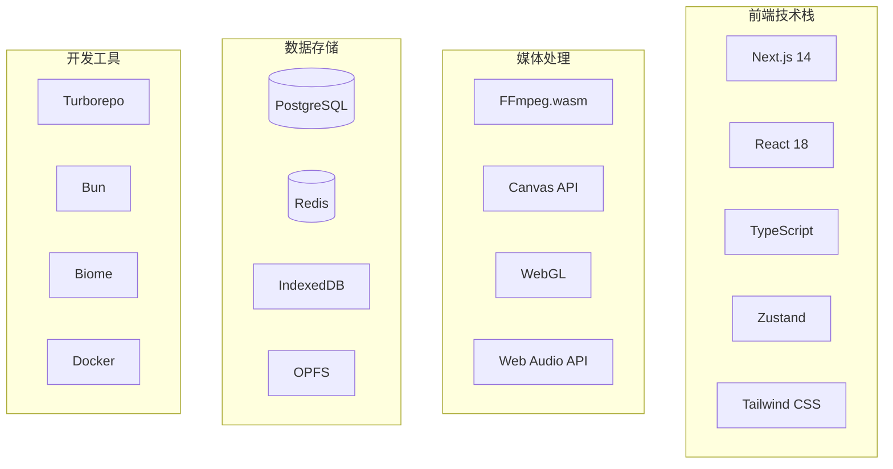

## 模块架构

### 编辑器核心模块

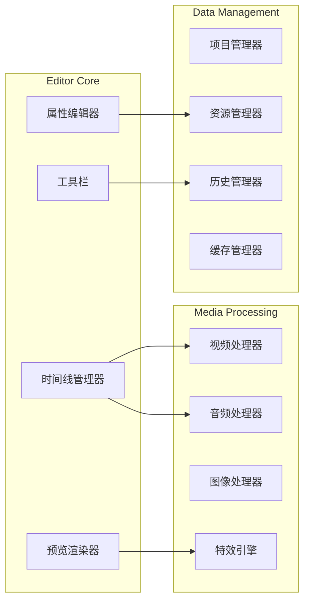

### 状态管理架构

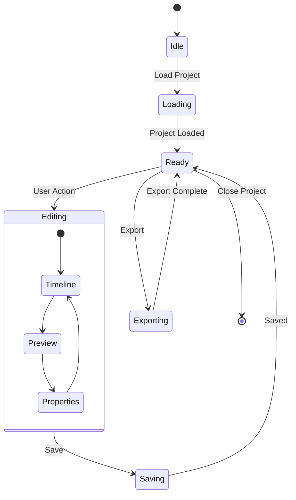

## 数据流设计

### 单向数据流

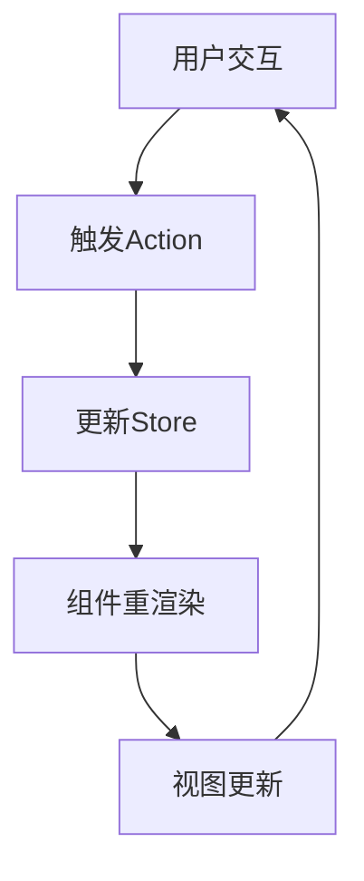

### 媒体处理流程

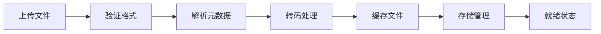

## 存储架构

### 多层存储策略

| 层级 | 存储介质 | 用途 | 特点 |
|------|---------|------|------|
| L1 | Memory | 活跃数据缓存 | 极快访问速度 |
| L2 | IndexedDB | 项目和元数据 | 快速本地存储 |
| L3 | OPFS | 大媒体文件 | 大容量文件系统 |
| L4 | PostgreSQL | 用户数据 | 持久化存储 |
| L5 | Cloud Storage | 备份和分享 | 远程存储 |

### 缓存策略

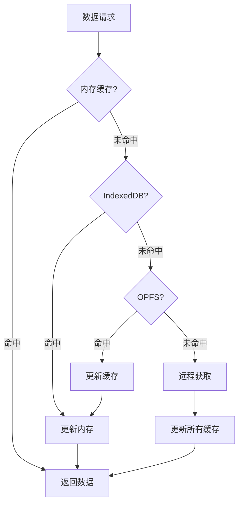

## 渲染架构

### 预览渲染管线

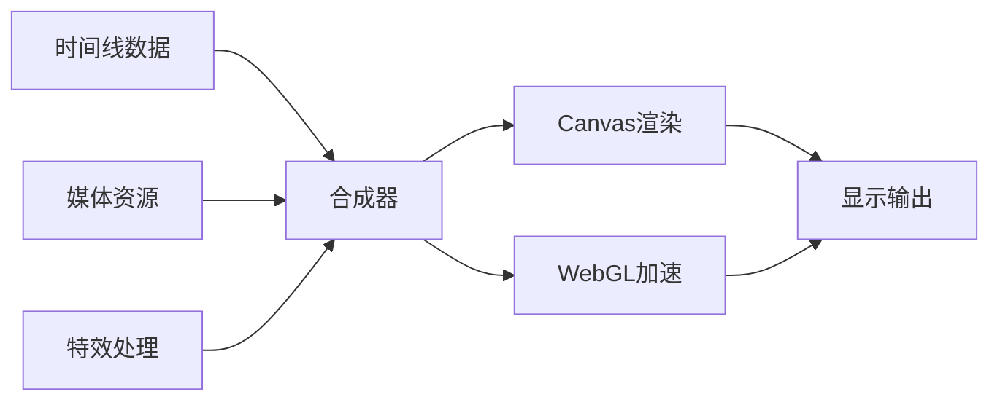

### 导出渲染管线

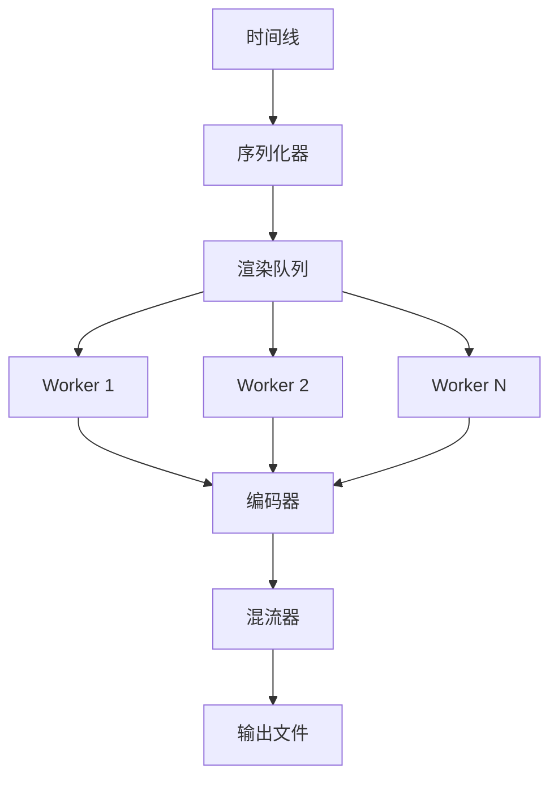

## 性能优化策略

### 1. 渲染优化
- 虚拟化长列表
- 懒加载组件
- 帧缓存机制
- WebGL加速

### 2. 内存管理
- 资源池复用
- 及时释放引用
- 分片加载大文件
- 内存泄漏检测

### 3. 网络优化
- 资源预加载
- 并行请求
- 请求去重
- 断点续传

### 4. 计算优化
- Web Workers并行计算
- WASM加速
- 算法优化
- 缓存计算结果

## 安全架构

### 数据安全
- 客户端加密
- 安全传输（HTTPS）
- 权限控制
- 数据隔离

### 隐私保护
- 本地处理优先
- 最小化数据收集
- 用户数据控制权
- 透明的隐私政策

## 扩展性设计

### 插件架构（规划中）

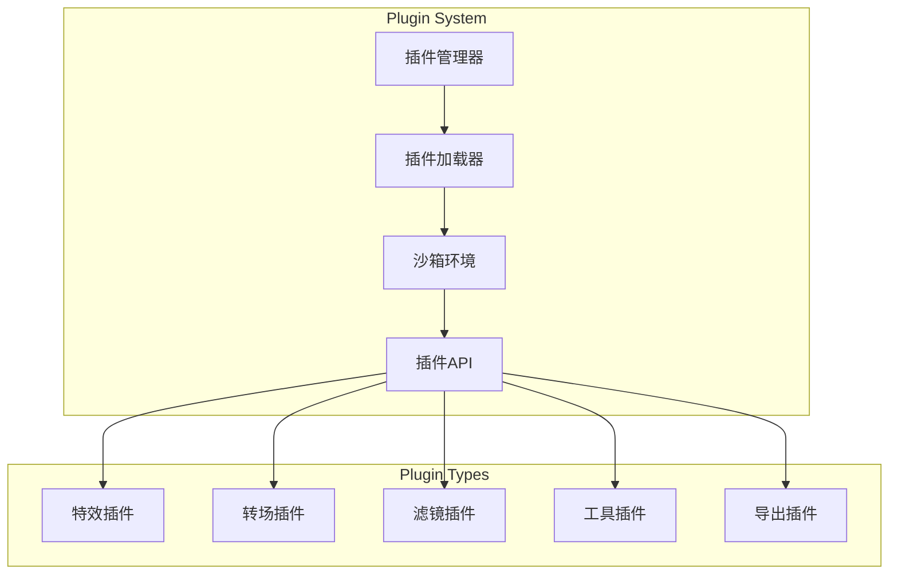

### 主题系统

```typescript
interface ThemeSystem {
  themes: Map<string, Theme>
  currentTheme: string
  
  registerTheme(theme: Theme): void
  setTheme(themeName: string): void
  getThemeVariable(variable: string): string
  
  // 动态主题
  generateTheme(baseColor: string): Theme
  applyCustomCSS(css: string): void
}
```

## 部署架构

### 生产环境部署

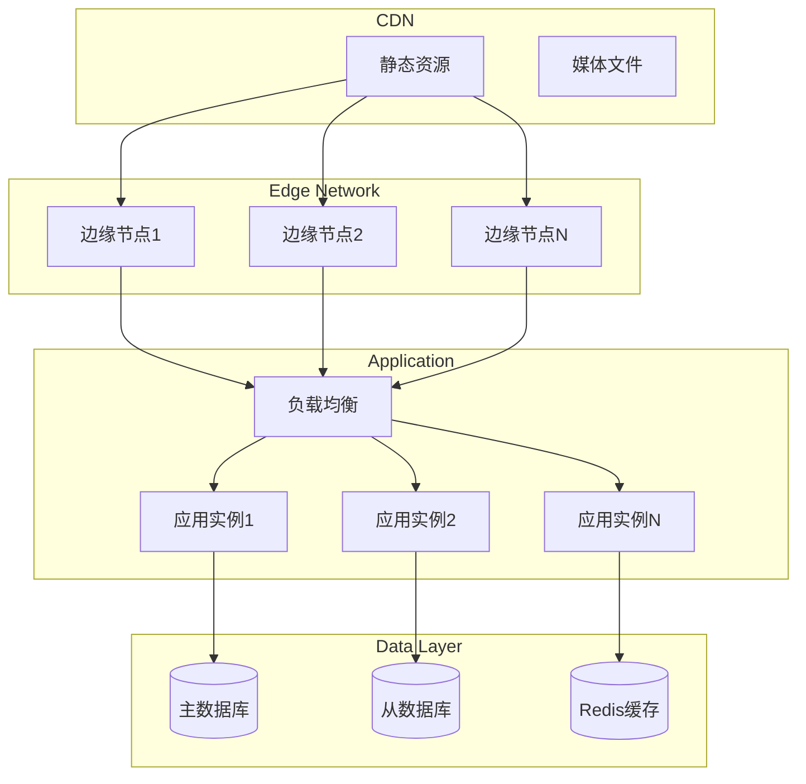

### 容器化部署

```yaml
# Docker Compose 架构
services:
  web:
    build: ./apps/web
    ports:
      - "3000:3000"
    environment:
      - NODE_ENV=production
    depends_on:
      - postgres
      - redis
  
  postgres:
    image: postgres:15
    volumes:
      - postgres_data:/var/lib/postgresql/data
    environment:
      - POSTGRES_DB=opencut
      - POSTGRES_USER=opencut
      - POSTGRES_PASSWORD=secret
  
  redis:
    image: redis:7-alpine
    volumes:
      - redis_data:/data
    command: redis-server --appendonly yes
  
  nginx:
    image: nginx:alpine
    ports:
      - "80:80"
      - "443:443"
    volumes:
      - ./nginx.conf:/etc/nginx/nginx.conf
    depends_on:
      - web
```

## 监控与日志

### 监控架构

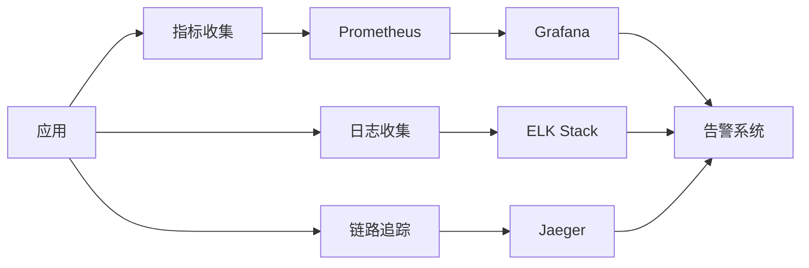

### 关键指标
- 应用性能指标（APM）
- 用户体验指标（Core Web Vitals）
- 业务指标（使用率、转化率）
- 系统指标（CPU、内存、磁盘）

## 开发工作流

### CI/CD管线

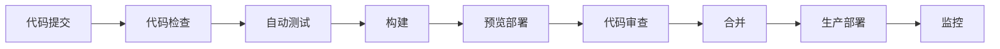

### 版本管理策略
- 语义化版本控制（SemVer）
- Git Flow分支模型
- 自动化发布流程
- 变更日志自动生成

## 未来规划

### 短期目标（3个月）
- [ ] 完成二进制渲染重构
- [ ] 实现插件系统基础架构
- [ ] 优化移动端体验
- [ ] 添加协作功能

### 中期目标（6个月）
- [ ] AI辅助编辑功能
- [ ] 云端渲染服务
- [ ] 高级特效库
- [ ] 桌面应用（Tauri）

### 长期愿景（1年）
- [ ] 完整的创作者生态
- [ ] 开放的插件市场
- [ ] 专业版功能
- [ ] 企业级解决方案

## 技术债务管理

### 当前技术债务
1. 预览渲染需要重构为二进制方式
2. 部分组件需要性能优化
3. 测试覆盖率需要提升
4. 文档需要持续完善

### 偿还策略
- 每个Sprint分配20%时间处理技术债务
- 定期的代码重构和优化
- 持续的文档更新
- 自动化测试完善

## 总结

OpenCut的架构设计遵循模块化、可扩展、高性能的原则，通过合理的分层和组件化设计，实现了复杂视频编辑功能的Web化。未来将继续优化架构，提供更好的用户体验和开发体验。