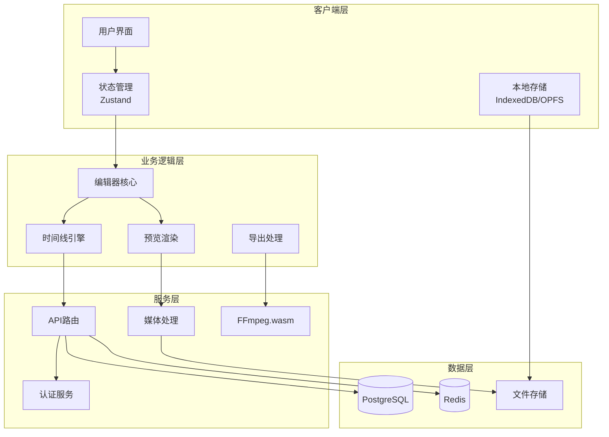
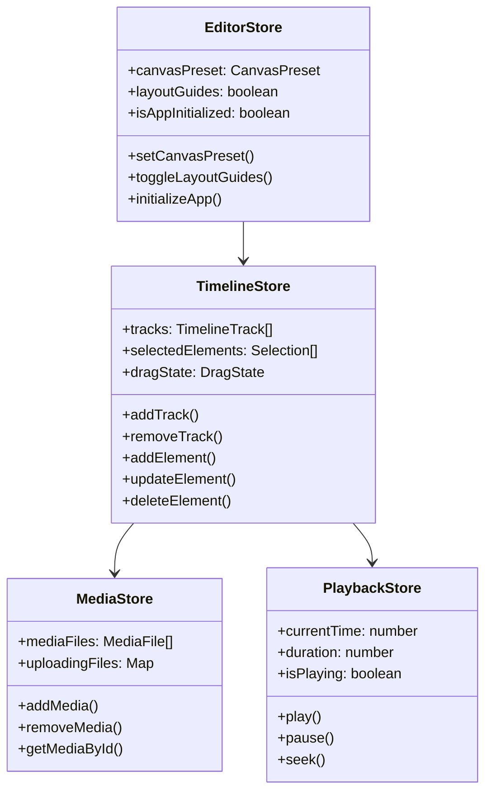
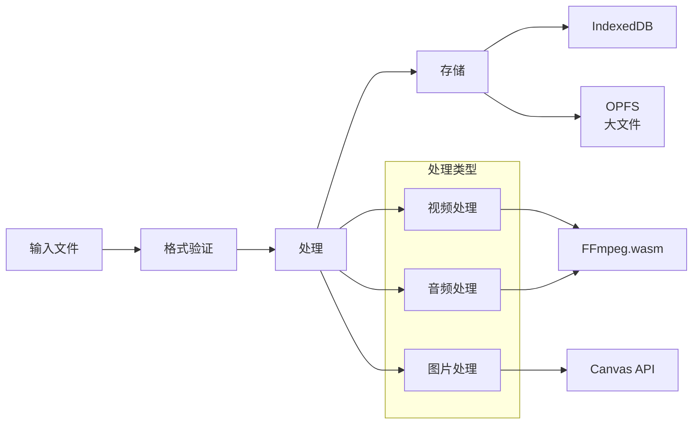
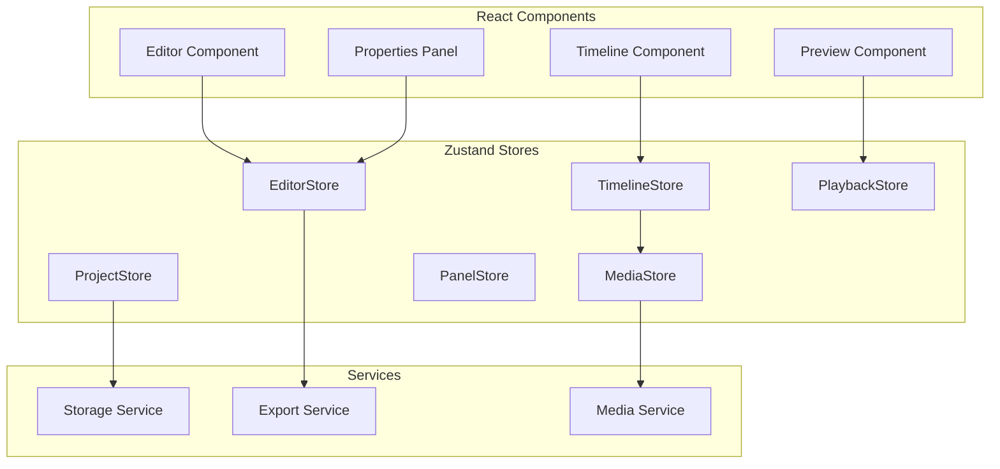
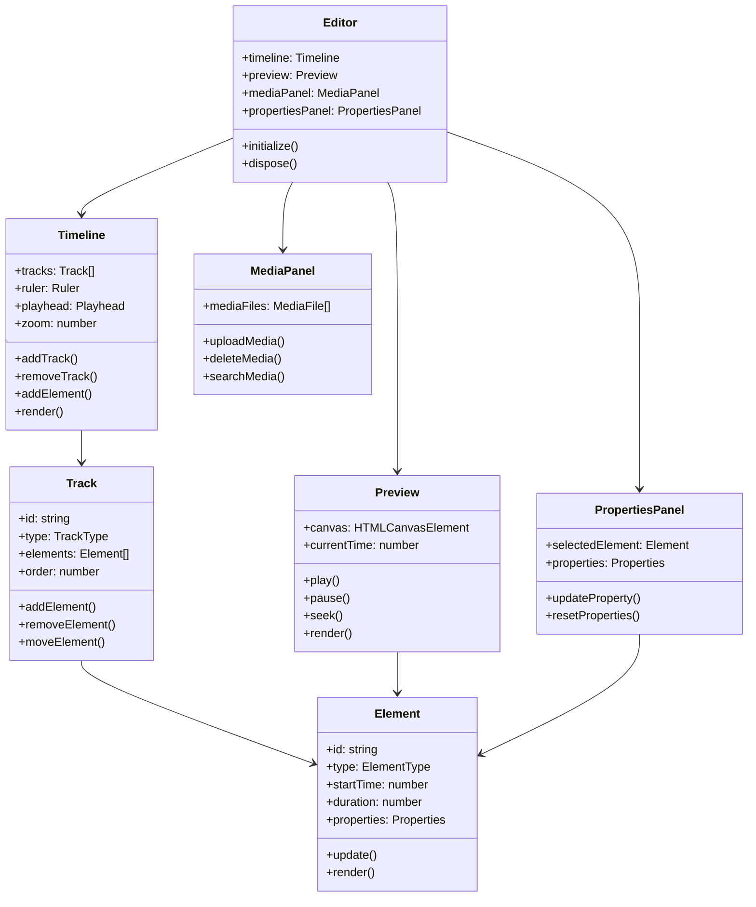
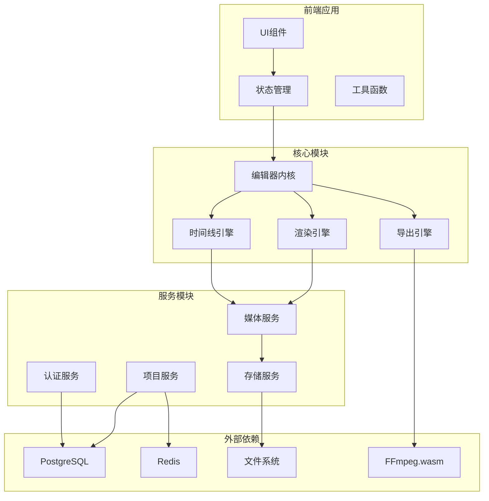
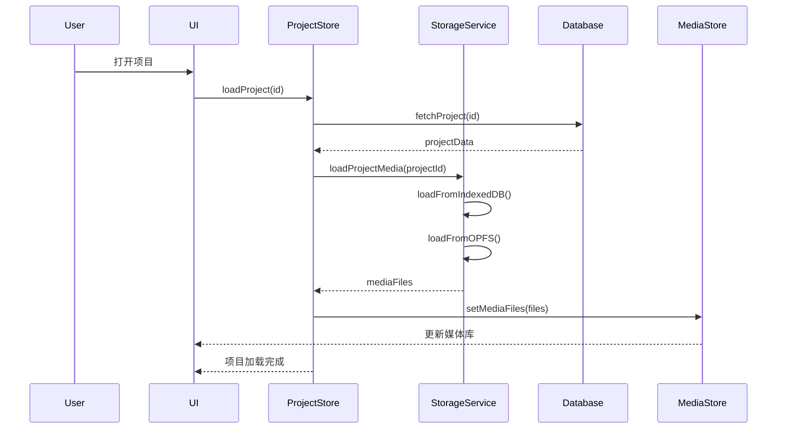
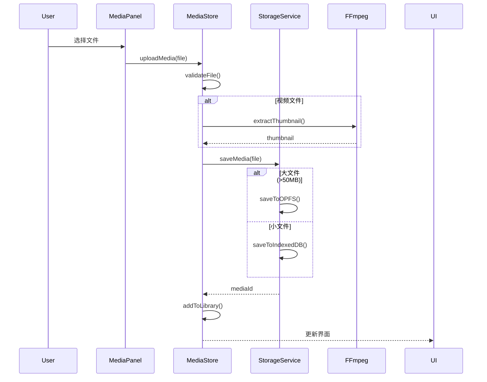
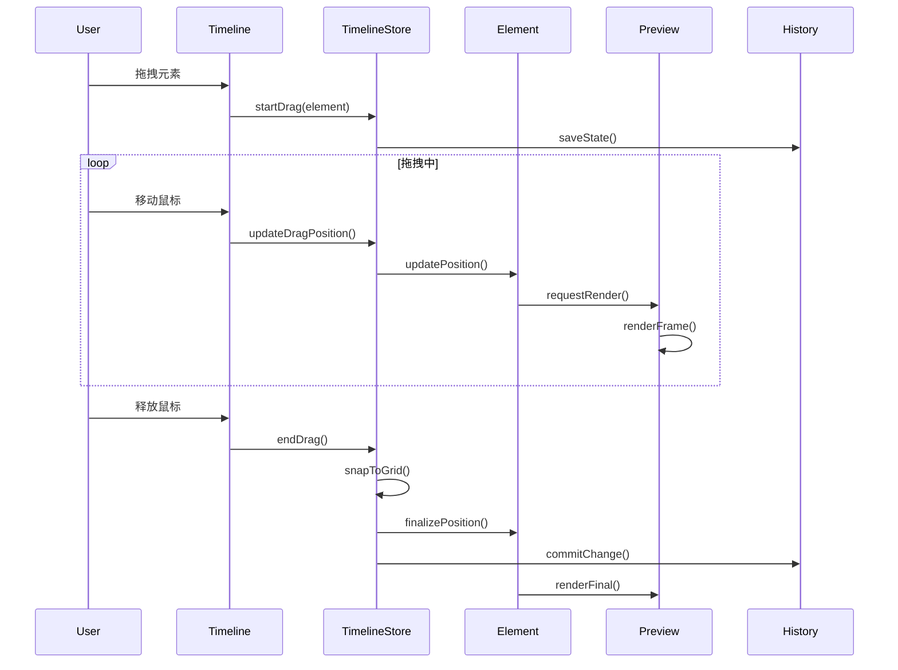
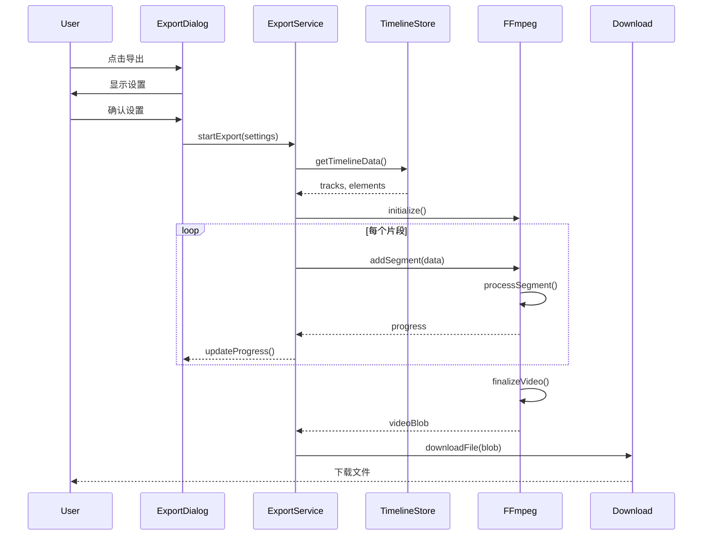

# OpenCut 二次开发指南

## 目录
- [项目概述](#项目概述)
- [系统架构](#系统架构)
- [核心模块分析](#核心模块分析)
- [数据流与状态管理](#数据流与状态管理)
- [UML架构图](#uml架构图)
- [时序图](#时序图)
- [开发指南](#开发指南)
- [扩展开发](#扩展开发)
- [API参考](#api参考)

## 项目概述

OpenCut是一个开源的Web视频编辑器，采用现代化的前端技术栈构建，支持多轨道时间线编辑、实时预览、无水印导出等功能。

### 技术栈
- **框架**: Next.js 14 (App Router)
- **语言**: TypeScript
- **状态管理**: Zustand
- **样式**: Tailwind CSS
- **数据库**: PostgreSQL + Drizzle ORM
- **认证**: Better Auth
- **缓存**: Redis (Upstash)
- **媒体处理**: FFmpeg.wasm
- **存储**: IndexedDB + OPFS
- **构建工具**: Turborepo + Bun

### 项目结构
```
OpenCut/
├── apps/
│   ├── web/                 # 主Web应用
│   │   ├── src/
│   │   │   ├── app/         # Next.js页面和API路由
│   │   │   ├── components/  # React组件
│   │   │   ├── stores/      # Zustand状态管理
│   │   │   ├── lib/         # 工具函数和服务
│   │   │   ├── hooks/       # 自定义React Hooks
│   │   │   └── types/       # TypeScript类型定义
│   │   └── public/          # 静态资源
│   └── transcription/       # 转录服务
├── packages/
│   ├── auth/               # 认证包
│   └── db/                 # 数据库包
└── docker-compose.yaml     # Docker服务配置
```

## 系统架构

### 整体架构图



### 分层架构

1. **表现层（Presentation Layer）**
   - React组件
   - 用户交互界面
   - 响应式设计

2. **状态管理层（State Management Layer）**
   - Zustand stores
   - 全局状态管理
   - 本地状态缓存

3. **业务逻辑层（Business Logic Layer）**
   - 编辑器核心逻辑
   - 时间线管理
   - 媒体处理

4. **服务层（Service Layer）**
   - API接口
   - 认证授权
   - 数据验证

5. **数据访问层（Data Access Layer）**
   - 数据库操作
   - 文件系统访问
   - 缓存管理

## 核心模块分析

### 1. 编辑器模块（Editor Module）



### 2. 时间线模块（Timeline Module）

#### 核心组件
- **TimelineCanvas**: 画布渲染器
- **TimelineTrack**: 轨道管理
- **TimelineElement**: 元素管理
- **TimelineRuler**: 时间标尺

#### 数据结构
```typescript
interface TimelineTrack {
  id: string
  type: 'main' | 'audio' | 'overlay' | 'text'
  name: string
  order: number
  elements: TimelineElement[]
  muted?: boolean
  locked?: boolean
}

interface TimelineElement {
  id: string
  type: 'video' | 'audio' | 'text' | 'image' | 'sticker'
  name: string
  startTime: number
  duration: number
  mediaFileId?: string
  properties: ElementProperties
}
```

### 3. 媒体处理模块（Media Processing Module）



### 4. 存储模块（Storage Module）

#### 双层存储架构
1. **IndexedDB**
   - 项目数据
   - 元数据
   - 小文件

2. **OPFS (Origin Private File System)**
   - 大媒体文件
   - 临时文件
   - 缓存数据

```typescript
class StorageService {
  async saveProject(project: Project): Promise<void>
  async loadProject(id: string): Promise<Project>
  async saveMedia(file: File): Promise<string>
  async getMedia(id: string): Promise<Blob>
  async deleteMedia(id: string): Promise<void>
}
```

## 数据流与状态管理

### 状态管理架构



### 数据流向

1. **用户操作** → **组件** → **Action** → **Store** → **UI更新**
2. **媒体上传** → **MediaStore** → **Storage** → **IndexedDB/OPFS**
3. **项目保存** → **ProjectStore** → **Storage** → **Database**
4. **导出** → **Timeline** → **FFmpeg** → **Download**

## UML架构图

### 类图：核心编辑器架构



### 组件图：系统模块关系



## 时序图

### 1. 项目加载时序



### 2. 媒体上传时序



### 3. 时间线编辑时序



### 4. 导出流程时序



## 开发指南

### 环境搭建

1. **克隆项目**
```bash
git clone https://github.com/opencut-app/opencut.git
cd opencut
```

2. **安装依赖**
```bash
bun install
```

3. **环境配置**
```bash
cd apps/web
cp .env.example .env.local
# 编辑 .env.local 配置必要的环境变量
```

4. **启动Docker服务**
```bash
docker-compose up -d
```

5. **运行开发服务器**
```bash
bun dev
```

### 核心开发流程

#### 1. 添加新的Store

```typescript
// src/stores/my-feature-store.ts
import { create } from "zustand";

interface MyFeatureStore {
  // 状态
  data: any[];
  loading: boolean;
  
  // Actions
  loadData: () => Promise<void>;
  updateData: (id: string, data: any) => void;
  clearData: () => void;
}

export const useMyFeatureStore = create<MyFeatureStore>((set, get) => ({
  data: [],
  loading: false,
  
  loadData: async () => {
    set({ loading: true });
    try {
      // 加载数据逻辑
      const data = await fetchData();
      set({ data, loading: false });
    } catch (error) {
      set({ loading: false });
    }
  },
  
  updateData: (id, newData) => {
    set(state => ({
      data: state.data.map(item => 
        item.id === id ? { ...item, ...newData } : item
      )
    }));
  },
  
  clearData: () => set({ data: [] })
}));
```

#### 2. 创建新组件

```tsx
// src/components/my-feature/index.tsx
"use client";

import { useMyFeatureStore } from "@/stores/my-feature-store";

export function MyFeature() {
  const { data, loading, loadData } = useMyFeatureStore();
  
  useEffect(() => {
    loadData();
  }, []);
  
  if (loading) return <div>Loading...</div>;
  
  return (
    <div className="my-feature">
      {data.map(item => (
        <div key={item.id}>{item.name}</div>
      ))}
    </div>
  );
}
```

#### 3. 添加时间线元素类型

```typescript
// 1. 定义新元素类型
// src/types/timeline.ts
export interface MyElement extends BaseTimelineElement {
  type: 'my-element';
  specificProperty: string;
}

// 2. 创建元素渲染器
// src/components/editor/timeline/renderers/my-element-renderer.tsx
export function MyElementRenderer({ element }: { element: MyElement }) {
  return (
    <div className="my-element">
      {/* 渲染逻辑 */}
    </div>
  );
}

// 3. 注册到时间线
// src/components/editor/timeline/element-factory.tsx
import { MyElementRenderer } from './renderers/my-element-renderer';

export function renderElement(element: TimelineElement) {
  switch (element.type) {
    case 'my-element':
      return <MyElementRenderer element={element} />;
    // ... 其他类型
  }
}
```

#### 4. 扩展媒体处理

```typescript
// src/lib/media-processing/my-processor.ts
export class MyMediaProcessor {
  async process(file: File): Promise<ProcessedMedia> {
    // 使用FFmpeg或其他工具处理媒体
    const ffmpeg = await loadFFmpeg();
    
    // 处理逻辑
    const result = await ffmpeg.run(
      '-i', file.name,
      // FFmpeg参数
      'output.mp4'
    );
    
    return {
      url: result.url,
      metadata: extractMetadata(result)
    };
  }
}
```

### 最佳实践

#### 1. 状态管理原则
- 使用Zustand进行全局状态管理
- 组件内部状态用useState
- 复杂异步逻辑使用React Query
- 避免过度嵌套的状态结构

#### 2. 性能优化
- 使用React.memo优化组件渲染
- 虚拟化长列表（react-window）
- 懒加载大型组件
- 使用Web Workers处理耗时操作

#### 3. 代码规范
- 遵循TypeScript严格模式
- 使用Biome进行代码格式化
- 组件采用函数式编程
- 避免使用any类型

#### 4. 测试策略
- 单元测试：核心逻辑函数
- 集成测试：Store交互
- E2E测试：用户流程
- 性能测试：渲染性能

## 扩展开发

### 插件系统架构（规划中）

```typescript
// 插件接口定义
interface Plugin {
  id: string;
  name: string;
  version: string;
  
  // 生命周期钩子
  onInstall?: () => void;
  onUninstall?: () => void;
  onActivate?: () => void;
  onDeactivate?: () => void;
  
  // 功能扩展
  effects?: Effect[];
  transitions?: Transition[];
  tools?: Tool[];
  panels?: Panel[];
}

// 插件管理器
class PluginManager {
  private plugins: Map<string, Plugin> = new Map();
  
  async installPlugin(plugin: Plugin) {
    this.plugins.set(plugin.id, plugin);
    await plugin.onInstall?.();
  }
  
  async uninstallPlugin(pluginId: string) {
    const plugin = this.plugins.get(pluginId);
    await plugin?.onUninstall?.();
    this.plugins.delete(pluginId);
  }
}
```

### 自定义效果开发

```typescript
// src/effects/custom-effect.ts
export class CustomEffect implements VideoEffect {
  name = "My Custom Effect";
  
  async apply(
    frame: VideoFrame,
    parameters: EffectParameters
  ): Promise<VideoFrame> {
    // 使用Canvas或WebGL处理帧
    const canvas = new OffscreenCanvas(frame.width, frame.height);
    const ctx = canvas.getContext('2d');
    
    // 应用效果
    ctx.filter = `brightness(${parameters.brightness})`;
    ctx.drawImage(frame, 0, 0);
    
    return canvas.transferToImageBitmap();
  }
}
```

### 自定义导出格式

```typescript
// src/exporters/custom-exporter.ts
export class CustomExporter implements Exporter {
  async export(
    timeline: Timeline,
    settings: ExportSettings
  ): Promise<Blob> {
    // 自定义导出逻辑
    const frames = await this.renderFrames(timeline);
    const encoded = await this.encode(frames, settings);
    return new Blob([encoded], { type: 'video/custom' });
  }
}
```

## API参考

### Store API

#### TimelineStore
```typescript
interface TimelineStore {
  // 状态
  tracks: TimelineTrack[];
  selectedElements: Selection[];
  
  // 轨道操作
  addTrack(type: TrackType): string;
  removeTrack(trackId: string): void;
  moveTrack(trackId: string, newOrder: number): void;
  
  // 元素操作
  addElement(trackId: string, element: TimelineElement): void;
  updateElement(trackId: string, elementId: string, updates: Partial<TimelineElement>): void;
  deleteElement(trackId: string, elementId: string): void;
  
  // 选择操作
  selectElement(trackId: string, elementId: string): void;
  clearSelection(): void;
  
  // 历史操作
  undo(): void;
  redo(): void;
  canUndo(): boolean;
  canRedo(): boolean;
}
```

#### MediaStore
```typescript
interface MediaStore {
  // 状态
  mediaFiles: MediaFile[];
  uploadProgress: Map<string, number>;
  
  // 媒体操作
  uploadMedia(file: File): Promise<string>;
  deleteMedia(mediaId: string): Promise<void>;
  getMediaUrl(mediaId: string): string;
  
  // 查询
  getMediaById(id: string): MediaFile | undefined;
  getMediaByType(type: MediaType): MediaFile[];
  searchMedia(query: string): MediaFile[];
}
```

#### ProjectStore
```typescript
interface ProjectStore {
  // 状态
  currentProject: Project | null;
  projects: Project[];
  isSaving: boolean;
  
  // 项目操作
  createProject(name: string): Promise<Project>;
  loadProject(id: string): Promise<void>;
  saveProject(): Promise<void>;
  deleteProject(id: string): Promise<void>;
  
  // 导出
  exportProject(settings: ExportSettings): Promise<Blob>;
  
  // 自动保存
  enableAutoSave(interval: number): void;
  disableAutoSave(): void;
}
```

### 服务API

#### StorageService
```typescript
class StorageService {
  // 项目存储
  saveProject(project: Project): Promise<void>;
  loadProject(id: string): Promise<Project>;
  deleteProject(id: string): Promise<void>;
  listProjects(): Promise<Project[]>;
  
  // 媒体存储
  saveMedia(file: File, metadata?: MediaMetadata): Promise<string>;
  loadMedia(id: string): Promise<Blob>;
  deleteMedia(id: string): Promise<void>;
  
  // 缓存管理
  clearCache(): Promise<void>;
  getCacheSize(): Promise<number>;
}
```

#### ExportService
```typescript
class ExportService {
  // 导出配置
  getAvailableFormats(): ExportFormat[];
  getDefaultSettings(): ExportSettings;
  
  // 导出操作
  export(timeline: Timeline, settings: ExportSettings): Promise<Blob>;
  
  // 进度监听
  onProgress(callback: (progress: number) => void): void;
  onComplete(callback: (result: Blob) => void): void;
  onError(callback: (error: Error) => void): void;
  
  // 控制
  cancel(): void;
  pause(): void;
  resume(): void;
}
```

### 工具函数API

#### 时间处理
```typescript
// src/lib/time.ts
function formatTime(seconds: number): string;
function parseTime(timeString: string): number;
function snapToGrid(time: number, gridSize: number): number;
function calculateDuration(startTime: number, endTime: number): number;
```

#### 媒体处理
```typescript
// src/lib/media-processing.ts
async function extractThumbnail(video: File): Promise<Blob>;
async function getVideoDuration(video: File): Promise<number>;
async function extractAudioTrack(video: File): Promise<Blob>;
async function generateWaveform(audio: Blob): Promise<number[]>;
```

#### 文件处理
```typescript
// src/lib/file-utils.ts
function validateFileType(file: File, allowedTypes: string[]): boolean;
function formatFileSize(bytes: number): string;
function generateFileId(file: File): string;
async function compressImage(image: File, quality: number): Promise<Blob>;
```

## 故障排查

### 常见问题

#### 1. 媒体文件无法加载
- 检查文件格式是否支持
- 验证CORS设置
- 确认存储空间充足
- 清除浏览器缓存

#### 2. 导出失败
- 检查FFmpeg是否正确加载
- 验证内存是否充足
- 确认浏览器支持SharedArrayBuffer
- 检查时间线是否有无效元素

#### 3. 性能问题
- 减少同时渲染的元素数量
- 使用较低的预览质量
- 清理未使用的媒体文件
- 使用Chrome DevTools分析性能

### 调试技巧

#### 1. 启用开发模式日志
```typescript
// src/lib/debug.ts
export const debug = {
  timeline: process.env.NODE_ENV === 'development',
  media: process.env.NODE_ENV === 'development',
  export: process.env.NODE_ENV === 'development'
};

// 使用
if (debug.timeline) {
  console.log('[Timeline]', data);
}
```

#### 2. Store调试
```typescript
// 在浏览器控制台
window.__STORES__ = {
  timeline: useTimelineStore,
  media: useMediaStore,
  project: useProjectStore
};

// 查看状态
window.__STORES__.timeline.getState()

// 监听变化
window.__STORES__.timeline.subscribe(console.log)
```

#### 3. 性能监控
```typescript
// src/lib/performance.ts
export function measurePerformance(name: string, fn: Function) {
  const start = performance.now();
  const result = fn();
  const end = performance.now();
  console.log(`[Performance] ${name}: ${end - start}ms`);
  return result;
}
```

## 贡献指南

### 提交规范
- feat: 新功能
- fix: 修复bug
- docs: 文档更新
- style: 代码格式
- refactor: 重构
- test: 测试
- chore: 构建/工具

### 分支策略
- main: 生产分支
- develop: 开发分支
- feature/*: 功能分支
- fix/*: 修复分支
- release/*: 发布分支

### Pull Request流程
1. Fork项目
2. 创建功能分支
3. 提交代码
4. 编写测试
5. 更新文档
6. 提交PR
7. 代码审查
8. 合并

## 资源链接

- [项目仓库](https://github.com/opencut-app/opencut)
- [在线演示](https://opencut.app)
- [API文档](https://docs.opencut.app)
- [社区论坛](https://community.opencut.app)
- [问题追踪](https://github.com/opencut-app/opencut/issues)

## 许可证

MIT License - 详见 [LICENSE](LICENSE) 文件