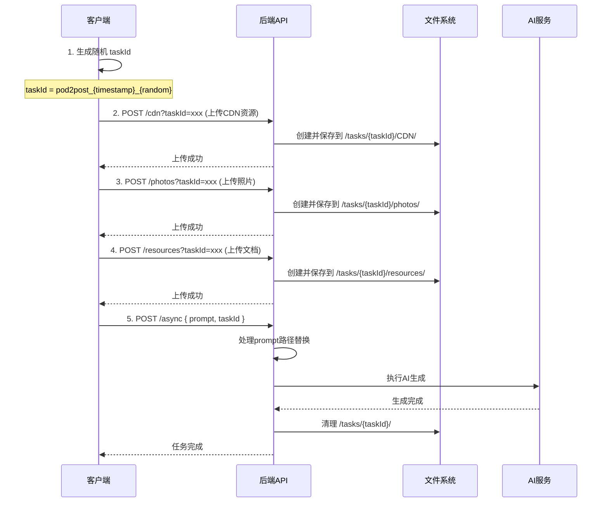

# Pod2Post 并发方案改造文档 V2

## 一、问题分析

### 当前问题
1. **资源冲突**：多个任务共享同一个模板目录（`/users/{username}/templates/pod2post/CDN|photos|resources/`），导致资源文件相互覆盖
2. **并发限制**：当前使用 `userTaskStatus` Map 限制每个用户只能同时执行一个任务
3. **路径引用错误**：提示词处理后，所有任务都指向相同的资源目录，导致引用错误的文件

### 影响范围
- 用户无法同时处理多个Pod2Post任务
- 资源文件可能被错误覆盖或引用
- 降低了系统的吞吐量和用户体验

## 二、解决方案设计

### 核心思路
采用**任务级资源隔离**方案，每个任务拥有独立的资源目录，通过**前端生成的 `taskId`** 关联资源上传和任务执行。

### 目录结构设计
```
/users/{username}/templates/pod2post/
├── CDN/                           # 保留：默认/公共模板资源
├── photos/                        # 保留：默认/公共模板资源  
├── resources/                     # 保留：默认/公共模板资源
├── *.md                          # 保留：模板文档
└── tasks/                         # 新增：任务级临时目录
    └── {taskId}/                  # 任务专属目录
        ├── CDN/                   # 该任务上传的CDN资源
        ├── photos/                # 该任务上传的照片
        └── resources/             # 该任务上传的文档
```

### 工作流程



## 三、API 接口变更

### 1. 修改：资源上传接口
```http
# CDN上传
POST /api/generate/pod2post/cdn?taskId={taskId}
Content-Type: multipart/form-data

# 照片上传
POST /api/generate/pod2post/pic?taskId={taskId}
Content-Type: multipart/form-data

# 文档上传
POST /api/generate/pod2post/resources?taskId={taskId}
Content-Type: multipart/form-data
```

**变更说明：**
- 新增可选参数 `taskId`
- 有 `taskId` 时：保存到 `/tasks/{taskId}/对应目录/`，目录不存在时自动创建
- 无 `taskId` 时：保存到默认目录（保持向后兼容）

### 2. 修改：异步生成接口
```http
POST /api/generate/pod2post/async
Content-Type: application/json

{
  "prompt": "...",
  "taskId": "pod2post_1234567890_abc123",  // 新增：可选参数
  "token": "user-token"                     // 保留：用户token
}
```

**变更说明：**
- 新增可选参数 `taskId`
- 有 `taskId` 时：使用任务专属资源目录
- 无 `taskId` 时：生成新的taskId并使用默认资源目录

## 四、代码改动清单

### 需要新增的文件
1. `/terminal-backend/src/utils/taskManager.js` - 任务管理工具类

### 需要修改的文件

#### 1. `/terminal-backend/src/routes/generate/pod2postCdn.js`
```javascript
// 修改点：
// 1. 解析 query 参数中的 taskId
// 2. 根据 taskId 决定保存路径
// 3. 自动创建任务目录

const taskId = req.query.taskId
let savePath
if (taskId && taskId.startsWith('pod2post_')) {
  // 创建任务目录（如果不存在）
  savePath = path.join(templatePath, 'tasks', taskId, 'CDN')
  await fs.mkdir(savePath, { recursive: true })
} else {
  // 默认路径
  savePath = path.join(templatePath, 'CDN')
}
```

#### 2. `/terminal-backend/src/routes/generate/pod2postPic.js`
```javascript
// 同上，修改保存路径逻辑
const taskId = req.query.taskId
let savePath
if (taskId && taskId.startsWith('pod2post_')) {
  savePath = path.join(templatePath, 'tasks', taskId, 'photos')
  await fs.mkdir(savePath, { recursive: true })
} else {
  savePath = path.join(templatePath, 'photos')
}
```

#### 3. `/terminal-backend/src/routes/generate/pod2postResources.js`
```javascript
// 同上，修改保存路径逻辑
const taskId = req.query.taskId
let savePath
if (taskId && taskId.startsWith('pod2post_')) {
  savePath = path.join(templatePath, 'tasks', taskId, 'resources')
  await fs.mkdir(savePath, { recursive: true })
} else {
  savePath = path.join(templatePath, 'resources')
}
```

#### 4. `/terminal-backend/src/routes/generate/pod2postAsync.js`
```javascript
// 修改点：
// 1. 接收客户端传入的 taskId
// 2. 移除单用户单任务限制
// 3. 修改资源清理逻辑

// 移除或修改 userTaskStatus 限制
const userTaskStatus = new Map() // 改为记录用户的所有活跃任务

// 处理传入的 taskId
const { prompt, taskId: clientTaskId, token } = req.body
let taskId = clientTaskId

// 如果客户端提供了taskId，验证格式
if (taskId) {
  if (!taskId.startsWith('pod2post_')) {
    return res.status(400).json({
      code: 400,
      message: 'Invalid taskId format'
    })
  }
  // 任务目录将在首次上传资源时自动创建
} else {
  // 生成新的 taskId
  taskId = `pod2post_${Date.now()}_${Math.random().toString(36).substring(2, 9)}`
}

// 修改用户任务跟踪（支持多任务）
if (!userTaskStatus.has(targetUser.username)) {
  userTaskStatus.set(targetUser.username, new Set())
}
userTaskStatus.get(targetUser.username).add(taskId)

// 任务完成后的清理
function cleanupTask(username, taskId) {
  // 清理任务跟踪
  const userTasks = userTaskStatus.get(username)
  if (userTasks) {
    userTasks.delete(taskId)
    if (userTasks.size === 0) {
      userTaskStatus.delete(username)
    }
  }
  
  // 清理任务资源目录
  const taskPath = path.join(templatePath, 'tasks', taskId)
  await fs.rm(taskPath, { recursive: true, force: true })
}
```

#### 5. `/terminal-backend/src/utils/promptProcessor.js`
```javascript
// 修改点：支持任务特定路径

async processPrompt(prompt, userTemplateDir, cardPath, taskId = null) {
  // ... 原有代码 ...
  
  // 处理 [CDN], [photos], [resources] 路径
  for (const match of bracketMatches) {
    const fileName = match.slice(1, -1)
    
    // 如果有 taskId，优先使用任务目录
    if (taskId && ['CDN', 'photos', 'resources'].includes(fileName)) {
      const taskPath = path.join(userTemplateDir, 'tasks', taskId, fileName)
      const taskDirExists = await fs.access(taskPath).then(() => true).catch(() => false)
      
      if (taskDirExists) {
        processed = processed.replace(match, taskPath)
        console.log(`[PromptProcessor] Replaced [${fileName}] -> ${taskPath} (task-specific)`)
        continue
      }
    }
    
    // 回退到默认逻辑
    const fullPath = await this.findPath(userTemplateDir, fileName)
    // ... 原有代码 ...
  }
}
```

## 五、任务管理机制

### 任务生命周期
1. **创建**：客户端生成 taskId（格式：`pod2post_{timestamp}_{random}`）
2. **准备**：客户端上传资源到任务目录（首次上传时自动创建目录）
3. **执行**：`/async` 接口执行任务，使用任务资源
4. **清理**：任务完成或失败后，清理任务目录

### 任务ID格式
```
pod2post_{timestamp}_{random}
示例：pod2post_1704096000000_abc123
```

### 任务ID生成规则（前端）
```javascript
// 前端生成 taskId 示例
function generateTaskId() {
  const timestamp = Date.now()
  const random = Math.random().toString(36).substring(2, 9)
  return `pod2post_${timestamp}_${random}`
}
```

### 任务过期机制
- 任务创建后 30 分钟未执行自动过期
- 定时任务清理过期的任务目录
- 执行完成的任务立即清理

## 六、兼容性保证

### 向后兼容
1. 所有上传接口的 `taskId` 参数为可选
2. 无 `taskId` 时使用原有逻辑和路径
3. 保留默认资源目录结构

### 迁移路径
1. 第一阶段：实现新接口，保持旧逻辑可用
2. 第二阶段：客户端逐步迁移到新流程
3. 第三阶段：完全切换到新流程

## 七、实施步骤

### Phase 1：基础设施（优先级：高）
1. 创建任务管理工具类
2. 修改上传接口支持 `taskId`（自动创建任务目录）

### Phase 2：核心逻辑（优先级：高）
1. 修改 `promptProcessor` 支持任务路径
2. 修改 `/async` 接口支持客户端传入的 `taskId`
3. 移除单任务限制

### Phase 3：清理机制（优先级：中）
1. 实现任务完成后的资源清理
2. 实现定时清理过期任务
3. 添加监控和日志

### Phase 4：优化（优先级：低）
1. 添加任务并发数量软限制
2. 添加资源使用量监控
3. 优化错误处理

## 八、测试计划

### 功能测试
1. 单任务流程测试
2. 多任务并发测试
3. 资源隔离验证
4. 向后兼容性测试

### 性能测试
1. 并发任务数量测试
2. 资源清理效率测试
3. 系统负载测试

### 异常测试
1. taskId 格式错误测试
2. 资源上传失败测试
3. 任务中断恢复测试

## 九、风险评估

### 风险点
1. **磁盘空间**：多任务可能占用更多磁盘空间
   - 缓解：及时清理，设置配额限制

2. **并发数量**：无限并发可能耗尽系统资源
   - 缓解：设置合理的并发上限（如每用户5个）

3. **任务泄露**：异常情况下任务目录可能未清理
   - 缓解：定时扫描清理，添加监控告警

## 十、监控指标

1. 活跃任务数量
2. 任务平均执行时间
3. 资源目录占用空间
4. 任务成功/失败率
5. 并发冲突次数

## 十一、配置参数

```javascript
// 建议的配置参数
const POD2POST_CONFIG = {
  MAX_CONCURRENT_TASKS_PER_USER: 5,      // 每用户最大并发任务数（软限制）
  TASK_EXPIRY_MINUTES: 30,               // 任务过期时间（分钟）
  CLEANUP_INTERVAL_MINUTES: 10,          // 清理任务执行间隔
  MAX_UPLOAD_SIZE_MB: 100,               // 最大上传文件大小
  TASK_DIRECTORY_QUOTA_MB: 500          // 任务目录配额
}
```

## 十二、前端改造指南

### 前端需要的改动

1. **生成 taskId**
```javascript
// 在开始任务前生成
const taskId = `pod2post_${Date.now()}_${Math.random().toString(36).substring(2, 9)}`
```

2. **上传资源时携带 taskId**
```javascript
// 上传CDN资源
const formData = new FormData()
formData.append('files', file)
await fetch(`/api/generate/pod2post/cdn?taskId=${taskId}`, {
  method: 'POST',
  body: formData
})

// 上传照片
await fetch(`/api/generate/pod2post/pic?taskId=${taskId}`, {
  method: 'POST',
  body: formData
})

// 上传文档
await fetch(`/api/generate/pod2post/resources?taskId=${taskId}`, {
  method: 'POST',
  body: formData
})
```

3. **提交任务时携带 taskId**
```javascript
await fetch('/api/generate/pod2post/async', {
  method: 'POST',
  headers: { 'Content-Type': 'application/json' },
  body: JSON.stringify({
    prompt: '...',
    taskId: taskId,
    token: userToken
  })
})
```

## 十三、总结

本方案通过任务级资源隔离彻底解决了Pod2Post服务的并发冲突问题，主要优势：

1. ✅ 支持真正的多任务并发
2. ✅ 资源完全隔离，无冲突
3. ✅ 向后兼容，平滑迁移
4. ✅ 自动清理，不占用空间
5. ✅ 前端生成taskId，简化后端逻辑

预期效果：
- 用户体验提升：可同时处理多个任务
- 系统吞吐量提升：充分利用系统资源
- 可靠性提升：避免资源冲突导致的错误