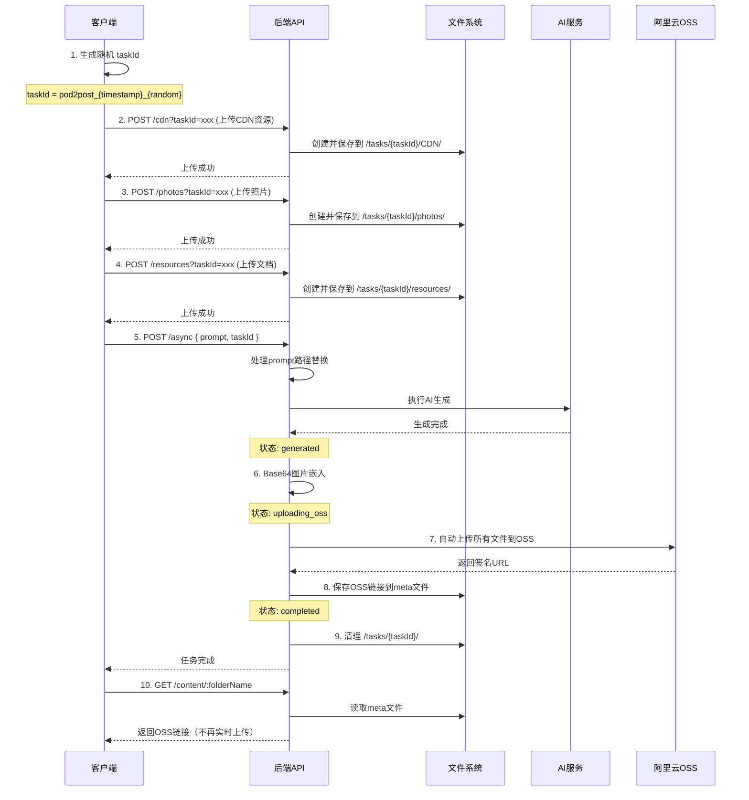

# Pod2Post 并发方案改造文档 V3 - 含OSS优化

## 一、问题分析

### 当前问题
1. **资源冲突**：多个任务共享同一个模板目录（`/users/{username}/templates/pod2post/CDN|photos|resources/`），导致资源文件相互覆盖
2. **并发限制**：当前使用 `userTaskStatus` Map 限制每个用户只能同时执行一个任务
3. **路径引用错误**：提示词处理后，所有任务都指向相同的资源目录，导致引用错误的文件
4. **重复OSS上传**：Content接口每次请求都实时上传，影响性能

### 影响范围
- 用户无法同时处理多个Pod2Post任务
- 资源文件可能被错误覆盖或引用
- 降低了系统的吞吐量和用户体验
- Content接口响应慢，重复上传浪费资源

## 二、解决方案设计

### 核心思路
1. 采用**任务级资源隔离**方案，每个任务拥有独立的资源目录
2. 通过**前端生成的 `taskId`** 关联资源上传和任务执行
3. **OSS自动上传**：生成完成后自动上传，链接保存到meta
4. **Content接口优化**：直接返回meta中的OSS链接

### 目录结构设计
```
/users/{username}/templates/pod2post/
├── CDN/                           # 保留：默认/公共模板资源
├── photos/                        # 保留：默认/公共模板资源  
├── resources/                     # 保留：默认/公共模板资源
├── *.md                          # 保留：模板文档
└── tasks/                         # 新增：任务级临时目录
    └── {taskId}/                  # 任务专属目录
        ├── CDN/                   # 该任务上传的CDN资源
        ├── photos/                # 该任务上传的照片
        └── resources/             # 该任务上传的文档
```

### 工作流程（含OSS优化）



## 三、OSS自动上传优化 🆕

### 新增状态流程
```
submitted → processing → generated → uploading_oss → completed
```

### OSS上传机制
1. **Base64转换完成后**：自动触发OSS上传
2. **上传所有文件**：HTML、JSON、meta文件统一上传
3. **生成签名URL**：1年有效期，支持大文件访问
4. **保存到meta**：OSS链接存储在SessionMetadata中
5. **状态管理**：只有OSS上传成功才标记为`completed`

### 新增阶段权重
- Prompt处理：10%
- AI生成：50% 
- Base64嵌入：25%
- **OSS上传：15%** 🆕

### Content接口优化
- **优先使用meta中的OSS链接**：避免重复上传，性能更好
- **不再实时上传**：移除Content接口的OSS上传逻辑
- **向后兼容**：如果meta中没有OSS链接，记录警告但不报错
- **预览支持**：大文件提供前50KB预览

### 新增文件
- `/utils/ossUploader.js` - OSS自动上传工具类

### SessionMetadata增强
```javascript
// 新增方法
setOSSResults(ossResults)     // 保存OSS上传结果
getOSSUrls()                   // 获取OSS链接
hasOSSUrls()                   // 检查是否有OSS链接

// 元数据结构
{
  custom: {
    ossUpload: {
      success: true,
      uploadedAt: "2025-01-10T...",
      urls: {
        originalHtml: "https://oss...",
        withBase64: "https://oss...",
        metadata: "https://oss..."
      },
      fileSizes: {
        originalHtml: 24590,
        withBase64: 23768530,
        metadata: 8219
      }
    }
  }
}
```

## 四、API 接口变更

### 1. 修改：资源上传接口
```http
# CDN上传
POST /api/generate/pod2post/cdn?taskId={taskId}
Content-Type: multipart/form-data

# 照片上传
POST /api/generate/pod2post/pic?taskId={taskId}
Content-Type: multipart/form-data

# 文档上传
POST /api/generate/pod2post/resources?taskId={taskId}
Content-Type: multipart/form-data
```

**变更说明：**
- 新增可选参数 `taskId`
- 有 `taskId` 时：保存到 `/tasks/{taskId}/对应目录/`
- 无 `taskId` 时：保存到默认目录（保持向后兼容）

### 2. 修改：异步生成接口
```http
POST /api/generate/pod2post/async
Content-Type: application/json

{
  "prompt": "...",
  "taskId": "pod2post_1234567890_abc123",  // 新增：可选参数
  "token": "user-token"                     // 保留：用户token
}
```

**变更说明：**
- 新增可选参数 `taskId`
- 有 `taskId` 时：使用任务专属资源目录
- 无 `taskId` 时：生成新的taskId并使用默认资源目录
- **生成完成后自动上传OSS** 🆕

### 3. 优化：内容获取接口
```http
GET /api/generate/pod2post/content/{folderName}?token={token}
```

**响应示例（使用meta中的OSS链接）：**
```json
{
  "code": 200,
  "success": true,
  "data": {
    "folderName": "pod2post_1757490170135_r9wjzw3",
    "content": {
      "originalHtmlOssUrl": "https://cms-mcp.oss-cn-hangzhou.aliyuncs.com/...",
      "base64HtmlOssUrl": "https://cms-mcp.oss-cn-hangzhou.aliyuncs.com/...",
      "base64HtmlSize": 23768530,
      "base64HtmlPreview": "<!DOCTYPE html>..."
    }
  }
}
```

**优化说明：**
- **不再实时上传OSS** 🆕
- 直接从meta文件读取预存的OSS链接
- 性能提升，避免重复上传

### 4. 增强：状态查询接口
```http
GET /api/generate/pod2post/status/{taskId}?token={token}
```

**响应示例（新增OSS阶段）：**
```json
{
  "success": true,
  "data": {
    "taskId": "pod2post_1757490170135_r9wjzw3",
    "status": "completed",
    "progress": 100,
    "phases": {
      "promptProcessing": "completed",
      "firstGeneration": "completed",
      "base64Embedding": "completed",
      "ossUpload": "completed"  // 🆕 新增OSS上传阶段
    }
  }
}
```

## 五、代码改动清单

### Phase 1：OSS自动上传（已完成）
- ✅ 创建 `/utils/ossUploader.js` 工具类
- ✅ 修改 `SessionMetadata` 支持OSS链接存储
- ✅ 修改 `pod2postAsync.js` 增加OSS上传阶段
- ✅ 修改 `pod2postStatus.js` 支持OSS状态显示

### Phase 2：Content接口优化（已完成）
- ✅ 修改 `pod2postContent.js` 移除实时上传
- ✅ 优先从meta读取OSS链接
- ✅ 保持向后兼容

### Phase 3：资源隔离（已完成）
- ✅ 修改上传接口支持 `taskId`
- ✅ 修改 `promptProcessor` 支持任务路径
- ✅ 实现任务资源自动清理

## 六、任务生命周期

### 完整生命周期
1. **创建**：客户端生成 taskId（格式：`pod2post_{timestamp}_{random}`）
2. **准备**：客户端上传资源到任务目录
3. **执行**：AI生成内容
4. **Base64**：图片转换为Base64嵌入
5. **OSS上传**：自动上传所有文件到OSS 🆕
6. **完成**：保存OSS链接到meta
7. **清理**：删除任务临时资源
8. **查询**：Content接口直接返回OSS链接

### 状态转换
```
submitted
  ↓
processing (AI生成中)
  ↓
generated (生成完成)
  ↓
uploading_oss (OSS上传中) 🆕
  ↓
completed (全部完成)
```

## 七、性能优化效果

### 优化前
- Content接口每次请求都实时上传OSS
- 重复上传相同文件
- 响应时间：5-30秒（取决于文件大小）

### 优化后
- 生成时一次性上传OSS
- Content接口直接返回缓存的链接
- 响应时间：<500ms
- 节省带宽和OSS请求次数

## 八、监控指标

### 新增监控
1. OSS上传成功率
2. OSS上传耗时
3. Content接口响应时间
4. OSS链接命中率
5. 文件大小分布

### 告警规则
- OSS上传失败率 > 5%
- Content接口响应时间 > 1秒
- 单个文件 > 50MB

## 九、前端改造指南

### 前端需要的改动

1. **生成 taskId**
```javascript
function generateTaskId() {
  const timestamp = Date.now()
  const random = Math.random().toString(36).substring(2, 9)
  return `pod2post_${timestamp}_${random}`
}
```

2. **上传资源时携带 taskId**
```javascript
// 统一的taskId用于整个任务流程
const taskId = generateTaskId()

// 上传各类资源
await uploadCDN(files, taskId)
await uploadPhotos(images, taskId)
await uploadResources(docs, taskId)
```

3. **提交任务时携带 taskId**
```javascript
await fetch('/api/generate/pod2post/async', {
  method: 'POST',
  headers: { 'Content-Type': 'application/json' },
  body: JSON.stringify({
    prompt: '...',
    taskId: taskId,
    token: userToken
  })
})
```

4. **获取内容（自动使用OSS链接）**
```javascript
// 不需要改动，后端自动返回OSS链接
const response = await fetch(`/api/generate/pod2post/content/${folderName}?token=${token}`)
const data = await response.json()

// 直接使用OSS链接
if (data.content.base64HtmlOssUrl) {
  window.open(data.content.base64HtmlOssUrl)
}
```

## 十、部署注意事项

### 环境要求
- Node.js >= 16
- 阿里云OSS配置
- 足够的磁盘空间（临时文件）

### 配置参数
```javascript
const POD2POST_CONFIG = {
  MAX_CONCURRENT_TASKS_PER_USER: 5,      // 每用户最大并发任务数
  TASK_EXPIRY_MINUTES: 30,               // 任务过期时间
  OSS_UPLOAD_TIMEOUT: 300000,            // OSS上传超时（5分钟）
  OSS_URL_EXPIRE_DAYS: 365,              // OSS链接有效期（1年）
  MAX_FILE_SIZE_MB: 100                  // 最大文件大小
}
```

## 十一、总结

### 主要改进
1. ✅ **任务级资源隔离**：解决并发冲突
2. ✅ **OSS自动上传**：生成完成后自动上传
3. ✅ **Content接口优化**：不再实时上传，性能提升
4. ✅ **状态管理增强**：新增OSS上传阶段
5. ✅ **向后兼容**：所有改动都兼容旧版本

### 预期效果
- **用户体验**：支持多任务并发，响应更快
- **系统性能**：减少重复上传，节省资源
- **可靠性**：任务隔离，避免冲突
- **可维护性**：状态清晰，易于调试

### 版本历史
- V1：初版并发方案
- V2：增加任务级资源隔离
- **V3：增加OSS自动上传优化** 🆕

---

**文档版本**: V3.0  
**更新时间**: 2025-01-10  
**更新内容**: 增加OSS自动上传机制，优化Content接口性能