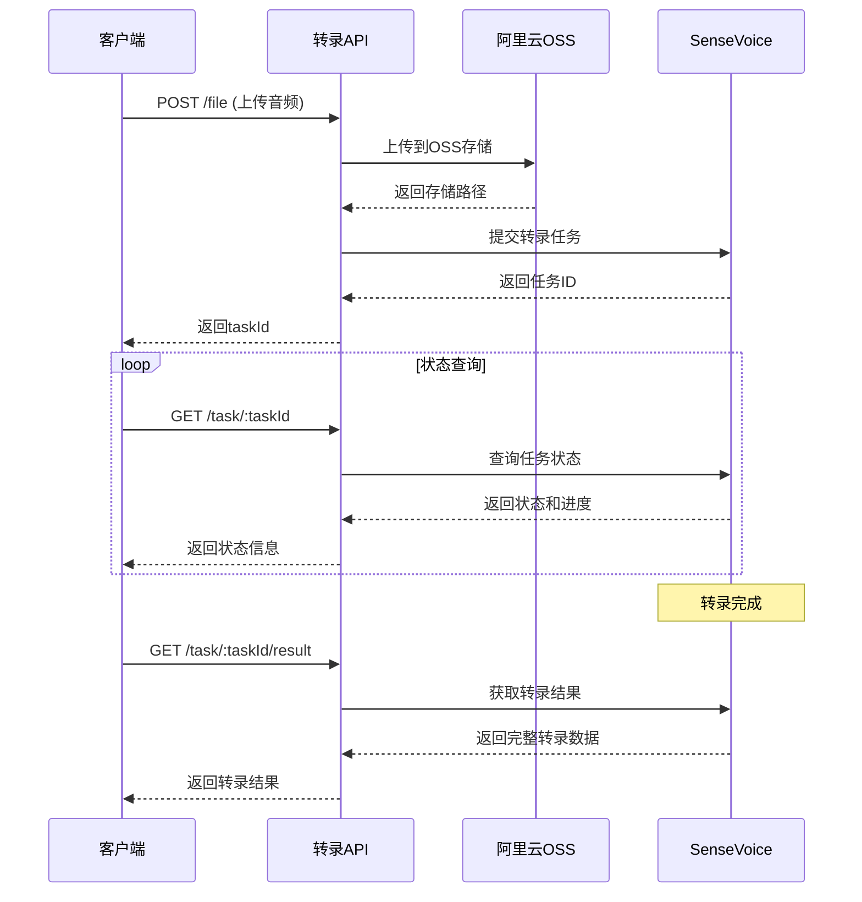

# Card Generation API Reference

> 统一的卡片生成 API 参考文档  
> 最后更新：2025-09-08 (v4.0.0)

## 概述

卡片生成 API 提供了通过 AI (Claude) 生成各种格式知识卡片的能力。支持多种模板、实时流式传输、自动参数生成、Pod2Post播客卡片生成、资源管理等高级功能。

## 端点列表

### 卡片生成服务
| 端点 | 方法 | 描述 | 响应格式 |
|-----|------|------|---------|
| `/api/generate/card` | POST | 标准卡片生成 | JSON |
| `/api/generate/card/stream` | POST | 流式卡片生成 | SSE |
| `/api/generate/card/async` | POST | 异步卡片生成 | JSON |
| `/api/generate/card/query/:folderName` | GET | 查询生成结果 | JSON |
| `/api/generate/card/content/:folderName` | GET | 获取卡片内容 | JSON |

### 自定义模板生成服务
| 端点 | 方法 | 描述 | 响应格式 |
|-----|------|------|---------|
| `/api/generate/custom/async` | POST | 自定义模板异步生成 | JSON |
| `/api/generate/custom/status/:taskId` | GET | 查询自定义任务状态 | JSON |
| `/api/generate/custom/ossasync` | POST | OSS自定义模板生成 | JSON |
| `/api/generate/custom/ossstatus/:taskId` | GET | OSS任务状态查询 | JSON |

### Pod2Post播客卡片服务
| 端点 | 方法 | 描述 | 响应格式 |
|-----|------|------|---------|
| `/api/generate/pod2post/async` | POST | Pod2Post播客卡片生成 | JSON |
| `/api/generate/pod2post/status/:taskId` | GET | Pod2Post任务状态查询 | JSON |
| `/api/generate/pod2post/cdn` | POST/GET/DELETE | CDN图片上传管理 | JSON |
| `/api/generate/pod2post/pic` | POST/GET/DELETE | 照片上传管理 | JSON |
| `/api/generate/pod2post/resources` | POST/GET/DELETE | 参考文档上传管理 | JSON |

### 通用服务
| 端点 | 方法 | 描述 | 响应格式 |
|-----|------|------|---------|
| `/api/generate/templates` | GET | 获取模板列表 | JSON |
| `/api/generate/status/:topic` | GET | 检查生成状态 | JSON |
| `/api/generate/cc` | POST | Claude执行 | JSON |
| `/api/generate/share/xiaohongshu` | POST | 分享到小红书 | JSON |
| `/api/generate/health` | GET | 健康检查 | JSON |

### 音频转录服务 `/api/transcription`
| 端点 | 方法 | 描述 | 响应格式 |
|-----|------|------|---------|
| `/file` | POST | **上传音频/视频文件并转录** | JSON |
| `/url` | POST | 从URL转录音频/视频 | JSON |
| `/batch` | POST | 批量转录多个文件 | JSON |
| `/task/:taskId` | GET | 查询任务状态 | JSON |
| `/task/:taskId/result` | GET | 获取转录结果 | JSON |
| `/tasks` | GET | 获取任务列表 | JSON |
| `/formats` | GET | 获取支持的格式 | JSON |
| `/task/:taskId` | DELETE | 删除任务 | JSON |
| `/task/:taskId/retry` | POST | 重试失败的任务 | JSON |
| `/statistics` | GET | 获取统计信息 | JSON |

## 1. 标准卡片生成

### 端点
```
POST /api/generate/card
```

### 请求体
```json
{
  "topic": "主题名称",
  "templateName": "模板名称",      // 可选，默认: daily-knowledge-card-template.md
  "style": "风格描述",            // 可选，用户自定义风格
  "language": "语言类型",         // 可选，如：中文、英文、中英双语
  "reference": "参考内容",        // 可选，额外的参考信息
  "token": "user_token_123"      // 可选，指定生成到特定用户目录
}
```

### 请求头（可选）
```http
Authorization: Bearer <token>  // 用于用户身份认证
```

### 支持的模板

| 模板名称 | 类型 | 输出格式 | 特殊参数 |
|---------|------|---------|---------|
| daily-knowledge-card-template.md | 单文件 | JSON | 无 |
| cardplanet-Sandra | 文件夹 | JSON | style, language, reference |
| cardplanet-Sandra-cover | 文件夹 | JSON | cover, style, language, reference |
| cardplanet-Sandra-json | 文件夹 | HTML + JSON | cover, style, language, reference |

### 响应格式

#### 基础响应结构
```json
{
  "code": 200,
  "success": true,
  "data": {
    "topic": "主题名称",
    "sanitizedTopic": "清理后的主题名",
    "templateName": "模板名称",
    "fileName": "生成的文件名",
    "filePath": "文件完整路径",
    "generationTime": 120000,  // 毫秒
    "content": {},  // 文件内容（HTML或解析后的JSON）
    "apiId": "会话ID"
  },
  "message": "卡片生成成功"
}
```

#### 特殊字段（v3.62.2+）

**pageinfo** (仅 cardplanet-Sandra-json 模板):
```json
{
  "pageinfo": {
    "title": "卡片集标题",
    "cards": [
      {
        "id": "card-1",
        "title": "卡片标题",
        "content": "卡片内容",
        "style": {}
      }
    ],
    "metadata": {
      "version": "1.0",
      "generatedAt": "2025-08-25"
    }
  }
}
```

**allFiles** (多文件模板):
```json
{
  "allFiles": [
    {
      "fileName": "topic_style.html",
      "path": "/full/path/to/file",
      "fileType": "html"
    },
    {
      "fileName": "topic_data.json",
      "path": "/full/path/to/file",
      "fileType": "json"
    }
  ]
}
```

### 参数生成机制

#### 自动参数生成
对于 cardplanet-Sandra 系列模板，系统会自动通过 AI 生成以下参数：

1. **style** - 根据主题类别自动选择合适的设计风格
2. **language** - 根据主题判断语言类型（中文/英文/中英双语）
3. **reference** - 自动检索主题相关内容（500字以内）
4. **cover** - (仅 cover/json 模板) 选择默认封面或小红书封面

#### 用户自定义参数（v3.63.0+）
用户可以在请求中直接传入以上参数，系统将：
- **优先使用**用户提供的参数
- **仅生成**未提供的参数
- **跳过AI调用**如果所有参数都已提供

示例：
```json
{
  "topic": "机器学习",
  "templateName": "cardplanet-Sandra-json",
  "style": "科技简约风",        // 用户指定，不会被AI覆盖
  "language": "中文"            // 用户指定，不会被AI覆盖
  // reference 未提供，将由AI自动生成
}
```

### 生成时间参考

- daily-knowledge-card-template: 100-120秒
- cardplanet-Sandra: 230-260秒
- cardplanet-Sandra-json: 240-280秒

### 错误响应
```json
{
  "code": 400,
  "success": false,
  "message": "主题(topic)参数不能为空"
}
```

## 2. 流式卡片生成

### 端点
```
POST /api/generate/card/stream
```

### 请求体
```json
{
  "topic": "主题名称",
  "templateName": "模板名称",      // 可选，默认: daily-knowledge-card-template.md
  "style": "风格描述",            // 可选，用户自定义风格
  "language": "语言类型",         // 可选，如：中文、英文、中英双语
  "reference": "参考内容",        // 可选，额外的参考信息
  "token": "user_token_123"      // 可选，指定生成到特定用户目录
}
```

### 响应格式
Server-Sent Events (SSE) 流

### 事件类型

| 事件 | 数据格式 | 描述 |
|------|---------|------|
| start | `{topic, templatePath, userCardPath}` | 开始生成 |
| status | `{step: string}` | 状态更新 |
| parameters | `{style, language, reference, cover?}` | 参数生成完成 |
| output | `{data: string, timestamp}` | 实时输出 |
| success | 与标准接口相同 | 生成成功 |
| error | `{message: string}` | 生成失败 |

### 客户端示例

```javascript
const eventSource = new EventSource('/api/generate/card/stream', {
  method: 'POST',
  headers: { 'Content-Type': 'application/json' },
  body: JSON.stringify({
    topic: '人工智能',
    templateName: 'cardplanet-Sandra-json'
  })
});

eventSource.addEventListener('parameters', (e) => {
  const params = JSON.parse(e.data);
  console.log('生成的参数:', params);
});

eventSource.addEventListener('success', (e) => {
  const result = JSON.parse(e.data);
  console.log('生成成功:', result);
  
  // 对于 cardplanet-Sandra-json，访问 pageinfo
  if (result.pageinfo) {
    console.log('JSON数据:', result.pageinfo);
  }
  
  eventSource.close();
});
```

## 3. 异步卡片生成（v3.63.0+）

### 端点
```
POST /api/generate/card/async
```

### 特点
- **立即返回**任务ID，不阻塞客户端
- **后台异步处理**，适合批量或长时间生成任务
- 支持所有与同步/流式接口相同的参数
- 默认模板：`cardplanet-Sandra-json`

### 请求体
```json
{
  "topic": "主题名称",
  "templateName": "模板名称",      // 可选，默认: cardplanet-Sandra-json
  "style": "风格描述",            // 可选，用户自定义风格
  "language": "语言类型",         // 可选，如：中文、英文、中英双语
  "reference": "参考内容",        // 可选，额外的参考信息
  "token": "user_token_123"      // 可选，指定生成到特定用户目录
}
```

### 响应格式
```json
{
  "code": 200,
  "success": true,
  "data": {
    "taskId": "task_1234567890_abc",
    "folderName": "sanitized_topic_name",
    "folderPath": "/path/to/user/folder",
    "topic": "原始主题",
    "templateName": "使用的模板",
    "status": "submitted",
    "submittedAt": "2025-08-27T10:00:00Z",
    "folderCreated": true,
    "folderExisted": false
  },
  "message": "任务已提交，正在后台生成"
}
```

### 查询生成结果

#### 方法1：使用通用查询接口
```bash
GET /api/generate/card/query/sanitized_topic_name
```

返回完整的文件内容和元数据。

#### 方法2：使用格式化查询接口
```bash
GET /api/generate/card/content/sanitized_topic_name
```

返回与生成接口格式一致的响应。

### 完整工作流示例

```javascript
// 1. 提交异步任务
const submitResponse = await fetch('/api/generate/card/async', {
  method: 'POST',
  headers: { 'Content-Type': 'application/json' },
  body: JSON.stringify({
    topic: '人工智能',
    templateName: 'cardplanet-Sandra-json',
    style: '科技风',
    language: '中文'
  })
});

const { data } = await submitResponse.json();
const { taskId, folderName } = data;

// 2. 轮询查询结果（建议间隔10秒）
const checkResult = async () => {
  const response = await fetch(`/api/generate/card/query/${folderName}`);
  const result = await response.json();
  
  if (result.code === 200) {
    console.log('生成成功！', result.data);
    // 处理生成的内容
    if (result.data.pageinfo) {
      console.log('JSON数据：', result.data.pageinfo);
    }
  } else if (result.code === 404) {
    console.log('还在生成中...');
    // 继续等待
    setTimeout(checkResult, 10000);
  }
};

// 开始检查
setTimeout(checkResult, 30000); // 30秒后开始检查
```

### 使用场景
- 批量生成多个卡片
- 不需要实时反馈的场景
- 避免前端长时间等待
- 与任务队列系统集成

## 4. 获取模板列表

### 端点
```
GET /api/generate/templates
```

### 响应示例
```json
{
  "code": 200,
  "success": true,
  "templates": [
    {
      "fileName": "daily-knowledge-card-template.md",
      "displayName": "daily knowledge card template",
      "type": "file"
    },
    {
      "fileName": "cardplanet-Sandra-json",
      "displayName": "cardplanet-Sandra-json",
      "type": "folder"
    }
  ]
}
```

## 5. 查询生成结果（通用查询）

### 端点
```
GET /api/generate/card/query/:folderName
```

### 用途
- 查询异步生成的结果
- 获取指定文件夹的所有生成文件
- 检查生成状态

### 路径参数
- `folderName` (string, 必需) - 文件夹名称（sanitized topic name）

### 查询参数
- `username` (string, 可选) - 指定用户名，默认使用认证用户

### 响应Schema（成功）
```json
{
  "code": 200,
  "success": true,
  "data": {
    "topic": "原始主题",
    "sanitizedTopic": "清理后的主题",
    "templateName": "cardplanet-Sandra-json",
    "fileName": "主文件名",
    "filePath": "/path/to/main/file",
    "content": "HTML内容或JSON对象",
    "fileType": "html",
    "allFiles": [
      {
        "fileName": "topic_style.html",
        "path": "/path/to/file",
        "content": "HTML内容",
        "fileType": "html"
      },
      {
        "fileName": "topic_data.json",
        "path": "/path/to/file",
        "content": {...},
        "fileType": "json"
      }
    ],
    "pageinfo": {...}  // JSON内容（仅cardplanet-Sandra-json模板）
  },
  "message": "查询成功"
}
```

### 响应Schema（文件不存在）
```json
{
  "code": 404,
  "success": false,
  "message": "文件尚未生成或不存在",
  "data": {
    "folderName": "folder_name",
    "folderPath": "/path/to/folder",
    "status": "not_found" | "no_files_generated" | "folder_not_found",
    "availableFiles": []  // 可选，显示文件夹中的文件列表
  }
}
```

### 使用示例
```bash
# 查询默认用户的生成结果
GET /api/generate/card/query/人工智能

# 查询指定用户的生成结果
GET /api/generate/card/query/人工智能?username=alice
```

## 6. 获取卡片内容（格式化查询）

### 端点
```
GET /api/generate/card/content/:folderName
```

### 特点
- 与 `/card/query` 类似，但使用特殊过滤规则
- 排除 response 文件、隐藏文件、元数据文件
- 响应格式与 `POST /api/generate/card` 完全一致
- 适合需要标准化格式的场景

### 路径参数
- `folderName` (string, 必需) - 文件夹名称

### 响应Schema（成功）
```json
{
  "code": 200,
  "success": true,
  "data": {
    "topic": "主题（文件夹名称）",
    "sanitizedTopic": "清理后的主题",
    "templateName": "推测的模板名称",
    "fileName": "主文件名（HTML优先）",
    "filePath": "主文件路径",
    "generationTime": null,  // 查询接口无法获取
    "content": "主文件内容",
    "apiId": null,  // 查询接口没有此信息
    "allFiles": [...],  // 可选，多文件时返回
    "pageinfo": {...}   // 可选，cardplanet-Sandra-json模板时返回JSON内容
  },
  "message": "卡片生成成功"  // 保持与生成接口一致
}
```

### 模板推测规则
| 文件类型 | 推测的模板 | 说明 |
|---------|-------------|------|
| HTML + JSON | cardplanet-Sandra-json | 双文件输出 |
| 仅JSON | daily-knowledge-card-template.md | 简单知识卡片 |
| 仅HTML | cardplanet-Sandra-cover | 带封面的卡片 |

### 与 `/card/query` 的区别
| 特性 | `/card/query` | `/card/content` |
|-----|--------------|----------------|
| 过滤规则 | 标准过滤 | 特殊过滤（更严格） |
| 响应格式 | 通用查询格式 | 与生成接口完全一致 |
| 用户参数 | 支持username查询参数 | 使用认证用户 |
| 适用场景 | 灵活查询 | 标准化输出 |

## 7. 检查生成状态

### 端点
```
GET /api/generate/status/:topic
```

### 响应示例
```json
{
  "code": 200,
  "success": true,
  "status": "completed",  // not_started | generating | completed
  "files": ["generated_file.json"],
  "message": "生成完成"
}
```

## 使用建议

1. **选择合适的接口**：
   - 需要实时反馈：使用流式接口
   - 简单集成：使用标准接口
   - 批量生成或后台处理：使用异步接口

2. **模板选择**：
   - 简单知识卡片：daily-knowledge-card-template
   - 精美设计卡片：cardplanet-Sandra
   - 双文件输出（预览+数据）：cardplanet-Sandra-json

3. **超时设置**：
   - 建议客户端超时设置为 8 分钟
   - 服务端默认超时为 7 分钟

4. **错误处理**：
   - 实现重试机制
   - 记录 apiId 用于调试

5. **用户身份管理**：
   - 使用 token 参数或 Authorization 头指定用户
   - 未指定时默认使用 default 用户
   - token 可以在请求体中或请求头中传递

6. **参数优化**：
   - 提供完整参数可减少AI调用，提高生成速度
   - style、language、reference 参数支持灵活组合

## 8. 自定义模板生成服务

### Pod2Post播客卡片生成

#### 端点
```
POST /api/generate/pod2post/async
```

#### 请求体
```json
{
  "prompts": [
    "播客内容概要",
    "主要观点总结"
  ],
  "token": "user_token_123"  // 可选，指定用户
}
```

#### 响应格式
```json
{
  "code": 200,
  "success": true,
  "data": {
    "taskId": "pod2post_1234567890_abc123",
    "folderName": "pod2post_1234567890",
    "folderPath": "/path/to/user/folder",
    "status": "submitted",
    "submittedAt": "2025-01-01T10:00:00Z"
  },
  "message": "Pod2Post任务已提交"
}
```

#### 查询任务状态
```
GET /api/generate/pod2post/status/:taskId
```

响应包含任务状态、生成进度、文件信息等。

### 资源管理服务

#### CDN图片上传
```
POST /api/generate/pod2post/cdn
Content-Type: multipart/form-data

参数:
- images: 图片文件（支持多个）
- clearBase64: "true" | "false" (可选)
```

#### 照片上传
```
POST /api/generate/pod2post/pic
Content-Type: multipart/form-data

参数:
- images: 图片文件（支持多个）
- clearBase64: "true" | "false" (可选)
```

#### 参考文档上传
```
POST /api/generate/pod2post/resources
Content-Type: multipart/form-data

参数:
- files: 文档文件（txt, md, pdf, doc等）
- clearBase64: "true" | "false" (可选)
```

#### 获取文件列表
```
GET /api/generate/pod2post/cdn        # CDN图片列表
GET /api/generate/pod2post/pic        # 照片列表
GET /api/generate/pod2post/resources  # 参考文档列表
```

#### 删除文件
```
DELETE /api/generate/pod2post/cdn/:filename
DELETE /api/generate/pod2post/pic/:filename
DELETE /api/generate/pod2post/resources/:filename
```

#### 批量删除文档
```
POST /api/generate/pod2post/resources/batch-delete
{
  "filenames": ["file1.pdf", "file2.md"]
}
```

#### 预览文档内容
```
GET /api/generate/pod2post/resources/content/:filename
```

支持文本类型文件（txt, md, json, xml, yaml等）的内容预览。

### Base64清理机制

所有资源上传接口都支持 `clearBase64=true` 参数，上传成功后会自动清理用户所有Pod2Post任务生成的Base64 HTML文件，避免存储空间浪费。

## 9. 音频转录服务

### 音频转录核心接口

#### 端点
```
POST /api/transcription/file
```

#### 特点
- 支持多种音视频格式的高精度转录
- 自动上传到阿里云OSS存储
- 基于阿里云SenseVoice语音识别
- 异步处理，支持进度查询
- 提供句子级和词级时间戳

#### 请求格式
```http
POST /api/transcription/file
Content-Type: multipart/form-data

参数:
- file: 音频/视频文件（必需，最大100MB）
- languages: JSON数组，如 ["zh", "en"]（可选）
- enableWords: "true" 或 "false"（可选）
- enableTimestamp: "true" 或 "false"（可选，默认true）
- enablePunctuation: "true" 或 "false"（可选，默认true）
- removeDisfluency: "true" 或 "false"（可选，默认false）
- format: "auto" 或指定格式（可选）
- sampleRate: 采样率，如 16000（可选）
```

#### 响应格式
```json
{
  "success": true,
  "taskId": "task-1234567890-abc123",
  "message": "Task submitted successfully",
  "status": "processing",
  "ossPath": "transcription/audio/1234567890-abc123.mp3"
}
```

#### 支持的文件格式
- **音频格式**: WAV, MP3, M4A, AAC, OPUS, FLAC, OGG, AMR
- **视频格式**: MP4, MOV, AVI, MKV, WMV, FLV, WebM
- **文件大小限制**: 最大100MB
- **时长限制**: 最长3小时

### 转录状态查询

#### 端点
```
GET /api/transcription/task/:taskId
```

#### 响应格式
```json
{
  "success": true,
  "taskId": "task-1234567890-abc123",
  "status": "processing",  // pending | processing | succeeded | failed
  "progress": 75,
  "message": "Processing...",
  "type": "file",
  "createdAt": "2024-01-01T10:00:00Z",
  "updatedAt": "2024-01-01T10:01:30Z",
  "executionTime": 90000,
  "hasResult": false
}
```

### 获取转录结果

#### 端点
```
GET /api/transcription/task/:taskId/result
```

#### 响应格式（成功）
```json
{
  "success": true,
  "taskId": "task-1234567890-abc123",
  "status": "succeeded",
  "fullText": "完整的转录文本内容...",
  "sentences": [
    {
      "text": "第一句话的内容",
      "startTime": 0,
      "endTime": 3.5,
      "words": [
        {
          "word": "第一",
          "startTime": 0,
          "endTime": 0.5
        }
      ]
    }
  ],
  "language": "zh",
  "duration": 125.8,
  "wordCount": 500,
  "sentenceCount": 25,
  "metadata": {
    "model": "sensevoice-v1",
    "processedAt": "2024-01-01T10:05:00Z"
  }
}
```

### 批量转录

#### 端点
```
POST /api/transcription/batch
```

#### 请求格式
```http
Content-Type: multipart/form-data

参数:
- files: 多个音频文件（最多10个）
- 其他参数同单文件接口
```

#### 响应格式
```json
{
  "success": true,
  "total": 5,
  "successful": 5,
  "failed": 0,
  "batchId": "batch-1234567890-abc123",
  "results": [
    {
      "filename": "audio1.mp3",
      "taskId": "task-001",
      "status": "processing",
      "ossPath": "transcription/batch/batch-xxx/audio/audio1.mp3"
    }
  ],
  "errors": []
}
```

### URL转录

#### 端点
```
POST /api/transcription/url
```

#### 请求格式
```json
{
  "url": "https://example.com/audio.mp3",
  "languages": ["zh", "en"],
  "enableWords": true,
  "enableTimestamp": true,
  "enablePunctuation": true,
  "removeDisfluency": false
}
```

### 任务管理

#### 获取任务列表
```
GET /api/transcription/tasks?status=succeeded&page=1&limit=20
```

#### 删除任务
```
DELETE /api/transcription/task/:taskId
```

#### 重试失败任务
```
POST /api/transcription/task/:taskId/retry
```

#### 获取统计信息
```
GET /api/transcription/statistics
```

#### 获取支持格式
```
GET /api/transcription/formats
```

### 使用示例

#### JavaScript示例
```javascript
// 1. 上传文件转录
const formData = new FormData();
formData.append('file', audioFile);
formData.append('languages', JSON.stringify(['zh', 'en']));
formData.append('enableTimestamp', 'true');
formData.append('enableWords', 'true');

const response = await fetch('/api/transcription/file', {
  method: 'POST',
  body: formData
});

const { taskId } = await response.json();

// 2. 轮询状态
const checkStatus = async () => {
  const response = await fetch(`/api/transcription/task/${taskId}`);
  const { status, progress } = await response.json();
  
  if (status === 'succeeded') {
    return getResult();
  } else if (status === 'failed') {
    throw new Error('Transcription failed');
  }
  
  // 继续等待
  setTimeout(checkStatus, 5000);
};

// 3. 获取结果
const getResult = async () => {
  const response = await fetch(`/api/transcription/task/${taskId}/result`);
  const result = await response.json();
  
  console.log('转录文本:', result.fullText);
  console.log('带时间戳的句子:', result.sentences);
  
  return result;
};
```

#### cURL示例
```bash
# 上传文件转录
curl -X POST http://localhost:6009/api/transcription/file \
  -F "file=@audio.mp3" \
  -F "languages=[\"zh\",\"en\"]" \
  -F "enableTimestamp=true"

# 查询状态
curl http://localhost:6009/api/transcription/task/task-123/

# 获取结果
curl http://localhost:6009/api/transcription/task/task-123/result
```

### 转录流程时序图



### 错误处理

| 状态码 | 错误类型 | 描述 |
|--------|----------|------|
| 400 | Bad Request | 文件格式不支持或参数错误 |
| 413 | Payload Too Large | 文件超过100MB限制 |
| 429 | Too Many Requests | 请求频率超限 |
| 500 | Internal Server Error | 服务器内部错误 |

### 最佳实践

1. **文件预处理**: 
   - 推荐使用WAV或MP3格式
   - 控制文件大小在100MB以内
   - 音频质量建议16kHz以上

2. **轮询策略**:
   - 建议5秒间隔轮询状态
   - 设置合理的超时时间（建议10分钟）
   - 处理网络异常情况

3. **结果处理**:
   - 保存完整的转录结果用于分析
   - 利用时间戳信息进行视频字幕生成
   - 词级信息可用于精确定位

### 技术架构

- **存储**: 阿里云OSS对象存储
- **转录引擎**: 阿里云SenseVoice
- **任务管理**: 本地持久化 + 内存缓存
- **状态跟踪**: 轮询 + 异步处理
- **文件处理**: 自动格式检测和转换

## 版本历史

- **v4.0.0** (2025-09-08):
  - 新增Pod2Post播客卡片生成服务
  - 新增资源管理服务（CDN、照片、参考文档）
  - 新增Base64 HTML文件自动清理机制
  - 完善自定义模板生成服务
- **v3.63.0** (2025-08-27): 
  - 添加用户自定义参数支持（style, language, reference）
  - 添加 token 参数支持指定生成到特定用户目录
  - 新增异步生成接口 /api/generate/card/async
  - 优化参数生成机制，支持部分参数传入
- **v3.62.2** (2025-08-25): 添加 pageinfo 字段支持 cardplanet-Sandra-json
- **v3.62.0** (2025-08-24): 支持多文件输出模板
- **v3.33.0** (2025-01-19): 简化 Claude 执行流程
- **v3.10.27** (2025-01-11): 添加自动参数生成功能

## 相关文档

- [API 总览](/docs/API_DOCUMENTATION.md)
- [开发者指南](/DEVELOPER.md)
- [模板开发指南](/docs/template-development.md)