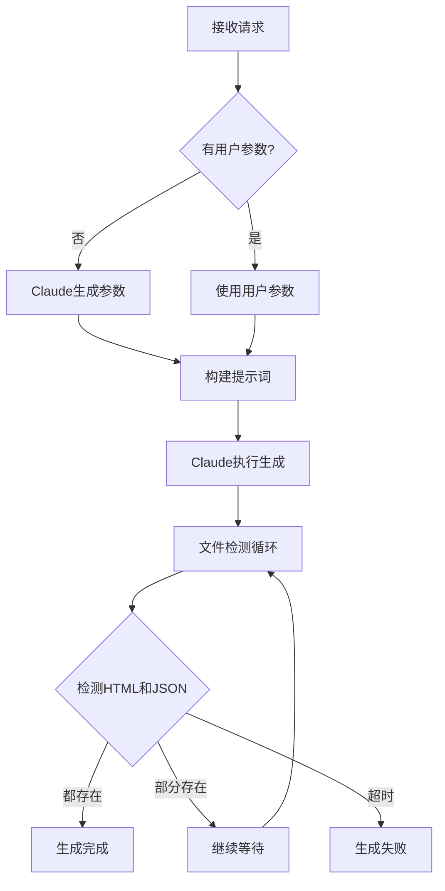
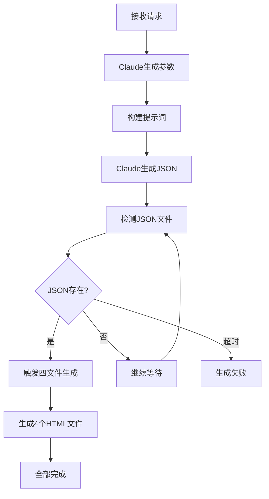
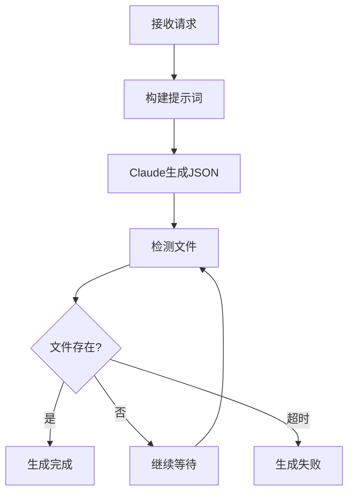

# 模板异步处理流程对比分析

## 1. cardplanet-Sandra-json 模板处理流程

### 1.1 特点
- **双文件生成**: 必须同时生成HTML和JSON两个文件
- **一次性生成**: Claude一次执行就生成两个文件
- **无后续处理**: 文件生成后直接完成

### 1.2 详细流程



### 1.3 关键代码逻辑

```javascript
// 文件检测逻辑 (第280-290行)
if (templateName === 'cardplanet-Sandra-json') {
  const htmlFiles = generatedFiles.filter(f => f.endsWith('.html'))
  const jsonFiles = generatedFiles.filter(f => f.endsWith('.json'))
  
  if (htmlFiles.length > 0 && jsonFiles.length > 0) {
    // 两个文件都检测到，完成
    resolve(true)
  } else if (htmlFiles.length > 0 || jsonFiles.length > 0) {
    // 只检测到部分文件，继续等待
    console.log(`Waiting for both files... HTML: ${htmlFiles.length}, JSON: ${jsonFiles.length}`)
  }
}
```

### 1.4 提示词特点

```javascript
prompt = `你是一位海报设计师，要为"${topic}"创作一套收藏级卡片海报作品。
...
特别注意：必须按照html_generation_workflow.md中的双文件输出规范，
同时生成HTML文件（主题英文名_style.html）和JSON文件（主题英文名_data.json）。
生成的文件保存在[${backgroundUserCardPath}]`
```

## 2. daily-knowledge-card-template 模板处理流程

### 2.1 特点
- **两阶段生成**: 先生成JSON，再触发生成4个HTML文件
- **自动触发**: 检测到JSON后自动执行四文件生成
- **多文件输出**: 最终生成1个JSON + 4个HTML共5个文件

### 2.2 详细流程



### 2.3 关键代码逻辑

```javascript
// 第361-396行
if (isDailyKnowledgeTemplate(templateName)) {
  console.log(`Daily template detected, starting four-file generation`)
  
  const jsonFiles = generatedFiles.filter(f => f.endsWith('.json'))
  if (jsonFiles.length > 0) {
    // 执行四文件生成流程
    const fourFileResult = await generateFourFiles({
      userId: targetUser.username,
      topic,
      templateName,
      outputDir: backgroundUserCardPath,
      jsonFilePath: path.join(backgroundUserCardPath, jsonFiles[0]),
      baseName: path.basename(jsonFiles[0], '.json'),
      requestId: taskId,
      apiEndpoint: '/api/generate/card/async'
    })
  }
}
```

## 3. 其他模板处理流程

### 3.1 特点
- **单文件生成**: 只生成一个JSON文件
- **简单流程**: 无后续处理
- **快速完成**: 检测到文件即完成

### 3.2 详细流程



## 4. 对比总结

| 特性 | cardplanet-Sandra-json | daily-knowledge-card | 其他模板 |
|------|------------------------|---------------------|----------|
| **文件数量** | 2个 (HTML+JSON) | 5个 (1 JSON + 4 HTML) | 1个 (JSON) |
| **生成阶段** | 单阶段 | 两阶段 | 单阶段 |
| **Claude调用** | 1次 | 1次 (JSON) + 自动触发 | 1次 |
| **文件检测** | 需要两种文件都存在 | 先检测JSON，后检测HTML | 检测到即完成 |
| **参数生成** | 支持Cover参数 | 标准参数 | 标准参数 |
| **提示词** | 包含双文件输出要求 | 标准JSON生成 | 标准JSON生成 |
| **完成条件** | HTML && JSON | JSON && 4个HTML | JSON |
| **状态轮询** | 显示部分文件进度 | 显示HTML生成进度 | 简单状态 |

## 5. 状态检查差异

### 5.1 前端轮询状态

```javascript
// cardplanet-Sandra-json
status: 'generating'
message: 'Waiting for both files... HTML: 1, JSON: 0'

// daily-knowledge-card  
status: 'generating'
message: 'JSON已生成，正在生成HTML文件 (2/4)'

// 其他模板
status: 'completed'
message: '生成完成'
```

### 5.2 后端状态判断

```javascript
// status.js 中的判断逻辑
if (hasKnowledgeCard) {
  // daily-knowledge-card: 需要4个HTML
  expectedHtmlCount = 4
  if (htmlFiles.length >= expectedHtmlCount) {
    isCompleted = true
  }
} else if (jsonFiles.length > 0 || htmlFiles.length > 0) {
  // cardplanet-Sandra-json 和其他模板
  isCompleted = true
}
```

## 6. 错误处理差异

| 模板 | 超时时间 | 错误恢复 | 部分成功处理 |
|------|---------|---------|-------------|
| cardplanet-Sandra-json | 10分钟 | 无 | 继续等待另一个文件 |
| daily-knowledge-card | 10分钟 + 额外HTML生成时间 | 记录四文件生成失败但不影响主流程 | JSON成功即可查询 |
| 其他模板 | 10分钟 | 无 | 不适用 |

## 7. 用户体验差异

### cardplanet-Sandra-json
- 用户等待时间较短
- 一次性获得完整结果
- 进度反馈相对简单

### daily-knowledge-card
- 用户等待时间较长
- 分阶段看到进度
- 详细的HTML生成进度反馈
- 即使HTML生成失败，JSON仍可用

### 其他模板
- 最快完成
- 简单明了
- 无复杂状态

## 8. 实际应用建议

1. **选择 cardplanet-Sandra-json**：
   - 需要同时展示HTML和JSON
   - 要求原子性操作（要么都有，要么都没有）
   - 需要自定义封面设计

2. **选择 daily-knowledge-card**：
   - 需要多种格式输出
   - 可以接受分阶段生成
   - 需要详细的知识卡片展示

3. **选择其他模板**：
   - 只需要JSON数据
   - 追求快速生成
   - 简单的数据结构需求