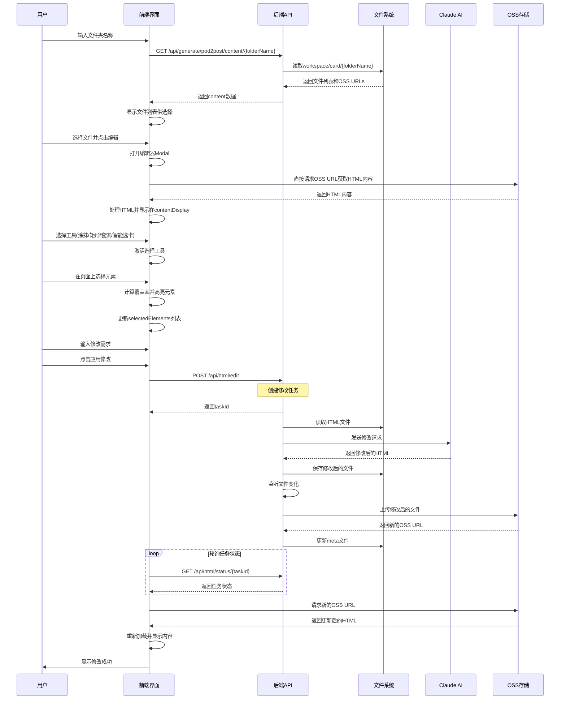

# HTML智能编辑功能开发说明文档

## 1. 功能概述

HTML智能编辑功能允许用户通过可视化界面选择HTML元素，并使用AI进行智能修改。整个流程包括：
1. 获取Pod2Post生成的HTML文件
2. 可视化选择要修改的元素
3. AI智能修改
4. 自动更新OSS并刷新显示

## 2. 系统架构

```
┌─────────────┐     ┌──────────────┐     ┌─────────────┐     ┌──────────┐
│   前端界面   │────►│   后端API    │────►│  Claude AI  │────►│   OSS    │
│  HTML/JS    │◄────│  Node.js     │◄────│             │◄────│  Storage │
└─────────────┘     └──────────────┘     └─────────────┘     └──────────┘
```

## 3. 完整流程时序图



## 4. API接口详细说明

### 4.1 获取文件列表
```javascript
GET /api/generate/pod2post/content/{folderName}

响应格式:
{
    "success": true,
    "data": {
        "content": {
            "originalHtmlOssUrl": "https://oss-url/content_ossurl.html",
            "base64HtmlOssUrl": "https://oss-url/content_base64.html"
        },
        "metadata": {...}
    }
}
```

### 4.2 提交修改请求
```javascript
POST /api/html/edit

请求体:
{
    "htmlPath": "card/pod2post_xxx/content_ossurl.html",  // 相对路径
    "fileId": "content_ossurl.html",
    "folderId": "pod2post_xxx",
    "elements": [
        {
            "selected_element": {
                "tagName": "div",
                "className": "card",
                "id": "card-1",
                "textContent": "...",
                "outerHTML": "..."
            },
            "selection_coverage_percentage": 0.8
        }
    ],
    "request": "修改需求描述"
}

响应:
{
    "success": true,
    "taskId": "task_xxx"
}
```

### 4.3 查询任务状态
```javascript
GET /api/html/status/{taskId}

响应:
{
    "status": "processing|completed|failed",
    "progress": 50,
    "message": "正在处理...",
    "ossUrl": "https://new-oss-url.html",  // 完成时返回
    "error": "错误信息"  // 失败时返回
}
```

## 5. 前端核心功能实现

### 5.1 初始化选择功能
```javascript
function initializeSelection() {
    const contentDisplay = document.getElementById('contentDisplay');
    const htmlContainer = document.getElementById('htmlContainer');

    // 初始化画布
    canvas = document.getElementById('selectionCanvas');
    brushCursor = document.getElementById('brushCursor');
    setupCanvas();

    // 添加事件监听器
    canvas.addEventListener('mousedown', handleCanvasMouseDown);
    canvas.addEventListener('mousemove', handleCanvasMouseMove);
    canvas.addEventListener('mouseup', handleCanvasMouseUp);

    // 智能选卡事件监听
    htmlContainer.addEventListener('click', function(event) {
        if (currentTool === 'smart-card' && toolActive) {
            handleSmartCardClick(event);
        }
    }, true);  // 使用捕获阶段
}
```

### 5.2 选择工具实现

#### 5.2.1 涂抹工具
```javascript
function drawBrush(point) {
    const radius = brushSize / 2;
    ctx.fillStyle = '#409eff';
    ctx.globalAlpha = 0.3;
    ctx.beginPath();
    ctx.arc(point.x, point.y, radius, 0, 2 * Math.PI);
    ctx.fill();
}
```

#### 5.2.2 矩形选择
```javascript
function drawRectangle() {
    const start = currentPath[0];
    const current = currentPath[currentPath.length - 1];
    ctx.strokeStyle = '#409eff';
    ctx.strokeRect(start.x, start.y,
                   current.x - start.x,
                   current.y - start.y);
}
```

#### 5.2.3 套索工具
```javascript
function drawLasso(point) {
    ctx.strokeStyle = '#409eff';
    ctx.lineWidth = 2;
    ctx.setLineDash([5, 5]);
    ctx.lineTo(point.x, point.y);
    ctx.stroke();
}
```

#### 5.2.4 智能选卡
```javascript
function detectCards() {
    const allElements = contentDisplay.querySelectorAll('*');
    const cardElements = [];

    allElements.forEach(element => {
        if (isCardElement(element)) {
            cardElements.push(element);
        }
    });

    return cardElements;
}

function isCardElement(element) {
    const className = element.className.toLowerCase();

    // 类名检查
    const cardClasses = ['tutorial-card', 'content-card',
                        'cover-card', 'card-container',
                        'card', 'panel', 'tile', 'item'];

    const hasCardClass = cardClasses.some(cls =>
        className.includes(cls)
    );

    if (!hasCardClass) return false;

    // 尺寸检查
    const rect = element.getBoundingClientRect();
    if (rect.width < 200 || rect.height < 250) return false;
    if (rect.width > 800 || rect.height > 1200) return false;

    // 内容检查
    if (element.children.length === 0) return false;
    if (element.textContent.trim().length < 20) return false;

    return true;
}
```

### 5.3 元素覆盖率计算
```javascript
function calculateCoverage(selection, rect) {
    const { path, bounds } = selection;
    const brushRadius = brushSize / 2;

    // 完全包含检查
    if (bounds.x <= rect.left &&
        bounds.y <= rect.top &&
        bounds.x + bounds.width >= rect.right &&
        bounds.y + bounds.height >= rect.bottom) {
        return 1.0;
    }

    // 采样计算覆盖率
    let coveredArea = 0;
    const sampleSize = Math.max(5, Math.min(rect.width, rect.height) / 10);
    let totalSamples = 0;

    for (let x = rect.left; x < rect.right; x += sampleSize) {
        for (let y = rect.top; y < rect.bottom; y += sampleSize) {
            totalSamples++;

            // 检查点是否在选区内
            for (const point of path) {
                const distance = Math.sqrt(
                    Math.pow(x - point.x, 2) +
                    Math.pow(y - point.y, 2)
                );

                if (currentTool === 'paint' && distance <= brushRadius) {
                    coveredArea++;
                    break;
                }
                // ... 其他工具判断
            }
        }
    }

    return totalSamples > 0 ? coveredArea / totalSamples : 0;
}
```

### 5.4 修改请求处理
```javascript
async function applyChanges() {
    const modifyText = document.getElementById('modifyInput').value;

    const requestData = {
        htmlPath: selectedFile.path,
        fileId: selectedFile.id,
        folderId: selectedFile.folderId,
        elements: selectedElements.map(sel => ({
            selected_element: {
                tagName: sel.element.tagName,
                className: sel.element.className,
                id: sel.element.id,
                textContent: sel.element.textContent?.substring(0, 200),
                outerHTML: sel.element.outerHTML.substring(0, 500)
            },
            selection_coverage_percentage: sel.coverage
        })),
        request: modifyText
    };

    const response = await fetch(`${serverUrl}/api/html/edit`, {
        method: 'POST',
        headers: { 'Content-Type': 'application/json' },
        body: JSON.stringify(requestData)
    });

    const result = await response.json();
    if (result.success) {
        pollTaskStatus(result.taskId);
    }
}
```

### 5.5 状态轮询和内容刷新
```javascript
async function pollTaskStatus(taskId, maxAttempts = 60) {
    let attempts = 0;

    const poll = async () => {
        attempts++;
        const response = await fetch(`${serverUrl}/api/html/status/${taskId}`);
        const status = await response.json();

        updateTaskStatusUI(taskId, status);

        if (status.status === 'completed') {
            if (status.ossUrl) {
                await reloadModifiedContent(status.ossUrl);
            }
            return;
        } else if (status.status === 'failed') {
            console.error('任务失败:', status.error);
            return;
        } else if (attempts < maxAttempts) {
            setTimeout(poll, 2000);  // 2秒后重试
        }
    };

    poll();
}

async function reloadModifiedContent(newOssUrl) {
    selectedFile.url = newOssUrl;

    const response = await fetch(newOssUrl);
    const html = await response.text();

    const processedHtml = processHtml(html, newOssUrl);
    contentDisplay.innerHTML = processedHtml;

    initializeSelection();  // 重新初始化选择功能
}
```

## 6. 后端核心实现

### 6.1 文件监听和OSS上传
```javascript
// htmlEdit.js
async handleFileChange(taskId, filePath) {
    // 读取元数据
    const metadata = this.taskMetadata.get(taskId);

    // 上传到OSS
    const uploadResult = await this.uploadModifiedFileToOSS(
        metadata.userId,
        metadata.folderId,
        filePath
    );

    // 更新meta文件
    await this.updateMetaFileWithNewOssUrl(
        metadata,
        uploadResult.ossUrl,
        uploadResult.fileName,
        filePath
    );

    // 更新任务状态
    this.updateTaskStatus(taskId, {
        status: 'completed',
        ossUrl: uploadResult.ossUrl
    });
}
```

### 6.2 Meta文件更新
```javascript
async updateMetaFileWithNewOssUrl(metadata, newOssUrl, fileName, filePath) {
    const metaPath = path.join(
        metadata.workspacePath,
        `${metadata.folderId}_meta.json`
    );

    const metaData = JSON.parse(await fs.readFile(metaPath, 'utf8'));

    // 更新OSS URLs
    if (fileName.includes('ossurl')) {
        metaData.custom.ossUpload.urls.originalHtml = newOssUrl;
    }

    // 更新uploadedFiles数组
    const fileIndex = metaData.custom.ossUpload.uploadedFiles
        .findIndex(f => f.fileName === fileName);

    if (fileIndex >= 0) {
        metaData.custom.ossUpload.uploadedFiles[fileIndex].ossUrl = newOssUrl;
        metaData.custom.ossUpload.uploadedFiles[fileIndex].uploadedAt =
            new Date().toISOString();
    }

    // 添加日志
    metaData.logs.push({
        timestamp: new Date().toISOString(),
        level: "info",
        message: "HTML文件编辑后重新上传OSS",
        context: { newOssUrl, fileName }
    });

    await fs.writeFile(metaPath, JSON.stringify(metaData, null, 2));
}
```

## 7. 关键技术点

### 7.1 事件处理优先级
```javascript
// 使用捕获阶段确保事件优先处理
element.addEventListener('click', handler, true);  // true表示捕获阶段

// 智能选卡模式下禁用overlay避免事件阻挡
if (currentTool === 'smart-card') {
    overlay.classList.remove('active');
    overlay.style.pointerEvents = 'none';
    contentDisplay.style.pointerEvents = 'auto';
}
```

### 7.2 跨域处理
```javascript
// 处理OSS跨域加载的HTML
function processHtml(html, baseUrl) {
    const parser = new DOMParser();
    const doc = parser.parseFromString(html, 'text/html');

    // 添加base标签处理相对路径
    const base = doc.createElement('base');
    base.href = baseUrl.substring(0, baseUrl.lastIndexOf('/') + 1);
    doc.head.insertBefore(base, doc.head.firstChild);

    return doc.documentElement.innerHTML;
}
```

### 7.3 元素选择的CSS类管理
```css
/* 被选中的元素高亮 */
.element-selected {
    outline: 2px solid #f56c6c !important;
    background: rgba(245, 108, 108, 0.1) !important;
}

/* 智能选卡检测到的卡片高亮 */
.card-detected {
    outline: 2px dashed #67c23a !important;
    background: rgba(103, 194, 58, 0.05) !important;
    cursor: pointer !important;
    position: relative !important;
    z-index: 10 !important;
    pointer-events: auto !important;
}
```

## 8. 文件结构

```
项目根目录/
├── html-edit-modal-complete.html    # 独立的HTML编辑器界面
├── terminal-backend/
│   ├── src/
│   │   ├── routes/
│   │   │   ├── htmlEdit.js         # HTML编辑API路由
│   │   │   └── generate/
│   │   │       ├── card.js         # 卡片生成相关
│   │   │       └── cardQuery.js    # 卡片查询
│   │   └── utils/
│   │       ├── apiTerminalService.js  # AI服务调用
│   │       └── ossUploader.js        # OSS上传工具
│   └── data/
│       └── users/default/workspace/card/  # 工作区文件
└── terminal-ui/
    └── src/
        └── components/
            └── HtmlEditModal/       # Vue组件版本(参考)
```

## 9. 开发注意事项

### 9.1 性能优化
- 使用节流(throttle)处理鼠标移动事件，避免过度绘制
- 使用离屏Canvas缓存绘制结果
- 采样计算覆盖率而非逐像素计算

### 9.2 错误处理
- 文件读写操作需要try-catch包装
- 网络请求需要超时控制
- 轮询需要设置最大次数避免无限循环

### 9.3 用户体验
- 提供实时的视觉反馈（高亮、进度条等）
- 操作可撤销（撤销按钮）
- 清晰的状态提示（processing、completed、failed）

### 9.4 安全性
- 对用户输入进行验证和清理
- 限制上传文件大小
- 使用签名URL访问OSS资源

## 10. 测试要点

1. **功能测试**
   - 各种选择工具是否正常工作
   - 元素选择是否准确
   - 修改是否正确应用

2. **兼容性测试**
   - 不同浏览器兼容性
   - 不同HTML结构的处理
   - 大文件处理能力

3. **性能测试**
   - 选择工具响应速度
   - 文件上传下载速度
   - 内存占用情况

4. **异常测试**
   - 网络中断恢复
   - 文件权限问题
   - AI服务异常处理

## 11. 扩展开发指南

如需开发类似功能的前端，可以：

1. **复用选择工具逻辑**
   - 直接使用或修改现有的选择工具实现
   - 根据需要调整覆盖率计算算法

2. **适配不同的后端API**
   - 修改API端点和请求格式
   - 调整响应处理逻辑

3. **自定义UI样式**
   - 修改CSS类定义
   - 调整界面布局

4. **增加新的选择工具**
   - 在工具栏添加新按钮
   - 实现对应的绘制和检测逻辑
   - 更新工具状态管理

## 12. 常见问题解决

### Q1: 智能选卡点击无响应
**A:** 检查以下几点：
- 确保事件监听器使用捕获阶段 (true参数)
- 检查z-index和pointer-events设置
- 确认overlay没有阻挡事件

### Q2: 修改后内容不刷新
**A:** 确认：
- OSS URL是否正确更新
- Meta文件是否正确修改
- 轮询状态是否正常工作

### Q3: 选择精度不准确
**A:** 调整：
- 采样密度(sampleSize)
- 覆盖率阈值(0.3)
- 画笔大小设置

## 13. 版本历史

- **v1.2.0** - 2024-01-16
  - 添加智能选卡功能
  - 修复事件处理问题
  - 优化选择精度

- **v1.1.0** - 2024-01-15
  - 实现基础选择工具
  - 集成Claude AI修改
  - OSS自动上传

- **v1.0.0** - 2024-01-14
  - 初始版本发布

## 14. 联系支持

如有问题或需要帮助，请联系开发团队或查看项目GitHub仓库的Issues页面。

---

*本文档最后更新时间：2024-01-16*