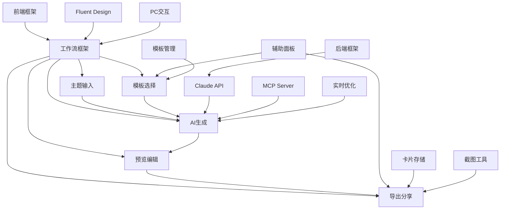

# 知识卡片生成器项目任务清单

## 项目概述
构建一个AI驱动的知识卡片生成器，通过友好的Web界面让用户输入知识主题，选择风格模板，快速生成专业的社交媒体知识卡片。系统基于Claude Code的AI能力，结合MCP Server渲染服务，实现从文本到精美卡片的自动化生成。

## 任务清单

### 第一阶段：基础框架搭建（已完成）✅

#### 1. 前端项目初始化
- **目标**：创建Vue 3项目环境，配置基础依赖
- **参考文档**：知识卡片生成器产品需求文档.md - 5.1 前端技术栈
- **具体任务**：
  - 创建Vue 3项目（使用Vite构建）
  - 安装Element Plus UI组件库
  - 配置Pinia状态管理
  - 设置Axios HTTP客户端
  - 创建基础路由结构
- **状态**：✅ 已完成

#### 2. 后端项目初始化
- **目标**：搭建Node.js + Express服务环境
- **参考文档**：知识卡片生成器产品需求文档.md - 5.2 后端技术栈
- **具体任务**：
  - 初始化Node.js项目（Node 18+）
  - 安装Express.js框架
  - 配置Socket.io实时通信
  - 集成Claude Code Terminal能力
  - 设置CORS和基础中间件
- **状态**：✅ 已完成

#### 3. Fluent Design风格系统
- **目标**：实现Microsoft Fluent Design设计语言
- **参考文档**：用户要求的Fluent Design风格
- **具体任务**：
  - 创建fluent-theme.css主题文件
  - 实现毛玻璃效果(Acrylic)组件
  - 设计深度和层次系统
  - 配置光影效果
  - 创建FluentCard和FluentButton组件
- **状态**：✅ 已完成

### 第二阶段：核心工作流开发（已完成）✅

#### 4. 五步式工作流框架
- **目标**：实现知识卡片生成的5步流程
- **参考文档**：知识卡片生成器产品需求文档.md - 4.2 核心工作流程
- **具体任务**：
  - 设计工作流步骤导航组件
  - 实现步骤切换逻辑
  - 添加进度指示器
  - 支持步骤间数据传递
  - 优化PC端键盘导航
- **状态**：✅ 已完成

#### 5. 主题输入组件
- **目标**：实现智能的主题输入界面
- **参考文档**：知识卡片生成器产品需求文档.md - 4.2.1 主题输入
- **具体任务**：
  - 创建TopicInputStep组件
  - 实现智能输入建议
  - 添加热门主题标签
  - 集成历史记录功能
  - 支持500字符输入限制
- **状态**：✅ 已完成

#### 6. 风格模板选择器
- **目标**：展示公共风格模板(.md规范文档)
- **参考文档**：后端templates/文件夹结构
- **具体任务**：
  - 创建TemplateSelectionStep组件
  - 映射后端.md文件(business.md, creative.md等)
  - 实现AI推荐功能
  - 显示模板特性和使用场景
  - 支持模板预览
- **状态**：✅ 已完成

#### 7. AI生成过程展示
- **目标**：可视化Claude Code生成流程
- **参考文档**：真实的后端处理流程
- **具体任务**：
  - 创建GenerationStep组件
  - 展示5个真实步骤(提示词→Claude→JSON→MCP→URL)
  - 实现进度动画
  - 添加错误处理和重试机制
  - 支持生成取消
- **状态**：✅ 已完成

#### 8. 卡片预览编辑器
- **目标**：预览和编辑生成的卡片
- **参考文档**：知识卡片生成器产品需求文档.md - 4.2.4
- **具体任务**：
  - 创建CardPreviewStep组件
  - 集成iframe预览MCP生成的URL
  - 实现基础编辑功能
  - 支持多平台尺寸切换
  - 添加实时预览
- **状态**：✅ 已完成

#### 9. 导出分享功能
- **目标**：实现一键截图和多格式导出
- **参考文档**：知识卡片生成器产品需求文档.md - 4.2.5
- **具体任务**：
  - 创建CardDownloadStep组件
  - 实现多格式导出(PNG/JPG/PDF/SVG)
  - 添加社交平台分享
  - 支持批量下载
  - 集成水印功能
- **状态**：✅ 已完成

#### 10. 辅助面板系统
- **目标**：右侧辅助功能面板
- **参考文档**：PC端三栏布局设计
- **具体任务**：
  - 创建TemplateLibrary面板
  - 创建RecentCards历史记录
  - 创建ExportSettings导出设置
  - 实现面板切换逻辑
  - 支持面板折叠
- **状态**：✅ 已完成

### 第三阶段：后端集成（进行中）🚧

#### 11. Terminal两阶段调用集成
- **目标**：实现两次Terminal调用的完整流程
- **参考文档**：更新后的需求文档 - 5.3.2 具体执行示例
- **具体任务**：
  - 创建/api/terminal/execute接口
  - 第一阶段：发送生成JSON的prompt到Terminal
  - 解析Claude Code生成的JSON文件路径
  - 第二阶段：发送使用JSON生成卡片的prompt
  - 获取MCP渲染后的URL
- **状态**：🚧 待开始

#### 12. 文件夹结构管理
- **目标**：管理用户卡片文件夹
- **参考文档**：users/[username]/cards/[命题]/ 结构
- **具体任务**：
  - 创建用户文件夹API
  - 实现按命题创建文件夹
  - 保存content.json到对应文件夹
  - 管理文件夹列表和计数
  - 支持文件夹内容读取
- **状态**：🚧 待开始

#### 13. 风格模板管理
- **目标**：管理公共.md风格规范文档
- **参考文档**：terminal-backend/templates/文件夹
- **具体任务**：
  - 创建模板读取API
  - 解析.md文件内容
  - 提取风格规范要点
  - 支持模板热更新
  - 实现模板版本管理
- **状态**：🚧 待开始

#### 14. 用户卡片存储
- **目标**：按命题管理用户生成的卡片
- **参考文档**：users/[username]/cards/[命题]/结构
- **具体任务**：
  - 创建用户文件夹结构
  - 实现卡片保存API
  - 支持命题分类管理
  - 添加元数据存储
  - 实现卡片检索功能
- **状态**：🚧 待开始

### 第四阶段：体验优化（待开始）📋

#### 15. PC端交互增强
- **目标**：优化桌面端使用体验
- **参考文档**：知识卡片生成器产品需求文档.md - 4.3 PC端交互
- **具体任务**：
  - 完善键盘快捷键系统(已部分完成)
  - 实现右键菜单
  - 添加拖拽功能
  - 优化焦点管理
  - 支持多窗口操作
- **状态**：✅ 已完成

#### 16. 实时生成优化
- **目标**：提升AI生成体验
- **具体任务**：
  - 实现流式生成展示
  - 添加中间结果预览
  - 支持多版本生成
  - 优化生成速度
  - 减少等待时间
- **状态**：📋 待开始

#### 17. 截图工具集成
- **目标**：自动化卡片截图功能
- **具体任务**：
  - 集成html2canvas库
  - 实现批量截图
  - 支持自定义截图区域
  - 优化截图质量
  - 添加截图编辑
- **状态**：📋 待开始

### 第五阶段：系统完善（待开始）📋

#### 18. 用户认证系统
- **目标**：多用户支持
- **具体任务**：
  - 创建登录注册界面
  - 实现JWT认证
  - 添加用户权限管理
  - 支持OAuth登录
  - 实现会话管理
- **状态**：📋 待开始

#### 19. 性能优化
- **目标**：提升系统性能
- **具体任务**：
  - 前端代码分割
  - 实现懒加载
  - 优化打包体积
  - 添加缓存机制
  - 提升渲染性能
- **状态**：📋 待开始

#### 20. 部署与监控
- **目标**：生产环境部署
- **具体任务**：
  - 配置Docker容器
  - 设置CI/CD流程
  - 添加错误监控
  - 实现日志收集
  - 配置性能监控
- **状态**：📋 待开始

## 任务依赖关系



## 里程碑

- **M1**：✅ 基础框架完成（任务1-3）- 已达成
- **M2**：✅ 核心工作流可用（任务4-10）- 已达成
- **M3**：🚧 后端集成完成（任务11-14）- 进行中
- **M4**：📋 体验优化完成（任务15-17）
- **M5**：📋 系统上线就绪（任务18-20）

## 技术栈总结

### 前端
- Vue 3 + Composition API
- Vite构建工具
- Element Plus组件库
- Pinia状态管理
- Microsoft Fluent Design System
- Axios + Socket.io

### 后端
- Node.js 18+
- Express.js
- Claude Code Terminal集成
- MCP Server (已配置)
- Socket.io实时通信

### 核心流程
```
用户输入主题 → 选择.md风格规范 → Claude生成JSON → MCP渲染URL → 前端展示 → 导出分享
```

## 风险管理

1. **技术风险**：Claude Code API调用稳定性
2. **性能风险**：MCP Server渲染速度
3. **体验风险**：生成质量不稳定

## 更新记录

- 2025-01-14：重新设计为知识卡片生成器
  - ✅ 完成所有前端工作流组件
  - ✅ 实现Fluent Design风格系统
  - ✅ 集成风格模板选择器
  - ✅ 优化PC端交互体验
  - 🚧 准备后端API集成

- 2025-01-14（第二次更新）：简化为单页界面
  - ✅ 基于新UI布局重新设计主界面
  - ✅ 实现左侧卡片文件夹列表
  - ✅ 重构中央预览区域
  - ✅ 优化底部风格模板选择器
  - ✅ 简化操作流程到单页面
  - 📝 更新两阶段Terminal调用流程
  - 📝 明确数据流：Prompt1→JSON→Prompt2→URL