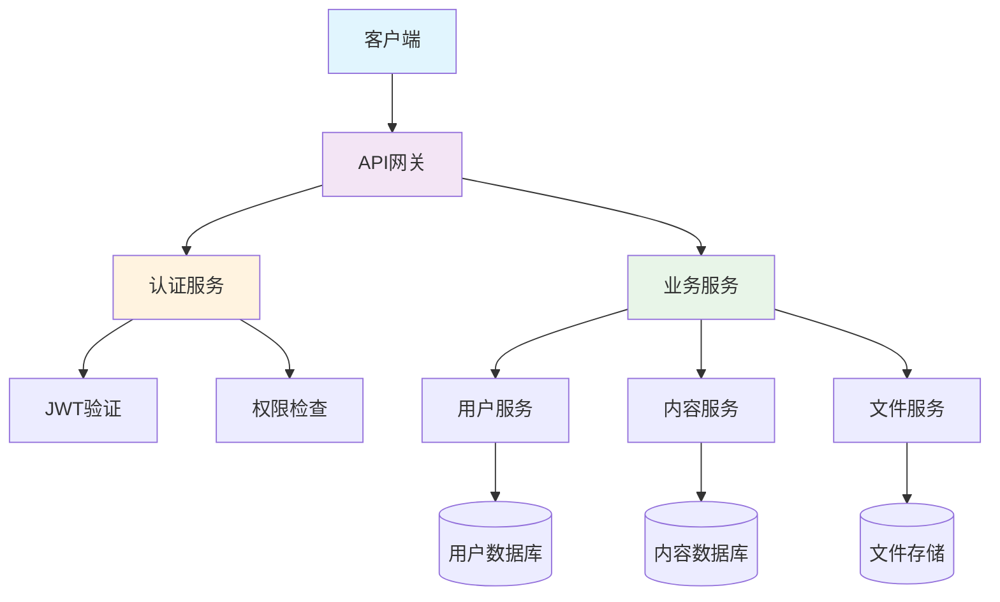
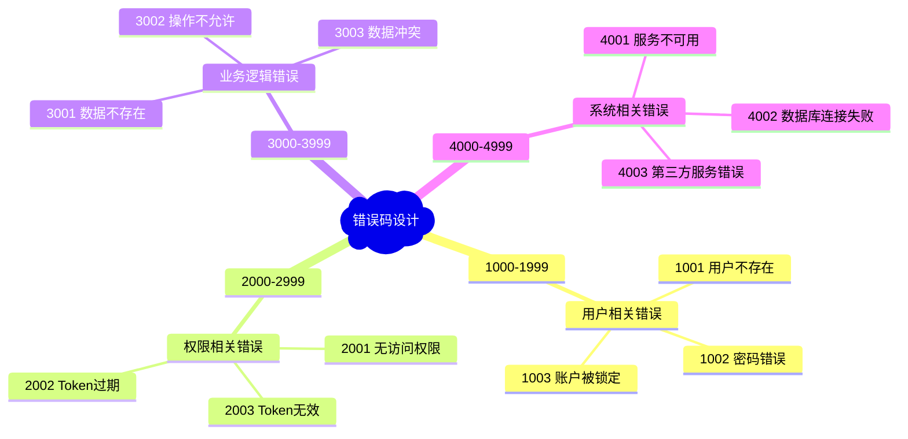
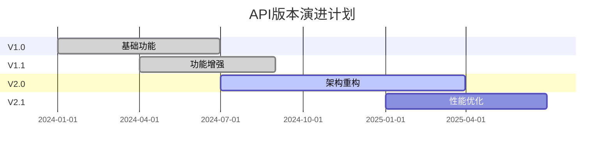

# API设计规范文档

> 📅 **创建时间**: 2025-01-10  
> 👤 **作者**: Alice  
> 🏷️ **标签**: API, 设计, 规范, RESTful

## 📖 目录

- [概述](#概述)
- [设计原则](#设计原则)
- [API架构](#api架构)
- [请求响应格式](#请求响应格式)
- [错误处理](#错误处理)
- [安全规范](#安全规范)
- [版本控制](#版本控制)
- [示例代码](#示例代码)

## 概述

本文档定义了我们项目的API设计标准和最佳实践，确保API的一致性、可维护性和用户友好性。

## 设计原则

### 🎯 核心原则

::: tip RESTful设计
遵循REST架构风格，使用标准HTTP方法和状态码
:::

::: info 一致性
保持命名规范、响应格式和错误处理的一致性
:::

::: warning 向后兼容
新版本API必须向后兼容，避免破坏性变更
:::

### 📋 任务清单

- [x] 确定API版本控制策略
- [x] 定义响应数据格式
- [x] 制定错误码规范
- [ ] 完善API文档自动生成
- [ ] 实现API测试套件
- [ ] 添加性能监控

## API架构



## 请求响应格式

### 标准响应格式

所有API响应都应遵循以下JSON格式：

```json
{
  "success": true,
  "code": 200,
  "message": "操作成功",
  "data": {
    // 实际数据内容
  },
  "timestamp": "2025-01-10T10:30:00.000Z",
  "requestId": "req_1234567890"
}
```

### HTTP状态码规范

| 状态码 | 含义 | 使用场景 |
|-------|------|----------|
| `200` | OK | 请求成功 |
| `201` | Created | 资源创建成功 |
| `400` | Bad Request | 请求参数错误 |
| `401` | Unauthorized | 未认证 |
| `403` | Forbidden | 无权限 |
| `404` | Not Found | 资源不存在 |
| `500` | Internal Server Error | 服务器内部错误 |

## 错误处理

### 错误响应格式

```json
{
  "success": false,
  "code": 400,
  "message": "请求参数错误",
  "error": {
    "type": "ValidationError",
    "details": [
      {
        "field": "email",
        "message": "邮箱格式不正确"
      }
    ]
  },
  "timestamp": "2025-01-10T10:30:00.000Z",
  "requestId": "req_1234567890"
}
```

### 自定义错误码



## 安全规范

### 认证机制

我们使用JWT (JSON Web Token) 进行用户认证：

```javascript
// JWT Token结构
{
  "header": {
    "alg": "HS256",
    "typ": "JWT"
  },
  "payload": {
    "sub": "user_id_123",
    "name": "Alice",
    "role": "admin",
    "iat": 1641801600,
    "exp": 1641888000
  },
  "signature": "..."
}
```

### 数据加密

::: danger 重要提醒
敏感数据必须加密存储和传输
:::

- **传输加密**: 所有API调用必须使用HTTPS
- **存储加密**: 密码、令牌等敏感信息使用bcrypt加密
- **数据脱敏**: 日志中不得包含敏感信息

## 版本控制

### URL版本控制

```http
GET /api/v1/users
GET /api/v2/users
```

### 版本演进策略



## 示例代码

### 用户登录API

**请求示例:**

```bash
curl -X POST "https://api.example.com/v1/auth/login" \
  -H "Content-Type: application/json" \
  -d '{
    "email": "alice@example.com",
    "password": "securePassword123"
  }'
```

**响应示例:**

```json
{
  "success": true,
  "code": 200,
  "message": "登录成功",
  "data": {
    "user": {
      "id": "user_123",
      "name": "Alice",
      "email": "alice@example.com",
      "role": "admin"
    },
    "token": "eyJhbGciOiJIUzI1NiIsInR5cCI6IkpXVCJ9...",
    "expiresIn": 3600
  },
  "timestamp": "2025-01-10T10:30:00.000Z",
  "requestId": "req_login_001"
}
```

### 创建文档API

```javascript
// JavaScript SDK示例
import { APIClient } from '@company/api-sdk'

const client = new APIClient({
  baseURL: 'https://api.example.com/v1',
  token: 'your-jwt-token'
})

// 创建文档
const createDocument = async (documentData) => {
  try {
    const response = await client.post('/documents', {
      title: documentData.title,
      content: documentData.content,
      type: 'markdown',
      tags: documentData.tags
    })
    
    console.log('文档创建成功:', response.data)
    return response.data
  } catch (error) {
    console.error('创建失败:', error.message)
    throw error
  }
}
```

### Python SDK示例

```python
import requests
from typing import Dict, Any

class APIClient:
    def __init__(self, base_url: str, token: str):
        self.base_url = base_url
        self.token = token
        self.session = requests.Session()
        self.session.headers.update({
            'Authorization': f'Bearer {token}',
            'Content-Type': 'application/json'
        })
    
    def create_document(self, title: str, content: str, **kwargs) -> Dict[str, Any]:
        """创建新文档"""
        payload = {
            'title': title,
            'content': content,
            **kwargs
        }
        
        response = self.session.post(
            f'{self.base_url}/documents',
            json=payload
        )
        
        if response.status_code == 201:
            return response.json()
        else:
            raise Exception(f'API调用失败: {response.text}')

# 使用示例
client = APIClient('https://api.example.com/v1', 'your-token')
doc = client.create_document(
    title='API使用指南',
    content='# 这是一个markdown文档',
    type='markdown',
    tags=['文档', '指南']
)
```

## 数学公式示例

### 性能计算公式

API响应时间计算：

$$
ResponseTime = ProcessingTime + NetworkLatency + QueueTime
$$

并发处理能力：

$$
Throughput = \frac{ConcurrentUsers \times RequestsPerUser}{ResponseTime}
$$

### 缓存命中率

$$
CacheHitRate = \frac{CacheHits}{TotalRequests} \times 100\%
$$

当缓存命中率 $> 80\%$ 时，系统性能最优。

## 监控指标

我们需要监控以下关键指标：

| 指标 | 目标值 | 监控方式 |
|------|--------|----------|
| 响应时间 | < 200ms | APM工具 |
| 可用性 | > 99.9% | 健康检查 |
| 错误率 | < 0.1% | 日志分析 |
| 吞吐量 | > 1000 RPS | 性能测试 |

---

::: info 文档更新
本文档会根据API演进持续更新，请关注版本变更通知。
:::

**最后更新**: 2025-01-10 10:30:00  
**版本**: v1.2  
**审核**: 技术团队