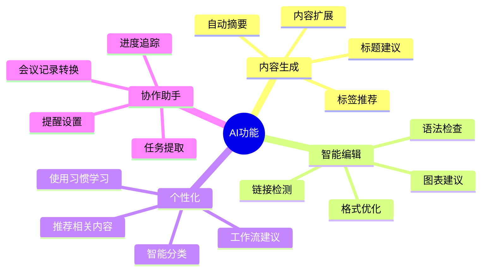
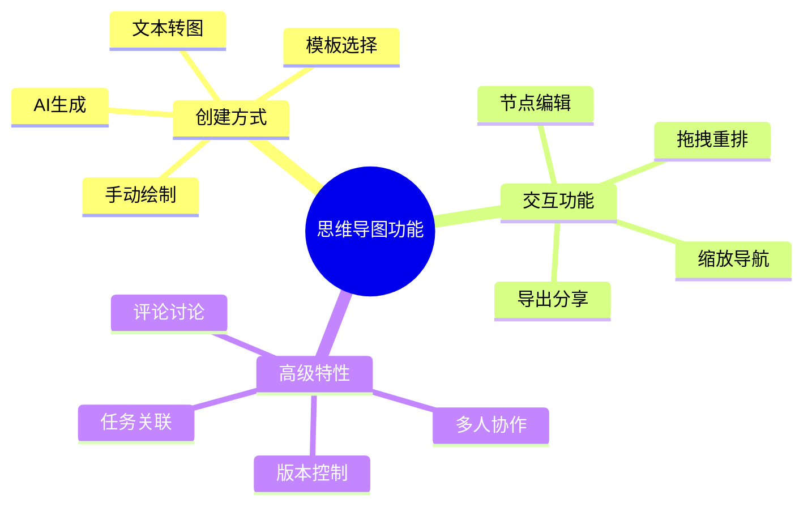
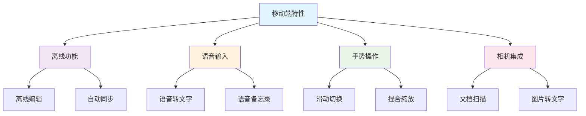
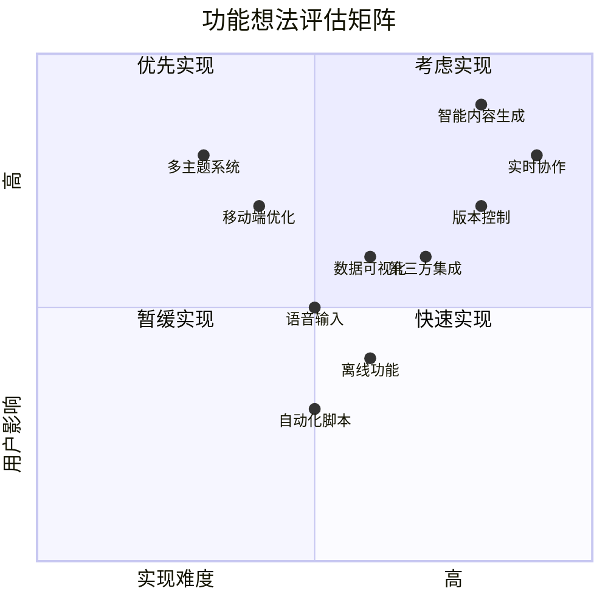
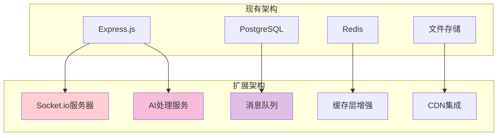

# 团队头脑风暴会议记录

> 💡 **会议主题**: AI Terminal功能增强头脑风暴  
> 📅 **会议时间**: 2025-01-09 14:00-16:00  
> 🏢 **会议地点**: 线上会议室 + Miro协作板  
> 👥 **参会人员**: 8人

## 👥 参会人员

| 姓名 | 角色 | 部门 | 参与度 |
|------|------|------|--------|
| **Alice Chen** | 技术负责人 | 工程部 | 🟢 主持 |
| **Bob Wang** | 前端架构师 | 工程部 | 🟢 积极 |
| **Carol Li** | UX设计师 | 设计部 | 🟢 积极 |
| **David Zhang** | 产品经理 | 产品部 | 🟢 积极 |
| **Emma Liu** | 后端工程师 | 工程部 | 🟡 一般 |
| **Frank Wu** | 测试工程师 | QA部 | 🟢 积极 |
| **Grace Kim** | 数据分析师 | 数据部 | 🟢 积极 |
| **Henry Chen** | 市场专员 | 市场部 | 🟡 一般 |

## 🎯 会议目标

### 主要目标
1. **功能创新** - 收集AI Terminal的创新功能想法
2. **用户体验** - 讨论如何提升用户体验
3. **技术可行性** - 评估想法的技术实现难度
4. **优先级排序** - 对收集的想法进行优先级排序

### 会议议程

```mermaid
gantt
    title 会议议程安排
    dateFormat  HH:mm
    axisFormat  %H:%M
    
    section 开场
    会议介绍          :done, intro, 14:00, 14:10
    
    section 头脑风暴
    功能想法收集      :done, brainstorm, 14:10, 15:00
    
    section 讨论评估
    想法分类整理      :done, categorize, 15:00, 15:20
    技术可行性评估    :done, evaluate, 15:20, 15:40
    
    section 总结
    优先级排序        :done, prioritize, 15:40, 15:55
    后续行动计划      :done, action, 15:55, 16:00
```


## 💡 头脑风暴成果

### 🎨 用户界面增强

#### 主题和个性化
- **🌈 多主题系统**
  - 跟随系统主题自动切换
  - 用户自定义颜色方案
  - 节日/特殊事件主题
  - 品牌定制主题

- **🎪 动画效果**
  - 页面切换动画
  - 加载状态动画
  - 交互反馈动画
  - 成功操作庆祝动画

#### 布局优化
- **📱 响应式改进**
  - 更好的移动端体验
  - 平板电脑优化
  - 折叠屏适配
  - 超宽屏支持

- **🔧 可定制界面**
  - 拖拽式布局编辑
  - 组件显示/隐藏控制
  - 快捷键自定义
  - 工作区预设模板

### 🤖 AI功能增强

#### 智能辅助


**具体功能想法**:

1. **🧠 智能内容生成**
   - 根据关键词自动生成大纲
   - AI续写和扩展内容
   - 多语言翻译集成
   - 代码注释自动生成

2. **📝 编辑智能化**
   - 实时语法和拼写检查
   - 写作风格建议
   - 重复内容检测
   - 引用格式自动化

3. **🔍 智能搜索**
   - 语义搜索而非关键词匹配
   - 相关内容推荐
   - 搜索历史分析
   - 跨文档关联发现

### 📊 数据可视化

#### 图表增强
- **📈 高级图表**
  - 交互式数据可视化
  - 动态图表更新
  - 3D图表支持
  - 地理信息图表

- **🎯 数据分析**
  - 用户行为分析仪表板
  - 内容质量评分
  - 使用时间统计
  - 协作效率指标

#### 思维导图


### 🔗 协作功能

#### 实时协作
- **👥 多人编辑**
  - 实时同步编辑
  - 冲突解决机制
  - 编辑历史记录
  - 用户光标显示

- **💬 沟通工具**
  - 行内评论系统
  - 讨论串管理
  - @提及通知
  - 实时聊天集成

#### 版本控制
- **📚 文档版本**
  - Git-like版本控制
  - 分支合并功能
  - 变更可视化
  - 回滚操作

### 🔌 集成和扩展

#### 第三方集成
| 服务类型 | 集成建议 | 优先级 | 技术难度 |
|----------|----------|--------|----------|
| **云存储** | Google Drive, Dropbox, OneDrive | 🔴 高 | 🟡 中 |
| **任务管理** | Jira, Trello, Asana | 🟡 中 | 🟡 中 |
| **代码仓库** | GitHub, GitLab, Bitbucket | 🔴 高 | 🟢 低 |
| **设计工具** | Figma, Sketch, Adobe XD | 🟡 中 | 🔴 高 |
| **沟通工具** | Slack, Teams, Discord | 🟢 低 | 🟡 中 |

#### API和自动化
- **🔄 Webhook支持**
  - 内容变更通知
  - 自定义触发器
  - 外部系统集成
  - 自动化工作流

- **🤖 自动化脚本**
  - 定时任务执行
  - 批量操作工具
  - 数据导入导出
  - 报告自动生成

### 📱 移动端特性

#### 专属功能


## 📊 想法评估矩阵

### 影响力 vs 难度矩阵



### 评估标准

| 评估维度 | 权重 | 评分标准 |
|----------|------|----------|
| **用户价值** | 40% | 解决用户核心痛点的程度 |
| **技术可行性** | 25% | 技术实现的复杂度和风险 |
| **商业价值** | 20% | 对业务目标的贡献度 |
| **资源投入** | 15% | 所需的人力和时间成本 |

### 功能评分表

| 功能 | 用户价值 | 技术可行性 | 商业价值 | 资源投入 | 综合评分 | 排名 |
|------|----------|------------|----------|----------|----------|------|
| **多主题系统** | 8/10 | 9/10 | 7/10 | 8/10 | **8.0** | 🥇 1 |
| **移动端优化** | 9/10 | 8/10 | 8/10 | 7/10 | **8.0** | 🥇 1 |
| **智能内容生成** | 10/10 | 6/10 | 9/10 | 5/10 | **7.5** | 🥈 3 |
| **实时协作** | 9/10 | 5/10 | 8/10 | 4/10 | **6.8** | 🥉 4 |
| **数据可视化** | 7/10 | 7/10 | 6/10 | 7/10 | **6.7** | 5 |
| **第三方集成** | 8/10 | 6/10 | 7/10 | 6/10 | **6.6** | 6 |

## 🎯 优先级排序结果

### 第一优先级 (Q1-Q2实现)
::: tip 立即开始
这些功能将在接下来的两个季度内重点开发
:::

1. **🎨 多主题系统** 
   - 理由：技术难度低，用户呼声高
   - 预期周期：4周
   - 负责团队：前端 + 设计

2. **📱 移动端优化**
   - 理由：市场需求强烈，技术方案成熟
   - 预期周期：6周
   - 负责团队：前端 + UX

3. **🧠 基础AI功能**
   - 理由：差异化竞争优势
   - 预期周期：8周
   - 负责团队：全栈 + AI团队

### 第二优先级 (Q3-Q4考虑)
::: info 规划阶段
需要进一步技术调研和原型验证
:::

1. **👥 实时协作功能**
2. **📊 数据可视化增强**
3. **🔗 核心第三方集成**

### 第三优先级 (未来版本)
::: warning 长期规划
技术复杂度高，需要团队能力提升
:::

1. **🤖 高级AI功能**
2. **🔄 完整自动化系统**
3. **🌐 企业级功能**

## 💪 技术可行性分析

### 技术栈评估

#### 前端技术需求
```javascript
// 技术栈扩展需求
const techStack = {
  // 现有技术栈
  current: {
    framework: 'Vue 3',
    ui: 'Element Plus',
    build: 'Vite',
    markdown: 'Milkdown'
  },
  
  // 新增技术需求
  additions: {
    // 实时协作
    realtime: ['Socket.io', 'Y.js', 'WebRTC'],
    
    // AI功能
    ai: ['TensorFlow.js', 'OpenAI API', 'Hugging Face'],
    
    // 数据可视化
    visualization: ['D3.js', 'Chart.js', 'Three.js'],
    
    // 移动端
    mobile: ['Capacitor', 'PWA APIs', 'Touch gestures'],
    
    // 状态管理
    state: ['Pinia', 'Zustand', 'Valtio']
  }
}
```

#### 后端架构调整


### 风险评估

| 技术风险 | 概率 | 影响 | 缓解策略 |
|----------|------|------|----------|
| **AI服务稳定性** | 中 | 高 | 多API源，降级方案 |
| **实时协作冲突** | 高 | 中 | 成熟算法，渐进实现 |
| **性能瓶颈** | 中 | 高 | 性能测试，优化优先 |
| **移动端兼容** | 低 | 中 | 渐进式增强 |
| **第三方依赖** | 中 | 中 | 依赖隔离，备选方案 |

## 📋 行动计划

### 短期行动 (1-2周)

- [ ] **技术调研** 
  - [ ] Alice：AI API调研报告 (1月15日)
  - [ ] Bob：移动端技术选型 (1月18日)
  - [ ] Carol：主题设计规范 (1月20日)

- [ ] **原型开发**
  - [ ] 多主题系统POC
  - [ ] AI集成MVP
  - [ ] 移动端适配样式

### 中期行动 (1个月)

- [ ] **团队培训**
  - [ ] AI开发最佳实践培训
  - [ ] 移动端开发规范培训
  - [ ] 协作工具使用培训

- [ ] **基础设施准备**
  - [ ] CI/CD流程优化
  - [ ] 测试环境扩展
  - [ ] 监控系统增强

### 长期规划 (季度)

- [ ] **团队扩展**
  - [ ] 招聘AI工程师
  - [ ] 增加移动端专家
  - [ ] 引入UX研究员

- [ ] **技术债务清理**
  - [ ] 代码重构和优化
  - [ ] 架构演进
  - [ ] 文档完善

## 📝 会议总结

### 🎯 关键决策

1. **✅ 多主题系统** - 立即启动开发
2. **✅ 移动端优化** - Q1优先级最高
3. **✅ AI功能集成** - 分阶段实现，从基础功能开始
4. **⏸️ 实时协作** - 暂缓至Q3，需要更多技术准备

### 💡 创新亮点

- **🎨 情境化主题**: 根据内容类型自动切换主题
- **🤖 AI写作助手**: 集成多个AI模型提供智能建议
- **📱 手势导航**: 移动端专属的手势操作体验
- **🔄 增量同步**: 高效的实时数据同步方案

### 📊 数据支持

**用户调研数据**:
- 72%用户希望有深色主题
- 68%用户需要移动端支持
- 45%用户对AI功能感兴趣
- 38%用户需要协作功能

**市场分析**:
- 竞品对比显示我们在移动端存在劣势
- AI功能是下一个竞争焦点
- 用户留存率与个性化程度正相关

### 🚀 后续步骤

1. **立即行动**:
   - 技术调研分工明确
   - 原型开发时间表确定
   - 资源分配优化

2. **定期评估**:
   - 每两周进展回顾
   - 月度优先级调整
   - 季度目标评估

3. **风险监控**:
   - 技术风险定期评估
   - 进度偏差预警机制
   - 资源瓶颈提前识别

---

## 📞 会议信息

**主持人**: Alice Chen  
**记录人**: Alice Chen  
**会议时长**: 2小时  
**参与度**: 87.5% (7/8人积极参与)

**下次相关会议**: 
- **技术评审会**: 2025-01-15 (评审调研结果)
- **产品规划会**: 2025-01-20 (确定Q1-Q2路线图)

::: tip 会议反馈
参会人员对会议效果满意，产出了很多有价值的想法。建议后续保持这种开放式讨论的氛围。
:::

**会议满意度**: ⭐⭐⭐⭐⭐ (4.8/5.0)