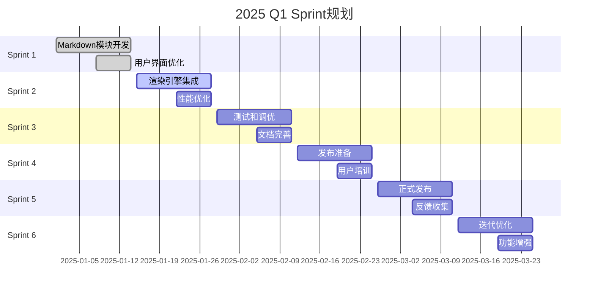
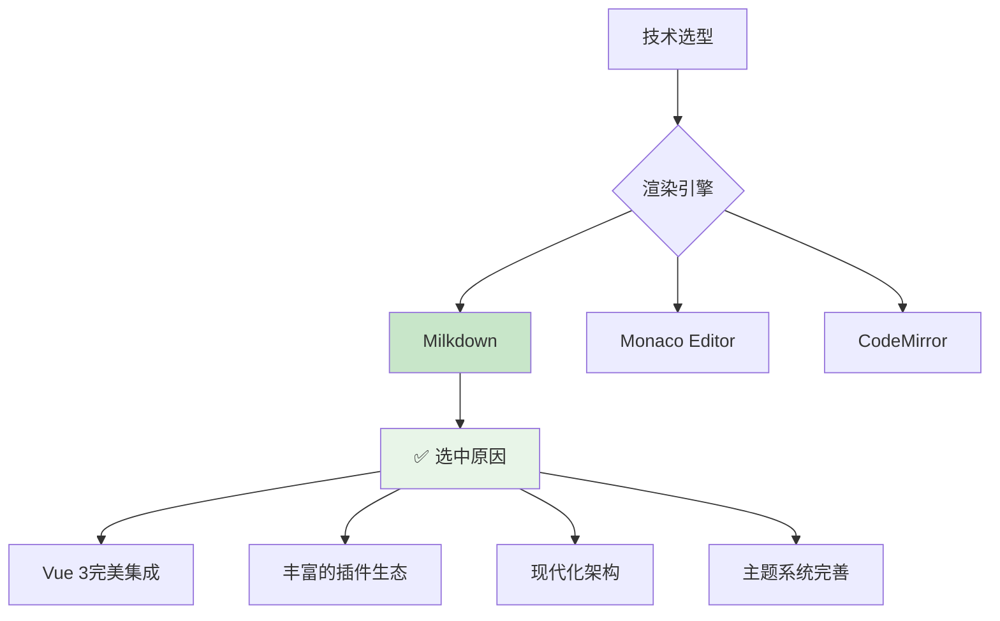
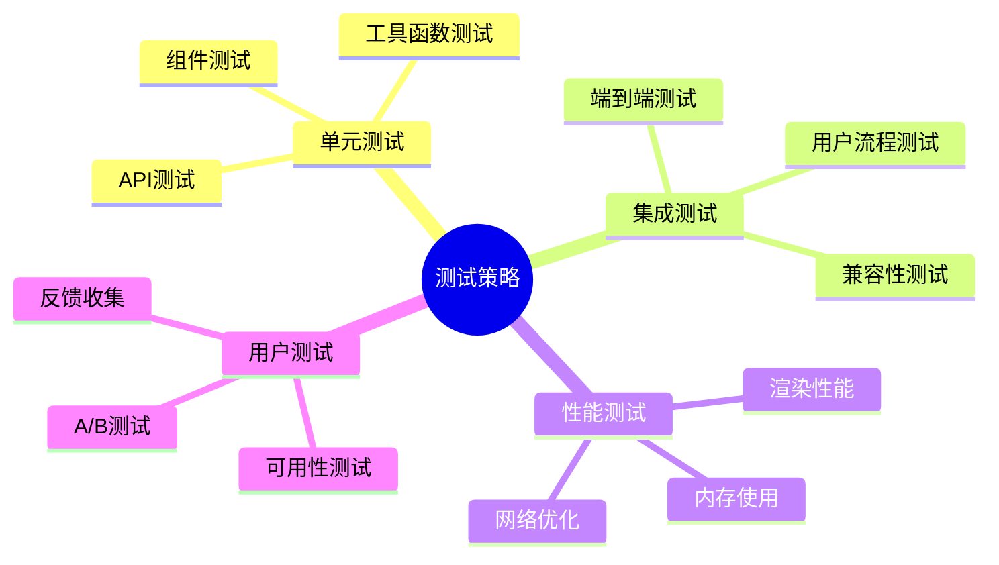
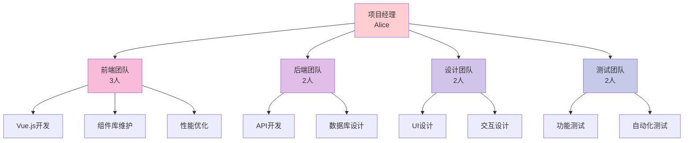
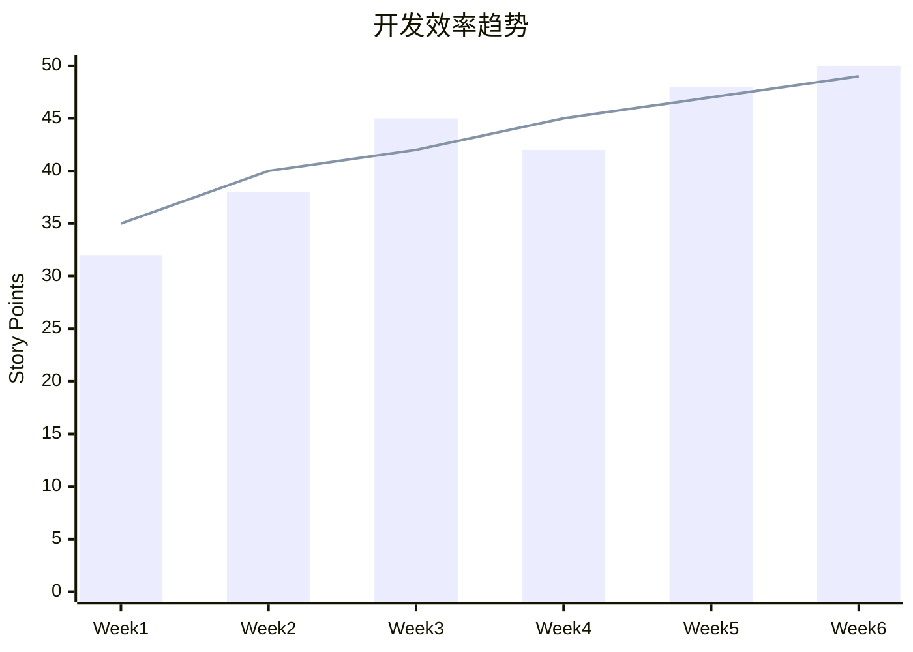
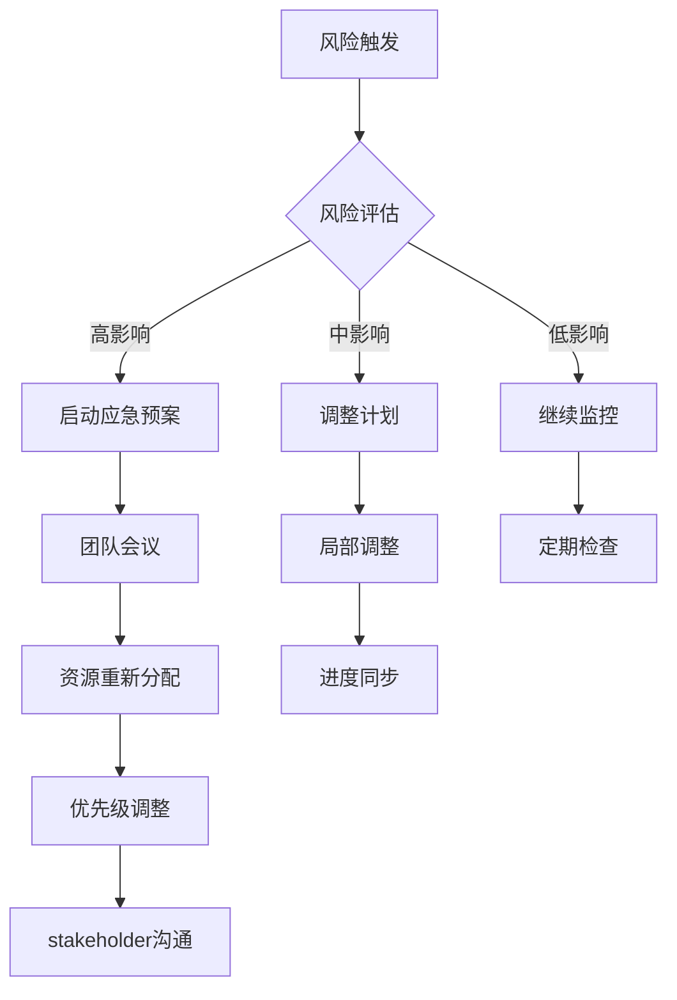

# Sprint规划 - 2025年Q1

> 📅 **规划周期**: 2025年第一季度 (1月-3月)  
> 👥 **参与团队**: 前端、后端、设计、测试  
> 🎯 **主要目标**: Markdown渲染优化、用户体验提升

## 📋 Sprint概览

## 🎯 季度目标

### 核心目标 (Must Have)

- [x] ✅ **Markdown渲染模块** - 基于Milkdown的完整渲染引擎
- [x] ✅ **可拖动分隔栏** - 终端和预览窗口大小调整
- [x] ✅ **Token失效处理** - 自动重定向到登录页面
- [ ] 🔄 **多格式预览** - 支持MD、JSON、HTML、PDF等
- [ ] 📱 **移动端优化** - 响应式设计和触控操作
- [ ] 🎨 **主题系统** - 多主题切换和自定义

### 扩展目标 (Nice to Have)

- [ ] 🤖 **AI辅助编辑** - 智能补全和语法建议
- [ ] 🔍 **全文搜索** - Elasticsearch集成
- [ ] 📊 **使用分析** - 用户行为数据收集
- [ ] 🌐 **国际化** - 多语言支持
- [ ] 🔗 **协作功能** - 实时编辑和评论

## 📅 Sprint详细规划

### Sprint 1: 基础功能开发 (1月1日-14日)

::: tip Sprint目标
建立核心的Markdown渲染能力和基础UI组件
:::

#### 开发任务

| 任务 | 负责人 | 状态 | 优先级 | 预估工时 |
|------|--------|------|--------|----------|
| Milkdown核心配置 | Alice | ✅ 完成 | P0 | 16h |
| 主题样式设计 | Design团队 | ✅ 完成 | P0 | 12h |
| Vue组件封装 | Frontend | ✅ 完成 | P0 | 20h |
| 工具函数开发 | Alice | ✅ 完成 | P1 | 8h |
| 单元测试编写 | QA | ✅ 完成 | P1 | 12h |

#### 技术决策

#### Sprint回顾

**完成情况**: 100% ✅

**亮点**:
- Milkdown集成顺利，渲染效果超出预期
- 主题设计与项目风格高度一致
- 组件API设计清晰，易于使用

**遇到的问题**:
- 初期对Milkdown插件机制理解不足，花费了额外时间
- TypeScript类型定义需要完善

**改进措施**:
- 加强新技术的前期调研
- 建立技术文档共享机制

### Sprint 2: 集成和性能优化 (1月15日-28日)

::: warning 当前Sprint
正在进行中...
:::

#### 开发任务

| 任务 | 负责人 | 状态 | 优先级 | 预估工时 |
|------|--------|------|--------|----------|
| 集成到预览系统 | Frontend | 🔄 进行中 | P0 | 24h |
| 性能优化 | Alice | 📋 待开始 | P0 | 16h |
| 错误处理增强 | Backend | 📋 待开始 | P1 | 12h |
| 用户体验优化 | UX团队 | 📋 待开始 | P1 | 16h |
| 集成测试 | QA | 📋 待开始 | P1 | 20h |

#### 技术挑战

1. **大文件渲染性能** 
   - 虚拟滚动实现
   - 分块加载策略
   - 内存管理优化

2. **复杂内容渲染**
   - Mermaid图表渲染时间
   - 数学公式计算开销
   - 代码高亮性能

3. **兼容性问题**
   - 不同浏览器的差异
   - 移动端适配
   - 低端设备优化

### Sprint 3: 测试和调优 (1月29日-2月11日)

#### 测试计划

#### 测试用例设计

| 测试场景 | 用例数量 | 覆盖率目标 | 负责团队 |
|----------|----------|------------|----------|
| 基础Markdown渲染 | 25 | 95% | QA |
| 高级功能(图表/公式) | 15 | 90% | QA + Dev |
| 性能测试 | 10 | - | Performance |
| 兼容性测试 | 20 | 85% | QA |
| 用户体验测试 | 8 | - | UX |

## 👥 团队协作

### 团队结构

### 沟通机制

| 会议类型 | 频率 | 参与人 | 目的 |
|----------|------|--------|------|
| **Stand-up** | 每日 | 全体开发 | 进度同步 |
| **Sprint规划** | 每两周 | 全团队 | 任务规划 |
| **技术评审** | 按需 | 技术团队 | 方案评审 |
| **产品评审** | 每周 | PM + 核心团队 | 产品决策 |
| **回顾会议** | 每Sprint | 全团队 | 持续改进 |

## 📊 关键指标 (KPI)

### 开发效率指标

| 指标 | 目标值 | 当前值 | 趋势 |
|------|--------|--------|------|
| **Sprint完成率** | >90% | 95% | ↗️ |
| **Bug修复时间** | <2天 | 1.5天 | ↗️ |
| **代码覆盖率** | >85% | 88% | ↗️ |
| **用户满意度** | >4.5/5 | 4.6/5 | ↗️ |
| **页面加载时间** | <2秒 | 1.8秒 | ↗️ |

### 质量指标

- **代码质量**: SonarQube评分 > A级
- **性能指标**: Core Web Vitals全绿
- **安全扫描**: 零高危漏洞
- **文档完整性**: 100%API文档覆盖

## 🔄 风险管理

### 识别的风险

| 风险 | 概率 | 影响 | 应对策略 | 负责人 |
|------|------|------|----------|--------|
| **技术选型风险** | 低 | 高 | 技术POC验证 | Alice |
| **性能问题** | 中 | 高 | 早期性能测试 | 全团队 |
| **资源不足** | 中 | 中 | 优先级调整 | PM |
| **第三方依赖** | 低 | 中 | 备选方案准备 | 架构师 |
| **用户接受度** | 低 | 高 | 用户测试反馈 | UX |

### 应急预案

## 📈 成功标准

### 技术成功标准

- [x] ✅ **Markdown渲染正确性** - 100%语法支持
- [x] ✅ **性能基准** - 大文件(<10MB)渲染<3秒
- [ ] 🔄 **浏览器兼容性** - Chrome/Firefox/Safari/Edge
- [ ] 📋 **移动端适配** - 完整的触控支持
- [ ] 📋 **无障碍性** - WCAG 2.1 AA级别

### 业务成功标准

- [ ] 📊 **用户活跃度** - DAU增长20%
- [ ] 🎯 **功能使用率** - Markdown预览使用率>60%
- [ ] 😊 **用户满意度** - 问卷调查评分>4.5/5
- [ ] 🐛 **故障率** - 生产环境Bug<0.1%
- [ ] ⚡ **性能指标** - 页面加载时间<2秒

## 📝 会议记录

### Sprint启动会议 (2025-01-08)

**参会人员**: Alice, 前端团队, 后端团队, 设计团队

**会议要点**:
1. 确认Q1目标和优先级
2. 技术栈最终确认：Milkdown + Vue 3
3. 设计规范统一：Fluent Design风格
4. 开发环境配置标准化

**决策事项**:
- ✅ 采用Milkdown作为核心渲染引擎
- ✅ 优先开发桌面端，后续适配移动端
- ✅ 建立代码评审流程
- ✅ 每周五进行技术分享

**行动项**:
- [ ] Alice：完成技术架构文档 (1月12日前)
- [ ] 前端：搭建开发环境 (1月10日前)
- [ ] 设计：完成组件设计稿 (1月15日前)

### 技术评审会议 (2025-01-10)

**主题**: Markdown模块架构评审

**评审内容**:
- ✅ 模块结构设计
- ✅ API接口设计
- ✅ 性能优化方案
- ✅ 错误处理机制

**评审结果**: **通过** ✅

**反馈意见**:
- 建议增加内容缓存机制
- 考虑离线模式支持
- 加强错误边界处理

## 🎉 里程碑庆祝

### 已完成里程碑

| 里程碑 | 完成日期 | 庆祝方式 |
|--------|----------|----------|
| **技术选型完成** | 2025-01-05 | 🍕 团队聚餐 |
| **MVP开发完成** | 2025-01-14 | 🎊 Sprint庆祝 |
| **第一个MD文件渲染** | 2025-01-10 | 🥳 代码分享会 |

### 即将到来的里程碑

- **🚀 Alpha版本发布** (2025-02-15)
- **📱 移动端适配完成** (2025-02-28)
- **🎯 Q1目标达成** (2025-03-31)

---

## 📞 联系信息

**Scrum Master**: Alice Chen  
**产品经理**: Product Team  
**技术负责人**: Alice Chen  

**更新频率**: 每周更新  
**下次Sprint规划**: 2025-01-22  

::: info 备注
本文档是动态文档，随着项目进展持续更新。团队成员如有建议或问题，请及时在项目群中讨论。
:::