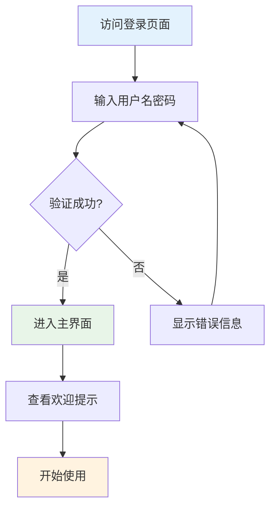
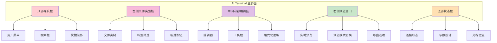
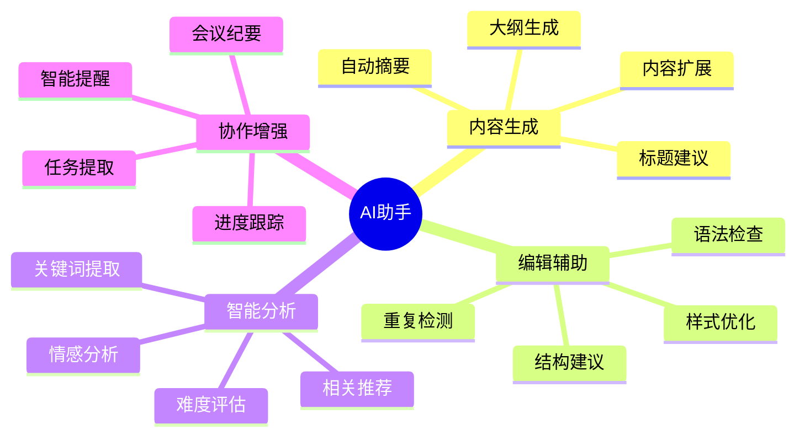
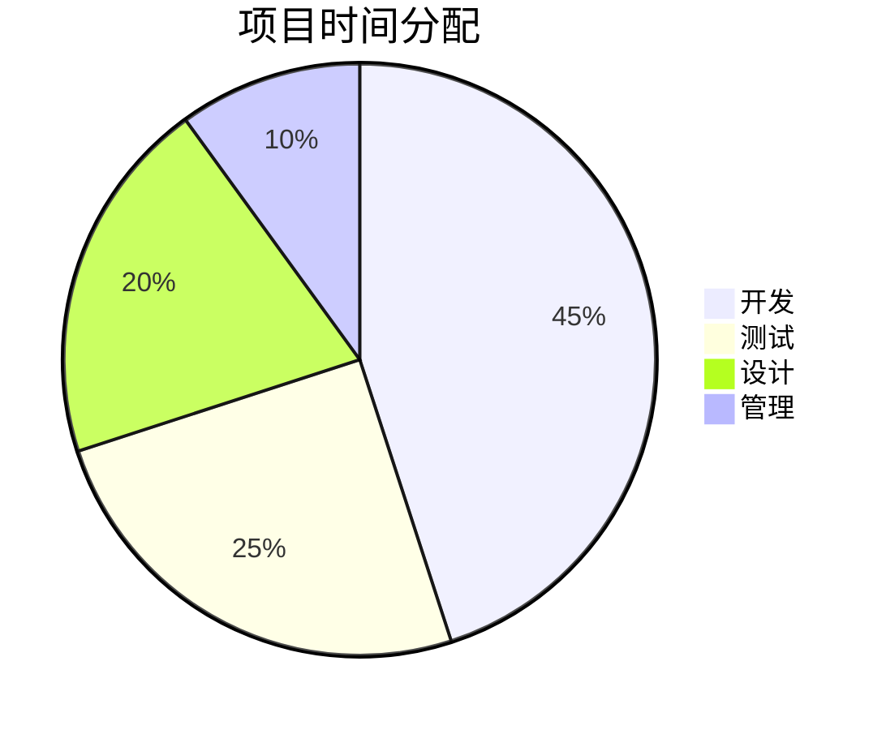
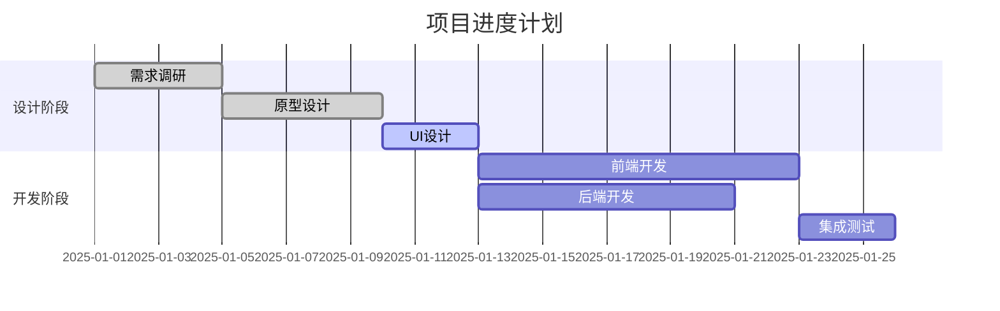
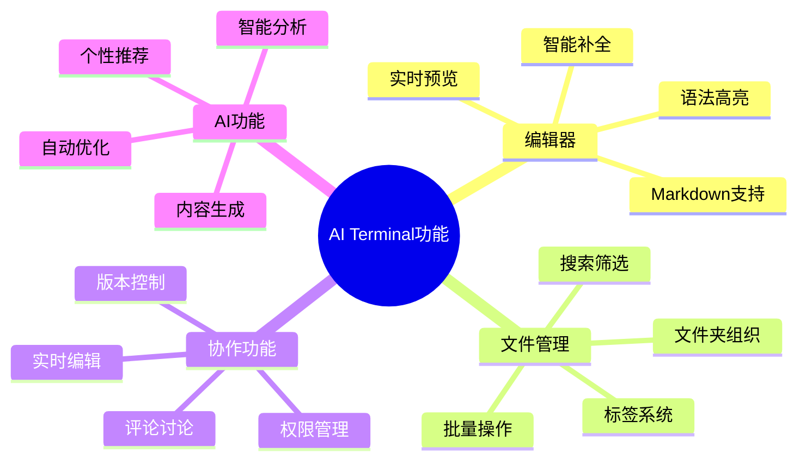
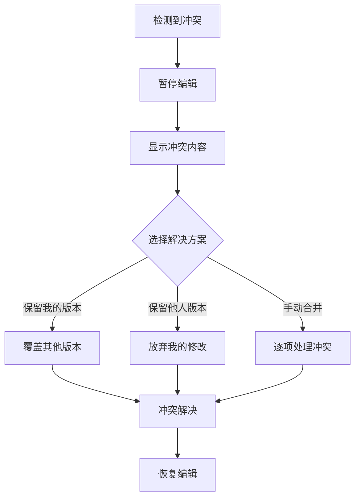
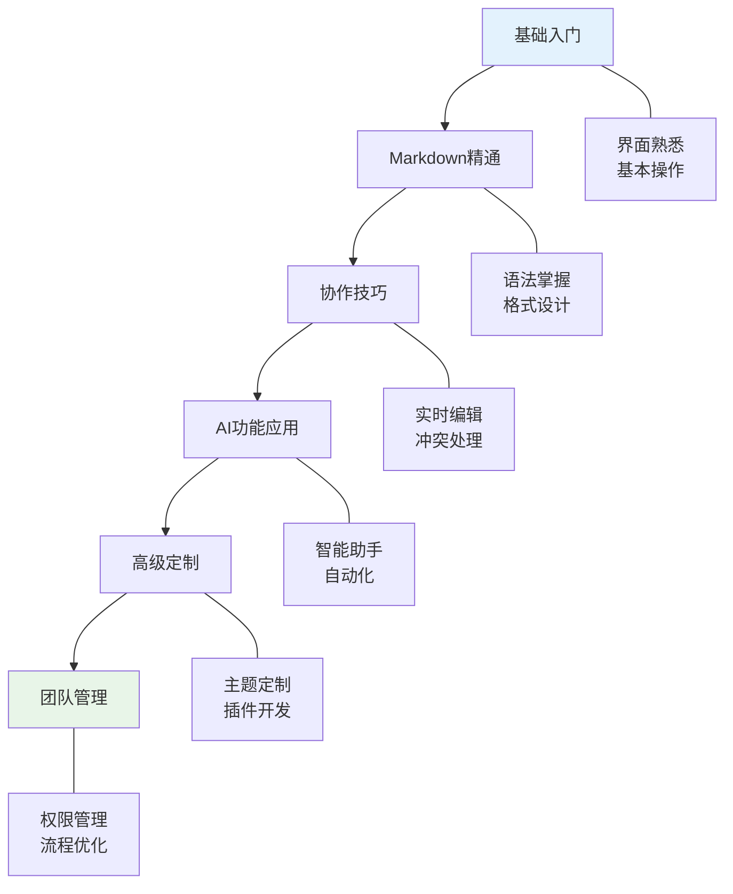
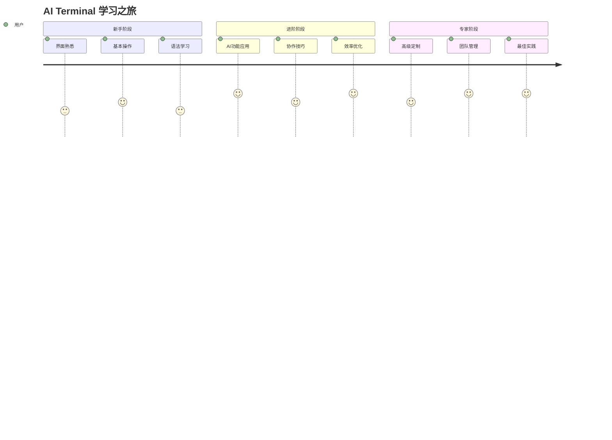

# AI Terminal 新手入门指南

> 🚀 **欢迎使用AI Terminal!**  
> 📖 **文档版本**: v3.9.8  
> 🎯 **适用对象**: 新用户、初学者  
> ⏱️ **预计阅读时间**: 15分钟

## 📋 目录索引

- [快速开始](#快速开始)
- [界面介绍](#界面介绍)
- [基本操作](#基本操作)
- [高级功能](#高级功能)
- [常见问题](#常见问题)
- [进阶学习](#进阶学习)

## 🚀 快速开始

### 系统要求

| 项目 | 最低要求 | 推荐配置 |
|------|----------|----------|
| **浏览器** | Chrome 90+ | Chrome/Edge 最新版 |
| **内存** | 4GB RAM | 8GB+ RAM |
| **网络** | 2Mbps | 10Mbps+ |
| **分辨率** | 1366x768 | 1920x1080+ |

### 第一次登录



#### 登录步骤

1. **打开AI Terminal**
   ```
   https://your-domain.com/login
   ```

2. **输入凭据**
   - 用户名: 您的注册邮箱或用户名
   - 密码: 设置的安全密码
   - 选择"记住我"(可选)

3. **首次登录设置**
   - 选择界面主题
   - 设置工作区布局
   - 配置通知偏好

## 🖥️ 界面介绍

### 主界面布局



### 核心功能区域

#### 🗂️ 文件夹管理区
- **文件夹树**: 层级显示所有文件夹
- **快速筛选**: 按标签、日期、类型筛选
- **批量操作**: 多选、移动、删除

#### ✏️ 编辑区域
- **富文本编辑**: 支持Markdown语法
- **智能提示**: 实时语法检查
- **快捷插入**: 表格、代码块、图片

#### 👁️ 预览窗口
- **实时预览**: 编辑即时生效
- **多种格式**: HTML、PDF、演示文稿
- **响应式设计**: 适配各种屏幕

## 📝 基本操作

### 创建您的第一个文档

#### 1. 新建文件夹

```markdown
📁 我的项目笔记/
├── 📄 项目概述.md
├── 📄 技术调研.md
└── 📄 会议记录.md
```

**操作步骤**:
1. 点击左侧面板的 **"+ 新建文件夹"** 按钮
2. 输入文件夹名称: `我的项目笔记`
3. 选择颜色标签: 蓝色 🔵
4. 添加描述: `项目相关的所有文档`
5. 点击 **"创建"** 确认

#### 2. 新建文档

**快捷方式**:
- 键盘快捷键: `Ctrl + N` (Windows/Linux) 或 `Cmd + N` (Mac)
- 右键菜单: 在文件夹上右键选择"新建文档"
- 快捷按钮: 点击工具栏的"新建"图标

**文档模板选择**:

| 模板类型 | 适用场景 | 包含元素 |
|----------|----------|----------|
| **📋 会议记录** | 会议、讨论 | 议程、参与者、行动项 |
| **📊 项目报告** | 项目汇报 | 摘要、进展、图表 |
| **📚 学习笔记** | 知识整理 | 大纲、重点、练习 |
| **🎯 任务清单** | 任务管理 | 清单、优先级、截止日期 |
| **📖 技术文档** | 技术说明 | 代码块、API、示例 |

#### 3. Markdown 语法快速入门

**基础语法**:

```markdown
# 一级标题
## 二级标题
### 三级标题

**粗体文本**
*斜体文本*
~~删除线~~

- 无序列表项1
- 无序列表项2
  - 嵌套列表项

1. 有序列表项1
2. 有序列表项2

[链接文本](https://example.com)


`行内代码`

\```javascript
// 代码块
function hello() {
  console.log("Hello, World!");
}
\```
```

**高级语法**:

````markdown
| 表头1 | 表头2 | 表头3 |
|-------|-------|-------|
| 单元格1 | 单元格2 | 单元格3 |

> 引用文本
> 可以多行

::: tip 提示
这是一个提示框
:::

::: warning 警告
这是一个警告框
:::


````

### 文档编辑技巧

#### 🎯 编辑器功能

**1. 智能补全**
- 输入 `#` 自动提示标题级别
- 输入 `[]` 自动创建复选框
- 输入 `|` 开始表格创建向导

**2. 快捷操作**

| 快捷键 | 功能 | 描述 |
|--------|------|------|
| `Ctrl + B` | **加粗** | 选中文本加粗 |
| `Ctrl + I` | *斜体* | 选中文本斜体 |
| `Ctrl + K` | 插入链接 | 创建超链接 |
| `Ctrl + Shift + C` | 代码块 | 插入代码块 |
| `Ctrl + /` | 注释切换 | 添加/移除注释 |
| `Alt + ↑/↓` | 移动行 | 上下移动当前行 |

**3. 实时协作**
```mermaid
sequenceNote
    participant A as 用户A
    participant S as 服务器
    participant B as 用户B
    
    A->>S: 编辑文档
    S->>B: 实时同步
    B->>S: 添加评论
    S->>A: 推送评论
    A->>S: 回复评论
    S->>B: 更新讨论
```

### 文件管理

#### 🗂️ 组织策略

**推荐的文件夹结构**:

```
📁 工作区/
├── 📁 项目管理/
│   ├── 📄 项目A计划.md
│   ├── 📄 项目B进展.md
│   └── 📁 会议记录/
├── 📁 学习笔记/
│   ├── 📄 技术文档.md
│   ├── 📄 课程笔记.md
│   └── 📁 参考资料/
├── 📁 个人笔记/
│   ├── 📄 想法收集.md
│   ├── 📄 读书笔记.md
│   └── 📄 计划清单.md
└── 📁 模板库/
    ├── 📄 会议记录模板.md
    ├── 📄 项目报告模板.md
    └── 📄 学习笔记模板.md
```

**标签系统**:
- 🔴 **紧急**: 需要立即处理的内容
- 🟡 **重要**: 重要但不紧急的内容
- 🟢 **完成**: 已经完成的任务
- 🔵 **参考**: 参考资料和文档
- 🟣 **模板**: 可复用的模板文件

## 🎛️ 高级功能

### AI 智能助手

#### 🤖 AI 功能概览



#### 使用AI助手

**1. 内容生成**

```markdown
# 示例：使用AI生成会议大纲

输入提示: "为产品规划会议生成大纲"

AI生成结果:
## 产品规划会议大纲
1. 会议开场 (5分钟)
2. 上季度回顾 (15分钟)
3. 市场分析 (20分钟)
4. 新功能讨论 (30分钟)
5. 资源分配 (15分钟)
6. 时间线确定 (10分钟)
7. 行动项总结 (5分钟)
```

**2. 智能编辑**
- **语法检查**: 自动检测拼写和语法错误
- **风格建议**: 提供写作风格改进建议
- **结构优化**: 分析文档结构并提供优化建议

**3. 内容分析**
- **关键词提取**: 自动识别文档的核心关键词
- **摘要生成**: 为长文档生成简洁摘要
- **相关推荐**: 推荐相关的文档和资源

### 数据可视化

#### 📊 图表类型

**1. 基础图表**




**2. 高级图表**



**3. 思维导图**



### 导出和分享

#### 📤 导出格式

| 格式 | 用途 | 特点 |
|------|------|------|
| **PDF** | 文档分享、打印 | 格式固定、跨平台兼容 |
| **HTML** | 网页发布 | 交互性强、样式丰富 |
| **Word** | 办公协作 | 编辑友好、格式兼容 |
| **演示文稿** | 会议演示 | 幻灯片模式、动画效果 |
| **图片** | 快速分享 | 预览方便、社交友好 |

#### 🔗 分享功能

**1. 链接分享**
```
分享链接: https://ai-terminal.com/share/abc123
访问权限: 仅查看 | 可评论 | 可编辑
有效期: 永久 | 7天 | 自定义
密码保护: 可选
```

**2. 嵌入代码**
```html
<iframe 
  src="https://ai-terminal.com/embed/abc123" 
  width="800" 
  height="600" 
  frameborder="0">
</iframe>
```

## ❓ 常见问题

### 🔧 技术问题

#### Q1: 页面加载缓慢怎么办？
**A**: 
1. **检查网络连接**: 确保网络稳定
2. **清除浏览器缓存**: Ctrl+Shift+Delete
3. **关闭不必要的标签页**: 释放内存资源
4. **检查浏览器版本**: 更新到最新版本

#### Q2: 文档保存失败？
**A**:
1. **检查网络状态**: 查看右下角连接指示器
2. **重新登录**: 可能是登录状态过期
3. **复制内容**: 先备份当前编辑内容
4. **联系支持**: 如问题持续，联系技术支持

#### Q3: 协作编辑出现冲突？
**A**:


### 📚 使用问题

#### Q4: 如何提高写作效率？
**A**:
1. **使用模板**: 创建常用的文档模板
2. **快捷键熟练**: 掌握常用快捷键
3. **AI辅助**: 利用AI功能辅助写作
4. **定期整理**: 保持良好的文件组织习惯

#### Q5: 团队协作最佳实践？
**A**:
- **明确分工**: 定义每个人的编辑区域
- **统一规范**: 制定文档格式标准
- **及时沟通**: 利用评论功能交流
- **版本管理**: 重要节点创建版本快照

## 🎓 进阶学习

### 学习路径



### 推荐资源

#### 📖 学习资料

| 资源类型 | 名称 | 描述 | 难度 |
|----------|------|------|------|
| **官方文档** | AI Terminal完整指南 | 全面的功能介绍 | ⭐⭐ |
| **视频教程** | 从入门到精通系列 | 分步操作演示 | ⭐⭐⭐ |
| **最佳实践** | 团队协作指南 | 实际案例分析 | ⭐⭐⭐⭐ |
| **高级技巧** | 自定义与扩展 | 深度定制方法 | ⭐⭐⭐⭐⭐ |

#### 🛠️ 实用工具

- **Markdown语法检查器**: 在线语法验证
- **颜色搭配工具**: 主题色彩选择
- **图标库**: 免费图标资源
- **模板库**: 社区共享模板

### 社区支持

#### 💬 获取帮助

1. **官方支持**
   - 📧 邮件: support@ai-terminal.com
   - 💬 在线客服: 工作日 9:00-18:00
   - 📞 电话: 400-888-9999

2. **社区论坛**
   - 🌐 用户论坛: https://community.ai-terminal.com
   - 💡 功能建议: 提交新功能想法
   - 🐛 问题反馈: 报告使用问题

3. **学习交流**
   - 👥 QQ群: 123456789
   - 📱 微信群: 扫码加入
   - 🎯 定期培训: 每月线上培训

---

## 🎯 总结

### 核心要点

::: tip 快速上手要点
- ✅ **界面熟悉**: 了解各功能区域布局
- ✅ **基本操作**: 掌握文档创建和编辑
- ✅ **Markdown语法**: 学会基础格式化
- ✅ **AI助手**: 利用智能功能提升效率
- ✅ **协作功能**: 学会团队协作技巧
:::

### 下一步建议

1. **立即开始**: 创建您的第一个文档
2. **探索功能**: 尝试使用AI助手和协作功能
3. **建立习惯**: 养成良好的文件组织习惯
4. **深入学习**: 根据需要学习高级功能

**学习进度跟踪**:
- [ ] 完成首次登录和基本设置
- [ ] 创建第一个文档和文件夹
- [ ] 掌握Markdown基础语法
- [ ] 尝试使用AI助手功能
- [ ] 体验协作编辑功能
- [ ] 完成文档导出和分享

### 技能提升路径



**持续学习建议**:
- 💡 关注产品更新和新功能
- 🤝 参与社区讨论和经验分享
- 📈 定期评估和优化工作流程
- 🎯 设定学习目标并跟踪进度

---

**文档信息**:
- 📝 **最后更新**: 2025-01-10
- 👤 **维护者**: AI Terminal 产品团队
- 📞 **联系方式**: docs@ai-terminal.com

::: info 欢迎反馈
如果您发现本指南有任何问题或建议，请通过邮件或社区论坛告诉我们。您的反馈将帮助我们持续改进文档质量。
:::