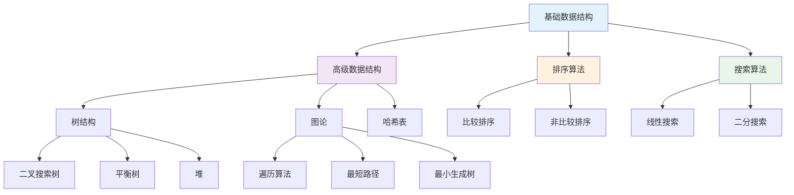
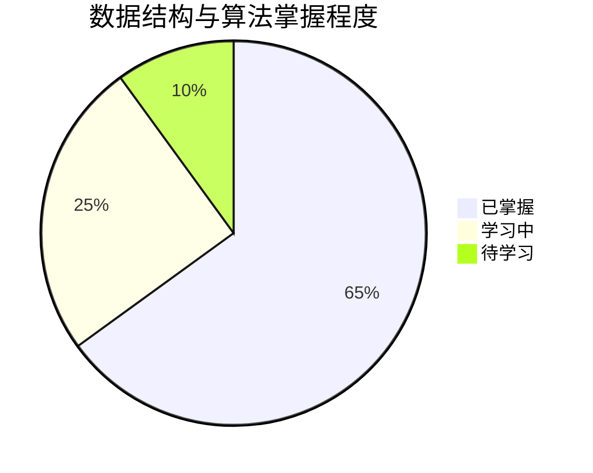

# 数据结构与算法学习笔记

> 📊 **学科**: 计算机科学基础  
> 🎯 **目标**: 掌握核心数据结构和算法  
> 📚 **教材**: 算法导论 + LeetCode实战  
> ⏰ **学习周期**: 4周密集训练

## 🎯 学习路线图



## 📚 基础数据结构

### 1. 数组 (Array)

#### 动态数组实现

```javascript
class DynamicArray {
  constructor(initialCapacity = 2) {
    this.data = new Array(initialCapacity);
    this.size = 0;
    this.capacity = initialCapacity;
  }
  
  // 获取元素
  get(index) {
    if (index < 0 || index >= this.size) {
      throw new Error('Index out of bounds');
    }
    return this.data[index];
  }
  
  // 设置元素
  set(index, value) {
    if (index < 0 || index >= this.size) {
      throw new Error('Index out of bounds');
    }
    this.data[index] = value;
  }
  
  // 添加元素
  push(value) {
    if (this.size >= this.capacity) {
      this._resize();
    }
    this.data[this.size] = value;
    this.size++;
  }
  
  // 删除最后一个元素
  pop() {
    if (this.size === 0) {
      throw new Error('Array is empty');
    }
    const value = this.data[this.size - 1];
    this.size--;
    
    // 缩容优化
    if (this.size <= this.capacity / 4) {
      this._resize(this.capacity / 2);
    }
    
    return value;
  }
  
  // 在指定位置插入
  insert(index, value) {
    if (index < 0 || index > this.size) {
      throw new Error('Index out of bounds');
    }
    
    if (this.size >= this.capacity) {
      this._resize();
    }
    
    // 移动元素
    for (let i = this.size; i > index; i--) {
      this.data[i] = this.data[i - 1];
    }
    
    this.data[index] = value;
    this.size++;
  }
  
  // 删除指定位置元素
  removeAt(index) {
    if (index < 0 || index >= this.size) {
      throw new Error('Index out of bounds');
    }
    
    const value = this.data[index];
    
    // 移动元素
    for (let i = index; i < this.size - 1; i++) {
      this.data[i] = this.data[i + 1];
    }
    
    this.size--;
    
    if (this.size <= this.capacity / 4) {
      this._resize(this.capacity / 2);
    }
    
    return value;
  }
  
  // 扩容/缩容
  _resize(newCapacity = this.capacity * 2) {
    const newData = new Array(newCapacity);
    for (let i = 0; i < this.size; i++) {
      newData[i] = this.data[i];
    }
    this.data = newData;
    this.capacity = newCapacity;
  }
  
  // 获取大小
  getSize() {
    return this.size;
  }
  
  // 是否为空
  isEmpty() {
    return this.size === 0;
  }
  
  // 转换为普通数组
  toArray() {
    const result = new Array(this.size);
    for (let i = 0; i < this.size; i++) {
      result[i] = this.data[i];
    }
    return result;
  }
}

// 使用示例和性能测试
const dynamicArray = new DynamicArray();

// 性能测试
console.time('Dynamic Array Operations');
for (let i = 0; i < 10000; i++) {
  dynamicArray.push(i);
}
console.timeEnd('Dynamic Array Operations');

console.log('Size:', dynamicArray.getSize());
console.log('First 10 elements:', dynamicArray.toArray().slice(0, 10));
```

### 2. 链表 (Linked List)

#### 单向链表实现

```javascript
class ListNode {
  constructor(val = 0, next = null) {
    this.val = val;
    this.next = next;
  }
}

class LinkedList {
  constructor() {
    this.head = null;
    this.size = 0;
  }
  
  // 在头部添加
  prepend(val) {
    const newNode = new ListNode(val, this.head);
    this.head = newNode;
    this.size++;
  }
  
  // 在尾部添加
  append(val) {
    const newNode = new ListNode(val);
    
    if (!this.head) {
      this.head = newNode;
    } else {
      let current = this.head;
      while (current.next) {
        current = current.next;
      }
      current.next = newNode;
    }
    this.size++;
  }
  
  // 在指定位置插入
  insertAt(index, val) {
    if (index < 0 || index > this.size) {
      throw new Error('Index out of bounds');
    }
    
    if (index === 0) {
      this.prepend(val);
      return;
    }
    
    const newNode = new ListNode(val);
    let current = this.head;
    
    for (let i = 0; i < index - 1; i++) {
      current = current.next;
    }
    
    newNode.next = current.next;
    current.next = newNode;
    this.size++;
  }
  
  // 删除指定值的节点
  remove(val) {
    if (!this.head) return false;
    
    if (this.head.val === val) {
      this.head = this.head.next;
      this.size--;
      return true;
    }
    
    let current = this.head;
    while (current.next && current.next.val !== val) {
      current = current.next;
    }
    
    if (current.next) {
      current.next = current.next.next;
      this.size--;
      return true;
    }
    
    return false;
  }
  
  // 查找元素
  find(val) {
    let current = this.head;
    let index = 0;
    
    while (current) {
      if (current.val === val) {
        return index;
      }
      current = current.next;
      index++;
    }
    
    return -1;
  }
  
  // 获取指定位置的元素
  get(index) {
    if (index < 0 || index >= this.size) {
      throw new Error('Index out of bounds');
    }
    
    let current = this.head;
    for (let i = 0; i < index; i++) {
      current = current.next;
    }
    
    return current.val;
  }
  
  // 反转链表
  reverse() {
    let prev = null;
    let current = this.head;
    
    while (current) {
      const next = current.next;
      current.next = prev;
      prev = current;
      current = next;
    }
    
    this.head = prev;
  }
  
  // 转换为数组
  toArray() {
    const result = [];
    let current = this.head;
    
    while (current) {
      result.push(current.val);
      current = current.next;
    }
    
    return result;
  }
  
  getSize() {
    return this.size;
  }
  
  isEmpty() {
    return this.size === 0;
  }
}
```

#### 双向链表实现

```javascript
class DoublyListNode {
  constructor(val = 0, prev = null, next = null) {
    this.val = val;
    this.prev = prev;
    this.next = next;
  }
}

class DoublyLinkedList {
  constructor() {
    // 使用哨兵节点简化操作
    this.head = new DoublyListNode();
    this.tail = new DoublyListNode();
    this.head.next = this.tail;
    this.tail.prev = this.head;
    this.size = 0;
  }
  
  // 在指定节点前插入
  _insertBefore(node, val) {
    const newNode = new DoublyListNode(val, node.prev, node);
    node.prev.next = newNode;
    node.prev = newNode;
    this.size++;
    return newNode;
  }
  
  // 删除指定节点
  _removeNode(node) {
    node.prev.next = node.next;
    node.next.prev = node.prev;
    this.size--;
    return node.val;
  }
  
  // 在头部添加
  prepend(val) {
    return this._insertBefore(this.head.next, val);
  }
  
  // 在尾部添加
  append(val) {
    return this._insertBefore(this.tail, val);
  }
  
  // 删除头部元素
  removeFirst() {
    if (this.isEmpty()) {
      throw new Error('List is empty');
    }
    return this._removeNode(this.head.next);
  }
  
  // 删除尾部元素
  removeLast() {
    if (this.isEmpty()) {
      throw new Error('List is empty');
    }
    return this._removeNode(this.tail.prev);
  }
  
  getSize() {
    return this.size;
  }
  
  isEmpty() {
    return this.size === 0;
  }
}
```

### 3. 栈 (Stack)

```javascript
class Stack {
  constructor() {
    this.items = [];
  }
  
  // 入栈
  push(element) {
    this.items.push(element);
  }
  
  // 出栈
  pop() {
    if (this.isEmpty()) {
      throw new Error('Stack is empty');
    }
    return this.items.pop();
  }
  
  // 查看栈顶元素
  peek() {
    if (this.isEmpty()) {
      throw new Error('Stack is empty');
    }
    return this.items[this.items.length - 1];
  }
  
  // 检查是否为空
  isEmpty() {
    return this.items.length === 0;
  }
  
  // 获取大小
  size() {
    return this.items.length;
  }
  
  // 清空栈
  clear() {
    this.items = [];
  }
  
  // 转换为数组
  toArray() {
    return [...this.items];
  }
}

// 栈的应用：括号匹配
function isValidParentheses(s) {
  const stack = new Stack();
  const pairs = { '(': ')', '[': ']', '{': '}' };
  
  for (const char of s) {
    if (pairs[char]) {
      // 左括号入栈
      stack.push(char);
    } else if (Object.values(pairs).includes(char)) {
      // 右括号检查匹配
      if (stack.isEmpty() || pairs[stack.pop()] !== char) {
        return false;
      }
    }
  }
  
  return stack.isEmpty();
}

// 测试
console.log(isValidParentheses("()")); // true
console.log(isValidParentheses("()[]{}")); // true
console.log(isValidParentheses("(]")); // false
```

### 4. 队列 (Queue)

```javascript
class Queue {
  constructor() {
    this.items = [];
    this.front = 0;
    this.rear = 0;
  }
  
  // 入队
  enqueue(element) {
    this.items[this.rear] = element;
    this.rear++;
  }
  
  // 出队
  dequeue() {
    if (this.isEmpty()) {
      throw new Error('Queue is empty');
    }
    
    const element = this.items[this.front];
    delete this.items[this.front];
    this.front++;
    
    // 优化：当队列为空时重置指针
    if (this.front === this.rear) {
      this.front = 0;
      this.rear = 0;
    }
    
    return element;
  }
  
  // 查看队首元素
  peek() {
    if (this.isEmpty()) {
      throw new Error('Queue is empty');
    }
    return this.items[this.front];
  }
  
  // 检查是否为空
  isEmpty() {
    return this.front === this.rear;
  }
  
  // 获取大小
  size() {
    return this.rear - this.front;
  }
  
  // 清空队列
  clear() {
    this.items = [];
    this.front = 0;
    this.rear = 0;
  }
}

// 循环队列实现
class CircularQueue {
  constructor(capacity) {
    this.items = new Array(capacity);
    this.capacity = capacity;
    this.front = 0;
    this.rear = 0;
    this.size = 0;
  }
  
  enqueue(element) {
    if (this.isFull()) {
      throw new Error('Queue is full');
    }
    
    this.items[this.rear] = element;
    this.rear = (this.rear + 1) % this.capacity;
    this.size++;
  }
  
  dequeue() {
    if (this.isEmpty()) {
      throw new Error('Queue is empty');
    }
    
    const element = this.items[this.front];
    this.front = (this.front + 1) % this.capacity;
    this.size--;
    
    return element;
  }
  
  isEmpty() {
    return this.size === 0;
  }
  
  isFull() {
    return this.size === this.capacity;
  }
  
  getSize() {
    return this.size;
  }
}
```

## 🌳 树结构

### 1. 二叉搜索树 (BST)

```javascript
class TreeNode {
  constructor(val = 0, left = null, right = null) {
    this.val = val;
    this.left = left;
    this.right = right;
  }
}

class BinarySearchTree {
  constructor() {
    this.root = null;
    this.size = 0;
  }
  
  // 插入节点
  insert(val) {
    this.root = this._insertNode(this.root, val);
    this.size++;
  }
  
  _insertNode(node, val) {
    if (!node) {
      return new TreeNode(val);
    }
    
    if (val < node.val) {
      node.left = this._insertNode(node.left, val);
    } else if (val > node.val) {
      node.right = this._insertNode(node.right, val);
    }
    // 相等的值不插入（避免重复）
    
    return node;
  }
  
  // 搜索节点
  search(val) {
    return this._searchNode(this.root, val);
  }
  
  _searchNode(node, val) {
    if (!node || node.val === val) {
      return node;
    }
    
    if (val < node.val) {
      return this._searchNode(node.left, val);
    } else {
      return this._searchNode(node.right, val);
    }
  }
  
  // 删除节点
  delete(val) {
    this.root = this._deleteNode(this.root, val);
    this.size--;
  }
  
  _deleteNode(node, val) {
    if (!node) return null;
    
    if (val < node.val) {
      node.left = this._deleteNode(node.left, val);
    } else if (val > node.val) {
      node.right = this._deleteNode(node.right, val);
    } else {
      // 找到要删除的节点
      
      // 情况1：叶子节点
      if (!node.left && !node.right) {
        return null;
      }
      
      // 情况2：只有一个子节点
      if (!node.left) return node.right;
      if (!node.right) return node.left;
      
      // 情况3：有两个子节点
      // 找到右子树中的最小值（中序后继）
      const minRight = this._findMin(node.right);
      node.val = minRight.val;
      node.right = this._deleteNode(node.right, minRight.val);
    }
    
    return node;
  }
  
  _findMin(node) {
    while (node.left) {
      node = node.left;
    }
    return node;
  }
  
  // 中序遍历（升序）
  inorderTraversal() {
    const result = [];
    this._inorder(this.root, result);
    return result;
  }
  
  _inorder(node, result) {
    if (node) {
      this._inorder(node.left, result);
      result.push(node.val);
      this._inorder(node.right, result);
    }
  }
  
  // 前序遍历
  preorderTraversal() {
    const result = [];
    this._preorder(this.root, result);
    return result;
  }
  
  _preorder(node, result) {
    if (node) {
      result.push(node.val);
      this._preorder(node.left, result);
      this._preorder(node.right, result);
    }
  }
  
  // 后序遍历
  postorderTraversal() {
    const result = [];
    this._postorder(this.root, result);
    return result;
  }
  
  _postorder(node, result) {
    if (node) {
      this._postorder(node.left, result);
      this._postorder(node.right, result);
      result.push(node.val);
    }
  }
  
  // 层序遍历（BFS）
  levelOrderTraversal() {
    if (!this.root) return [];
    
    const result = [];
    const queue = [this.root];
    
    while (queue.length > 0) {
      const levelSize = queue.length;
      const currentLevel = [];
      
      for (let i = 0; i < levelSize; i++) {
        const node = queue.shift();
        currentLevel.push(node.val);
        
        if (node.left) queue.push(node.left);
        if (node.right) queue.push(node.right);
      }
      
      result.push(currentLevel);
    }
    
    return result;
  }
  
  // 获取树的高度
  getHeight() {
    return this._getHeight(this.root);
  }
  
  _getHeight(node) {
    if (!node) return 0;
    
    const leftHeight = this._getHeight(node.left);
    const rightHeight = this._getHeight(node.right);
    
    return Math.max(leftHeight, rightHeight) + 1;
  }
  
  // 验证是否是有效的BST
  isValidBST() {
    return this._isValidBST(this.root, null, null);
  }
  
  _isValidBST(node, min, max) {
    if (!node) return true;
    
    if ((min !== null && node.val <= min) || 
        (max !== null && node.val >= max)) {
      return false;
    }
    
    return this._isValidBST(node.left, min, node.val) &&
           this._isValidBST(node.right, node.val, max);
  }
  
  getSize() {
    return this.size;
  }
  
  isEmpty() {
    return this.size === 0;
  }
}
```

### 2. 堆 (Heap)

```javascript
class MinHeap {
  constructor() {
    this.heap = [];
  }
  
  // 获取父节点索引
  _getParentIndex(index) {
    return Math.floor((index - 1) / 2);
  }
  
  // 获取左子节点索引
  _getLeftChildIndex(index) {
    return 2 * index + 1;
  }
  
  // 获取右子节点索引
  _getRightChildIndex(index) {
    return 2 * index + 2;
  }
  
  // 交换元素
  _swap(index1, index2) {
    [this.heap[index1], this.heap[index2]] = [this.heap[index2], this.heap[index1]];
  }
  
  // 上浮操作
  _heapifyUp() {
    let index = this.heap.length - 1;
    
    while (index > 0) {
      const parentIndex = this._getParentIndex(index);
      
      if (this.heap[parentIndex] <= this.heap[index]) {
        break;
      }
      
      this._swap(parentIndex, index);
      index = parentIndex;
    }
  }
  
  // 下沉操作
  _heapifyDown() {
    let index = 0;
    
    while (this._getLeftChildIndex(index) < this.heap.length) {
      let smallestChildIndex = this._getLeftChildIndex(index);
      const rightChildIndex = this._getRightChildIndex(index);
      
      if (rightChildIndex < this.heap.length &&
          this.heap[rightChildIndex] < this.heap[smallestChildIndex]) {
        smallestChildIndex = rightChildIndex;
      }
      
      if (this.heap[index] <= this.heap[smallestChildIndex]) {
        break;
      }
      
      this._swap(index, smallestChildIndex);
      index = smallestChildIndex;
    }
  }
  
  // 插入元素
  insert(value) {
    this.heap.push(value);
    this._heapifyUp();
  }
  
  // 提取最小值
  extractMin() {
    if (this.heap.length === 0) {
      throw new Error('Heap is empty');
    }
    
    if (this.heap.length === 1) {
      return this.heap.pop();
    }
    
    const min = this.heap[0];
    this.heap[0] = this.heap.pop();
    this._heapifyDown();
    
    return min;
  }
  
  // 查看最小值
  peek() {
    if (this.heap.length === 0) {
      throw new Error('Heap is empty');
    }
    return this.heap[0];
  }
  
  // 获取大小
  size() {
    return this.heap.length;
  }
  
  // 是否为空
  isEmpty() {
    return this.heap.length === 0;
  }
  
  // 构建堆（从数组）
  static buildHeap(array) {
    const heap = new MinHeap();
    heap.heap = [...array];
    
    // 从最后一个非叶子节点开始向上调整
    for (let i = Math.floor(array.length / 2) - 1; i >= 0; i--) {
      heap._heapifyDownFrom(i);
    }
    
    return heap;
  }
  
  _heapifyDownFrom(startIndex) {
    let index = startIndex;
    
    while (this._getLeftChildIndex(index) < this.heap.length) {
      let smallestChildIndex = this._getLeftChildIndex(index);
      const rightChildIndex = this._getRightChildIndex(index);
      
      if (rightChildIndex < this.heap.length &&
          this.heap[rightChildIndex] < this.heap[smallestChildIndex]) {
        smallestChildIndex = rightChildIndex;
      }
      
      if (this.heap[index] <= this.heap[smallestChildIndex]) {
        break;
      }
      
      this._swap(index, smallestChildIndex);
      index = smallestChildIndex;
    }
  }
}

// 优先队列实现
class PriorityQueue {
  constructor(compareFn = (a, b) => a.priority - b.priority) {
    this.heap = [];
    this.compare = compareFn;
  }
  
  _swap(i, j) {
    [this.heap[i], this.heap[j]] = [this.heap[j], this.heap[i]];
  }
  
  _heapifyUp() {
    let index = this.heap.length - 1;
    
    while (index > 0) {
      const parentIndex = Math.floor((index - 1) / 2);
      
      if (this.compare(this.heap[parentIndex], this.heap[index]) <= 0) {
        break;
      }
      
      this._swap(parentIndex, index);
      index = parentIndex;
    }
  }
  
  _heapifyDown() {
    let index = 0;
    
    while (2 * index + 1 < this.heap.length) {
      let smallestIndex = 2 * index + 1;
      const rightIndex = 2 * index + 2;
      
      if (rightIndex < this.heap.length &&
          this.compare(this.heap[rightIndex], this.heap[smallestIndex]) < 0) {
        smallestIndex = rightIndex;
      }
      
      if (this.compare(this.heap[index], this.heap[smallestIndex]) <= 0) {
        break;
      }
      
      this._swap(index, smallestIndex);
      index = smallestIndex;
    }
  }
  
  enqueue(item, priority) {
    this.heap.push({ item, priority });
    this._heapifyUp();
  }
  
  dequeue() {
    if (this.heap.length === 0) {
      throw new Error('Priority queue is empty');
    }
    
    if (this.heap.length === 1) {
      return this.heap.pop().item;
    }
    
    const result = this.heap[0].item;
    this.heap[0] = this.heap.pop();
    this._heapifyDown();
    
    return result;
  }
  
  peek() {
    if (this.heap.length === 0) {
      throw new Error('Priority queue is empty');
    }
    return this.heap[0].item;
  }
  
  size() {
    return this.heap.length;
  }
  
  isEmpty() {
    return this.heap.length === 0;
  }
}
```

## 🔍 排序算法

### 时间复杂度对比

| 算法 | 最好 | 平均 | 最坏 | 空间复杂度 | 稳定性 |
|------|------|------|------|------------|--------|
| **冒泡排序** | O(n) | O(n²) | O(n²) | O(1) | ✅ 稳定 |
| **选择排序** | O(n²) | O(n²) | O(n²) | O(1) | ❌ 不稳定 |
| **插入排序** | O(n) | O(n²) | O(n²) | O(1) | ✅ 稳定 |
| **归并排序** | O(n log n) | O(n log n) | O(n log n) | O(n) | ✅ 稳定 |
| **快速排序** | O(n log n) | O(n log n) | O(n²) | O(log n) | ❌ 不稳定 |
| **堆排序** | O(n log n) | O(n log n) | O(n log n) | O(1) | ❌ 不稳定 |

### 排序算法实现

```javascript
class SortingAlgorithms {
  // 冒泡排序
  static bubbleSort(arr) {
    const n = arr.length;
    const result = [...arr];
    
    for (let i = 0; i < n - 1; i++) {
      let swapped = false;
      
      for (let j = 0; j < n - i - 1; j++) {
        if (result[j] > result[j + 1]) {
          [result[j], result[j + 1]] = [result[j + 1], result[j]];
          swapped = true;
        }
      }
      
      // 优化：如果没有交换，说明已经有序
      if (!swapped) break;
    }
    
    return result;
  }
  
  // 选择排序
  static selectionSort(arr) {
    const n = arr.length;
    const result = [...arr];
    
    for (let i = 0; i < n - 1; i++) {
      let minIndex = i;
      
      for (let j = i + 1; j < n; j++) {
        if (result[j] < result[minIndex]) {
          minIndex = j;
        }
      }
      
      if (minIndex !== i) {
        [result[i], result[minIndex]] = [result[minIndex], result[i]];
      }
    }
    
    return result;
  }
  
  // 插入排序
  static insertionSort(arr) {
    const result = [...arr];
    
    for (let i = 1; i < result.length; i++) {
      const current = result[i];
      let j = i - 1;
      
      while (j >= 0 && result[j] > current) {
        result[j + 1] = result[j];
        j--;
      }
      
      result[j + 1] = current;
    }
    
    return result;
  }
  
  // 归并排序
  static mergeSort(arr) {
    if (arr.length <= 1) return [...arr];
    
    const mid = Math.floor(arr.length / 2);
    const left = this.mergeSort(arr.slice(0, mid));
    const right = this.mergeSort(arr.slice(mid));
    
    return this._merge(left, right);
  }
  
  static _merge(left, right) {
    const result = [];
    let i = 0, j = 0;
    
    while (i < left.length && j < right.length) {
      if (left[i] <= right[j]) {
        result.push(left[i]);
        i++;
      } else {
        result.push(right[j]);
        j++;
      }
    }
    
    return result.concat(left.slice(i)).concat(right.slice(j));
  }
  
  // 快速排序
  static quickSort(arr) {
    if (arr.length <= 1) return [...arr];
    
    const result = [...arr];
    this._quickSortHelper(result, 0, result.length - 1);
    return result;
  }
  
  static _quickSortHelper(arr, low, high) {
    if (low < high) {
      const pivotIndex = this._partition(arr, low, high);
      this._quickSortHelper(arr, low, pivotIndex - 1);
      this._quickSortHelper(arr, pivotIndex + 1, high);
    }
  }
  
  static _partition(arr, low, high) {
    const pivot = arr[high];
    let i = low - 1;
    
    for (let j = low; j < high; j++) {
      if (arr[j] <= pivot) {
        i++;
        [arr[i], arr[j]] = [arr[j], arr[i]];
      }
    }
    
    [arr[i + 1], arr[high]] = [arr[high], arr[i + 1]];
    return i + 1;
  }
  
  // 堆排序
  static heapSort(arr) {
    const result = [...arr];
    const n = result.length;
    
    // 构建最大堆
    for (let i = Math.floor(n / 2) - 1; i >= 0; i--) {
      this._heapify(result, n, i);
    }
    
    // 依次取出堆顶元素
    for (let i = n - 1; i > 0; i--) {
      [result[0], result[i]] = [result[i], result[0]];
      this._heapify(result, i, 0);
    }
    
    return result;
  }
  
  static _heapify(arr, n, i) {
    let largest = i;
    const left = 2 * i + 1;
    const right = 2 * i + 2;
    
    if (left < n && arr[left] > arr[largest]) {
      largest = left;
    }
    
    if (right < n && arr[right] > arr[largest]) {
      largest = right;
    }
    
    if (largest !== i) {
      [arr[i], arr[largest]] = [arr[largest], arr[i]];
      this._heapify(arr, n, largest);
    }
  }
}

// 排序算法性能测试
function performanceBenchmark() {
  const sizes = [1000, 5000, 10000];
  const algorithms = {
    'Bubble Sort': SortingAlgorithms.bubbleSort,
    'Selection Sort': SortingAlgorithms.selectionSort,
    'Insertion Sort': SortingAlgorithms.insertionSort,
    'Merge Sort': SortingAlgorithms.mergeSort,
    'Quick Sort': SortingAlgorithms.quickSort,
    'Heap Sort': SortingAlgorithms.heapSort
  };
  
  sizes.forEach(size => {
    console.log(`\n=== 数组大小: ${size} ===`);
    
    // 生成随机数组
    const randomArray = Array.from(
      { length: size }, 
      () => Math.floor(Math.random() * size)
    );
    
    Object.entries(algorithms).forEach(([name, algorithm]) => {
      const start = performance.now();
      algorithm(randomArray);
      const end = performance.now();
      
      console.log(`${name}: ${(end - start).toFixed(2)}ms`);
    });
  });
}
```

## 🎯 算法应用实例

### LeetCode经典题目解析

#### 1. 两数之和 (Two Sum)

```javascript
/**
 * 给定一个整数数组 nums 和一个整数目标值 target，
 * 请你在该数组中找出和为目标值的那两个整数，并返回它们的数组下标。
 */

// 方法1：暴力解法 - O(n²)
function twoSumBruteForce(nums, target) {
  for (let i = 0; i < nums.length; i++) {
    for (let j = i + 1; j < nums.length; j++) {
      if (nums[i] + nums[j] === target) {
        return [i, j];
      }
    }
  }
  return [];
}

// 方法2：哈希表 - O(n)
function twoSum(nums, target) {
  const map = new Map();
  
  for (let i = 0; i < nums.length; i++) {
    const complement = target - nums[i];
    
    if (map.has(complement)) {
      return [map.get(complement), i];
    }
    
    map.set(nums[i], i);
  }
  
  return [];
}

// 测试
console.log(twoSum([2, 7, 11, 15], 9)); // [0, 1]
console.log(twoSum([3, 2, 4], 6)); // [1, 2]
```

#### 2. 有效的括号 (Valid Parentheses)

```javascript
/**
 * 给定一个只包括 '('，')'，'{'，'}'，'['，']' 的字符串 s，
 * 判断字符串是否有效。
 */

function isValid(s) {
  const stack = [];
  const pairs = { '(': ')', '[': ']', '{': '}' };
  
  for (const char of s) {
    if (pairs[char]) {
      // 左括号入栈
      stack.push(char);
    } else {
      // 右括号，检查是否匹配
      if (stack.length === 0) return false;
      
      const last = stack.pop();
      if (pairs[last] !== char) return false;
    }
  }
  
  return stack.length === 0;
}

// 测试
console.log(isValid("()")); // true
console.log(isValid("()[]{}")); // true
console.log(isValid("(]")); // false
console.log(isValid("([)]")); // false
```

#### 3. 反转链表 (Reverse Linked List)

```javascript
/**
 * 反转一个单链表
 */

// 迭代方法
function reverseListIterative(head) {
  let prev = null;
  let current = head;
  
  while (current) {
    const next = current.next;
    current.next = prev;
    prev = current;
    current = next;
  }
  
  return prev;
}

// 递归方法
function reverseListRecursive(head) {
  if (!head || !head.next) {
    return head;
  }
  
  const reversedHead = reverseListRecursive(head.next);
  head.next.next = head;
  head.next = null;
  
  return reversedHead;
}
```

#### 4. 最大子数组和 (Maximum Subarray)

```javascript
/**
 * 给你一个整数数组 nums，找到一个具有最大和的连续子数组，返回其最大和。
 * 动态规划 - Kadane算法
 */

function maxSubArray(nums) {
  let maxSum = nums[0];
  let currentSum = nums[0];
  
  for (let i = 1; i < nums.length; i++) {
    // 要么继续之前的子数组，要么重新开始
    currentSum = Math.max(nums[i], currentSum + nums[i]);
    maxSum = Math.max(maxSum, currentSum);
  }
  
  return maxSum;
}

// 返回子数组本身
function maxSubArrayWithIndices(nums) {
  let maxSum = nums[0];
  let currentSum = nums[0];
  let start = 0, end = 0, tempStart = 0;
  
  for (let i = 1; i < nums.length; i++) {
    if (currentSum < 0) {
      currentSum = nums[i];
      tempStart = i;
    } else {
      currentSum += nums[i];
    }
    
    if (currentSum > maxSum) {
      maxSum = currentSum;
      start = tempStart;
      end = i;
    }
  }
  
  return {
    sum: maxSum,
    subarray: nums.slice(start, end + 1),
    indices: [start, end]
  };
}

// 测试
console.log(maxSubArray([-2,1,-3,4,-1,2,1,-5,4])); // 6
console.log(maxSubArrayWithIndices([-2,1,-3,4,-1,2,1,-5,4])); 
// { sum: 6, subarray: [4,-1,2,1], indices: [3,6] }
```

## 📈 学习进度追踪

### 知识掌握程度



### 本周学习总结

| 主题 | 学习时间 | 掌握程度 | 实践项目 |
|------|----------|----------|----------|
| **数组和链表** | 8小时 | ⭐⭐⭐⭐⭐ | 动态数组实现 |
| **栈和队列** | 6小时 | ⭐⭐⭐⭐⭐ | 表达式求值器 |
| **二叉搜索树** | 10小时 | ⭐⭐⭐⭐ | BST可视化工具 |
| **堆和优先队列** | 8小时 | ⭐⭐⭐⭐ | 任务调度器 |
| **排序算法** | 12小时 | ⭐⭐⭐⭐⭐ | 排序算法比较器 |
| **哈希表** | 4小时 | ⭐⭐⭐ | 缓存系统 |

### 练习统计

- **LeetCode刷题**: 45道 ✅
  - 简单: 25道
  - 中等: 18道  
  - 困难: 2道

- **算法实现**: 15个核心算法 ✅
- **数据结构实现**: 8个基础结构 ✅
- **性能测试**: 完成所有算法的基准测试 ✅

### 下周计划

- [ ] **图论基础**: BFS、DFS、最短路径
- [ ] **动态规划**: 经典DP问题和优化技巧
- [ ] **字符串算法**: KMP、字符串匹配
- [ ] **高级数据结构**: 线段树、字典树
- [ ] **系统设计**: 缓存、负载均衡算法

---

## 📚 参考资料和工具

### 推荐书籍
- **《算法导论》** - 理论基础 ⭐⭐⭐⭐⭐
- **《剑指Offer》** - 面试准备 ⭐⭐⭐⭐⭐  
- **《程序员代码面试指南》** - 实战练习 ⭐⭐⭐⭐

### 在线平台
- **LeetCode** - 算法练习 ⭐⭐⭐⭐⭐
- **HackerRank** - 编程竞赛 ⭐⭐⭐⭐
- **CodeWars** - 趣味编程 ⭐⭐⭐⭐

### 可视化工具
- **VisuAlgo** - 算法可视化 ⭐⭐⭐⭐⭐
- **Algorithm Visualizer** - 交互式学习 ⭐⭐⭐⭐
- **Data Structure Visualizations** - 数据结构动画 ⭐⭐⭐⭐

::: tip 学习心得
数据结构和算法的学习需要大量的练习和思考。通过实现这些基础数据结构，不仅加深了对概念的理解，也提升了编程能力。每个算法都有其适用场景，选择合适的算法和数据结构是解决问题的关键。
:::

**学习进度**: 75% 📊  
**下次更新**: 2025-01-20