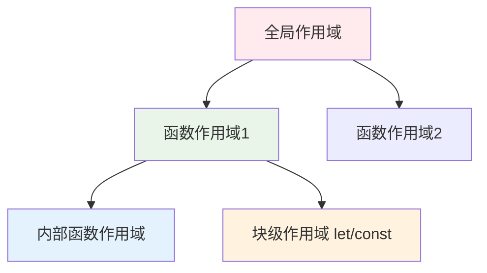
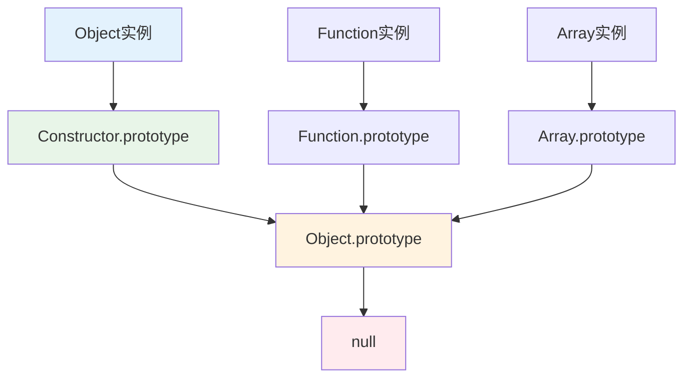
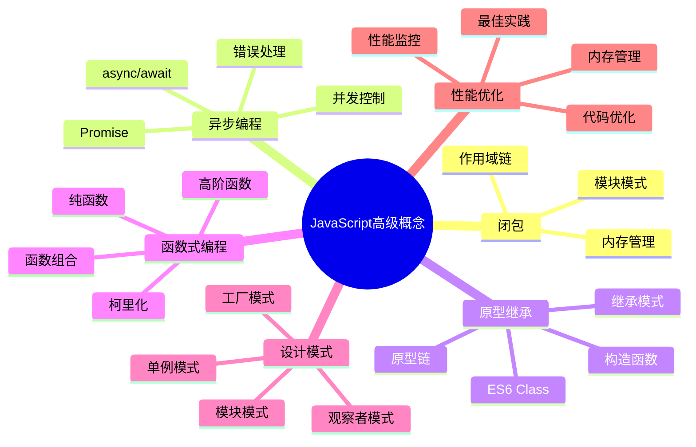

# JavaScript高级概念学习笔记

> 📚 **课程**: JavaScript高级编程  
> 🎓 **讲师**: MDN Web Docs + 现代JavaScript教程  
> 📅 **学习时间**: 2025年1月第二周  
> 🔖 **标签**: JavaScript, 编程, 前端, 高级概念

## 📑 学习目录

- [闭包与作用域](#闭包与作用域)
- [异步编程](#异步编程)
- [原型与继承](#原型与继承)
- [函数式编程](#函数式编程)
- [性能优化](#性能优化)
- [设计模式](#设计模式)
- [实践项目](#实践项目)

## 🎯 学习目标

### 本周目标
- [x] 深入理解闭包机制
- [x] 掌握Promise和async/await
- [x] 理解原型链继承
- [ ] 学习函数式编程范式
- [ ] 掌握常用设计模式
- [ ] 完成综合实践项目

### 评估标准
| 概念 | 理解程度 | 实践能力 | 状态 |
|------|----------|----------|------|
| **闭包** | ⭐⭐⭐⭐⭐ | ⭐⭐⭐⭐ | ✅ 已掌握 |
| **异步编程** | ⭐⭐⭐⭐⭐ | ⭐⭐⭐⭐⭐ | ✅ 已掌握 |
| **原型继承** | ⭐⭐⭐⭐ | ⭐⭐⭐ | 🔄 学习中 |
| **函数式编程** | ⭐⭐⭐ | ⭐⭐ | 📋 待学习 |
| **设计模式** | ⭐⭐ | ⭐ | 📋 待学习 |

## 🧠 闭包与作用域

### 概念理解

**闭包（Closure）**是JavaScript中的一个核心概念，指的是函数能够访问其外部作用域中变量的特性。

```javascript
// 经典闭包示例
function outerFunction(x) {
  // 外部函数的变量
  const outerVariable = x;
  
  // 内部函数（闭包）
  function innerFunction(y) {
    // 访问外部变量
    console.log(outerVariable + y);
  }
  
  return innerFunction;
}

const closure = outerFunction(10);
closure(5); // 输出: 15
```

### 闭包的实际应用

#### 1. 模块模式 (Module Pattern)

```javascript
const Calculator = (function() {
  // 私有变量
  let result = 0;
  
  // 私有方法
  function validateNumber(num) {
    return typeof num === 'number' && !isNaN(num);
  }
  
  // 公开接口
  return {
    add(num) {
      if (validateNumber(num)) {
        result += num;
      }
      return this;
    },
    
    subtract(num) {
      if (validateNumber(num)) {
        result -= num;
      }
      return this;
    },
    
    multiply(num) {
      if (validateNumber(num)) {
        result *= num;
      }
      return this;
    },
    
    divide(num) {
      if (validateNumber(num) && num !== 0) {
        result /= num;
      }
      return this;
    },
    
    getResult() {
      return result;
    },
    
    reset() {
      result = 0;
      return this;
    }
  };
})();

// 使用示例
const finalResult = Calculator
  .add(10)
  .multiply(2)
  .subtract(5)
  .getResult(); // 15
```

#### 2. 防抖和节流

```javascript
// 防抖函数 - 延迟执行
function debounce(func, delay) {
  let timeoutId;
  
  return function(...args) {
    const context = this;
    
    clearTimeout(timeoutId);
    timeoutId = setTimeout(() => {
      func.apply(context, args);
    }, delay);
  };
}

// 节流函数 - 限制执行频率
function throttle(func, limit) {
  let inThrottle;
  
  return function(...args) {
    const context = this;
    
    if (!inThrottle) {
      func.apply(context, args);
      inThrottle = true;
      setTimeout(() => inThrottle = false, limit);
    }
  };
}

// 实际应用
const searchInput = document.getElementById('search');
const handleSearch = debounce((event) => {
  console.log('搜索:', event.target.value);
}, 300);

searchInput.addEventListener('input', handleSearch);
```

### 作用域链理解



## ⚡ 异步编程

### Promise深入理解

```javascript
// Promise状态转换
const promiseStates = {
  PENDING: 'pending',
  FULFILLED: 'fulfilled', 
  REJECTED: 'rejected'
};

// 手动实现简化版Promise
class SimplePromise {
  constructor(executor) {
    this.state = promiseStates.PENDING;
    this.value = undefined;
    this.handlers = [];
    
    try {
      executor(this.resolve.bind(this), this.reject.bind(this));
    } catch (error) {
      this.reject(error);
    }
  }
  
  resolve(value) {
    if (this.state === promiseStates.PENDING) {
      this.state = promiseStates.FULFILLED;
      this.value = value;
      this.handlers.forEach(this.handle.bind(this));
      this.handlers = [];
    }
  }
  
  reject(reason) {
    if (this.state === promiseStates.PENDING) {
      this.state = promiseStates.REJECTED;
      this.value = reason;
      this.handlers.forEach(this.handle.bind(this));
      this.handlers = [];
    }
  }
  
  then(onFulfilled, onRejected) {
    return new SimplePromise((resolve, reject) => {
      this.handle({
        onFulfilled,
        onRejected,
        resolve,
        reject
      });
    });
  }
  
  handle(handler) {
    if (this.state === promiseStates.PENDING) {
      this.handlers.push(handler);
      return;
    }
    
    setTimeout(() => {
      const callback = this.state === promiseStates.FULFILLED 
        ? handler.onFulfilled 
        : handler.onRejected;
      
      if (!callback) {
        const action = this.state === promiseStates.FULFILLED 
          ? handler.resolve 
          : handler.reject;
        action(this.value);
        return;
      }
      
      try {
        const result = callback(this.value);
        handler.resolve(result);
      } catch (error) {
        handler.reject(error);
      }
    }, 0);
  }
}
```

### Async/Await最佳实践

```javascript
// 错误处理模式
async function fetchWithErrorHandling(url) {
  try {
    const response = await fetch(url);
    
    if (!response.ok) {
      throw new Error(`HTTP error! status: ${response.status}`);
    }
    
    const data = await response.json();
    return { success: true, data };
  } catch (error) {
    console.error('Fetch error:', error);
    return { success: false, error: error.message };
  }
}

// 并发请求处理
async function fetchMultipleResources(urls) {
  try {
    // 并发执行
    const promises = urls.map(url => fetchWithErrorHandling(url));
    const results = await Promise.allSettled(promises);
    
    return results.map((result, index) => ({
      url: urls[index],
      ...result.value
    }));
  } catch (error) {
    console.error('Multiple fetch error:', error);
    return [];
  }
}

// 使用示例
const urls = [
  'https://api.example.com/users',
  'https://api.example.com/posts',
  'https://api.example.com/comments'
];

fetchMultipleResources(urls).then(results => {
  results.forEach(result => {
    if (result.success) {
      console.log(`✅ ${result.url}:`, result.data);
    } else {
      console.log(`❌ ${result.url}:`, result.error);
    }
  });
});
```

### 异步编程模式对比

| 模式 | 优点 | 缺点 | 适用场景 |
|------|------|------|----------|
| **Callback** | 简单直接 | 回调地狱 | 简单异步操作 |
| **Promise** | 链式调用，错误处理好 | 语法复杂 | 复杂异步流程 |
| **Async/Await** | 同步化写法，易读 | 需要Promise支持 | 现代异步开发 |
| **Generator** | 可暂停执行 | 学习成本高 | 特殊控制流程 |

## 🔗 原型与继承

### 原型链机制



### 继承模式实现

#### 1. 原型链继承

```javascript
// 父类构造函数
function Animal(name) {
  this.name = name;
  this.colors = ['red', 'blue'];
}

Animal.prototype.speak = function() {
  console.log(`${this.name} makes a sound`);
};

// 子类构造函数
function Dog(name, breed) {
  Animal.call(this, name); // 调用父类构造函数
  this.breed = breed;
}

// 设置原型链
Dog.prototype = Object.create(Animal.prototype);
Dog.prototype.constructor = Dog;

// 添加子类方法
Dog.prototype.bark = function() {
  console.log(`${this.name} barks!`);
};

// 方法重写
Dog.prototype.speak = function() {
  console.log(`${this.name} the ${this.breed} barks loudly!`);
};

// 使用示例
const myDog = new Dog('Max', 'Golden Retriever');
myDog.speak(); // Max the Golden Retriever barks loudly!
myDog.bark();  // Max barks!
```

#### 2. ES6 Class语法

```javascript
class Animal {
  constructor(name) {
    this.name = name;
    this.energy = 100;
  }
  
  eat() {
    this.energy += 10;
    console.log(`${this.name} is eating. Energy: ${this.energy}`);
  }
  
  sleep() {
    this.energy += 20;
    console.log(`${this.name} is sleeping. Energy: ${this.energy}`);
  }
  
  speak() {
    console.log(`${this.name} makes a sound`);
  }
  
  // 静态方法
  static getSpecies() {
    return 'Unknown';
  }
  
  // Getter
  get status() {
    if (this.energy > 80) return 'energetic';
    if (this.energy > 50) return 'normal';
    if (this.energy > 20) return 'tired';
    return 'exhausted';
  }
  
  // Setter
  set energy(value) {
    this._energy = Math.max(0, Math.min(100, value));
  }
  
  get energy() {
    return this._energy || 0;
  }
}

class Dog extends Animal {
  constructor(name, breed) {
    super(name); // 调用父类构造函数
    this.breed = breed;
    this.loyalty = 100;
  }
  
  speak() {
    console.log(`${this.name} the ${this.breed} barks!`);
  }
  
  fetch() {
    this.energy -= 15;
    this.loyalty += 5;
    console.log(`${this.name} fetches the ball! Loyalty: ${this.loyalty}`);
  }
  
  static getSpecies() {
    return 'Canis lupus';
  }
}

// 使用示例
const dog = new Dog('Buddy', 'Labrador');
console.log(dog.status); // energetic
dog.speak(); // Buddy the Labrador barks!
dog.fetch(); // Buddy fetches the ball! Loyalty: 105
```

## 🚀 函数式编程

### 核心概念

#### 1. 纯函数 (Pure Functions)

```javascript
// 纯函数示例
const add = (a, b) => a + b;
const multiply = (a, b) => a * b;

// 不纯函数示例
let count = 0;
const impureIncrement = () => ++count; // 修改外部状态

// 纯函数版本
const pureIncrement = (value) => value + 1;
```

#### 2. 高阶函数 (Higher-Order Functions)

```javascript
// 高阶函数：接受函数作为参数或返回函数
const createMultiplier = (multiplier) => (value) => value * multiplier;

const double = createMultiplier(2);
const triple = createMultiplier(3);

console.log(double(5)); // 10
console.log(triple(5)); // 15

// 数组方法中的高阶函数
const numbers = [1, 2, 3, 4, 5];

const doubled = numbers.map(x => x * 2);
const evens = numbers.filter(x => x % 2 === 0);
const sum = numbers.reduce((acc, x) => acc + x, 0);

console.log(doubled); // [2, 4, 6, 8, 10]
console.log(evens);   // [2, 4]
console.log(sum);     // 15
```

#### 3. 函数组合 (Function Composition)

```javascript
// 函数组合工具
const compose = (...fns) => (value) => fns.reduceRight((acc, fn) => fn(acc), value);
const pipe = (...fns) => (value) => fns.reduce((acc, fn) => fn(acc), value);

// 基础函数
const addOne = x => x + 1;
const double = x => x * 2;
const square = x => x * x;

// 组合函数
const addOneThenDouble = compose(double, addOne);
const processNumber = pipe(addOne, double, square);

console.log(addOneThenDouble(3)); // (3 + 1) * 2 = 8
console.log(processNumber(3));    // ((3 + 1) * 2)² = 64
```

### 实用函数式编程模式

```javascript
// 柯里化 (Currying)
const curry = (fn) => {
  return function curried(...args) {
    if (args.length >= fn.length) {
      return fn.apply(this, args);
    } else {
      return function(...nextArgs) {
        return curried.apply(this, args.concat(nextArgs));
      };
    }
  };
};

// 示例：柯里化的加法函数
const curriedAdd = curry((a, b, c) => a + b + c);
const addTwo = curriedAdd(2);
const addTwoAndThree = addTwo(3);

console.log(addTwoAndThree(4)); // 9

// 部分应用 (Partial Application)
const partial = (fn, ...presetArgs) => {
  return (...laterArgs) => fn(...presetArgs, ...laterArgs);
};

const log = (level, message) => console.log(`[${level}] ${message}`);
const logError = partial(log, 'ERROR');
const logInfo = partial(log, 'INFO');

logError('Something went wrong'); // [ERROR] Something went wrong
logInfo('Process completed');     // [INFO] Process completed
```

## ⚡ 性能优化

### 内存管理

```javascript
// 避免内存泄漏的最佳实践

// 1. 正确移除事件监听器
class Component {
  constructor() {
    this.handleClick = this.handleClick.bind(this);
  }
  
  mount() {
    document.addEventListener('click', this.handleClick);
  }
  
  unmount() {
    // 重要：移除事件监听器
    document.removeEventListener('click', this.handleClick);
  }
  
  handleClick(event) {
    console.log('Clicked:', event.target);
  }
}

// 2. 清理定时器
class Timer {
  constructor() {
    this.intervalId = null;
  }
  
  start() {
    this.intervalId = setInterval(() => {
      console.log('Timer tick');
    }, 1000);
  }
  
  stop() {
    if (this.intervalId) {
      clearInterval(this.intervalId);
      this.intervalId = null;
    }
  }
}

// 3. WeakMap和WeakSet避免强引用
const elementData = new WeakMap();
const observers = new WeakSet();

function attachData(element, data) {
  elementData.set(element, data);
}

function addObserver(object) {
  observers.add(object);
}
```

### 性能监控

```javascript
// 性能测量工具
class PerformanceMonitor {
  static measure(name, fn) {
    const start = performance.now();
    const result = fn();
    const end = performance.now();
    
    console.log(`${name} took ${end - start} milliseconds`);
    return result;
  }
  
  static async measureAsync(name, asyncFn) {
    const start = performance.now();
    const result = await asyncFn();
    const end = performance.now();
    
    console.log(`${name} took ${end - start} milliseconds`);
    return result;
  }
  
  static profile(name, iterations = 1000) {
    return (target, propertyKey, descriptor) => {
      const originalMethod = descriptor.value;
      
      descriptor.value = function(...args) {
        const times = [];
        
        for (let i = 0; i < iterations; i++) {
          const start = performance.now();
          originalMethod.apply(this, args);
          const end = performance.now();
          times.push(end - start);
        }
        
        const avg = times.reduce((sum, time) => sum + time, 0) / times.length;
        const min = Math.min(...times);
        const max = Math.max(...times);
        
        console.log(`${name} - Avg: ${avg.toFixed(2)}ms, Min: ${min.toFixed(2)}ms, Max: ${max.toFixed(2)}ms`);
        
        return originalMethod.apply(this, args);
      };
    };
  }
}

// 使用示例
class DataProcessor {
  @PerformanceMonitor.profile('processLargeArray', 100)
  processLargeArray(data) {
    return data.map(item => item * 2).filter(item => item > 10);
  }
}
```

## 🎨 设计模式

### 常用设计模式实现

#### 1. 单例模式 (Singleton)

```javascript
class Database {
  constructor() {
    if (Database.instance) {
      return Database.instance;
    }
    
    this.connection = null;
    this.isConnected = false;
    Database.instance = this;
  }
  
  connect() {
    if (!this.isConnected) {
      this.connection = 'database-connection';
      this.isConnected = true;
      console.log('Database connected');
    }
  }
  
  disconnect() {
    if (this.isConnected) {
      this.connection = null;
      this.isConnected = false;
      console.log('Database disconnected');
    }
  }
  
  query(sql) {
    if (!this.isConnected) {
      throw new Error('Database not connected');
    }
    return `Executing: ${sql}`;
  }
}

// 使用
const db1 = new Database();
const db2 = new Database();

console.log(db1 === db2); // true - 同一个实例
```

#### 2. 观察者模式 (Observer)

```javascript
class EventEmitter {
  constructor() {
    this.events = {};
  }
  
  on(event, listener) {
    if (!this.events[event]) {
      this.events[event] = [];
    }
    this.events[event].push(listener);
  }
  
  off(event, listenerToRemove) {
    if (!this.events[event]) return;
    
    this.events[event] = this.events[event].filter(
      listener => listener !== listenerToRemove
    );
  }
  
  emit(event, ...args) {
    if (!this.events[event]) return;
    
    this.events[event].forEach(listener => {
      listener(...args);
    });
  }
}

// 使用示例
const emitter = new EventEmitter();

const userLoginHandler = (user) => {
  console.log(`User ${user.name} logged in`);
};

const analyticsHandler = (user) => {
  console.log(`Analytics: User login - ${user.id}`);
};

emitter.on('userLogin', userLoginHandler);
emitter.on('userLogin', analyticsHandler);

emitter.emit('userLogin', { id: 1, name: 'Alice' });
```

#### 3. 工厂模式 (Factory)

```javascript
// 抽象工厂
class ShapeFactory {
  static createShape(type, options = {}) {
    switch (type) {
      case 'circle':
        return new Circle(options.radius || 1);
      case 'rectangle':
        return new Rectangle(options.width || 1, options.height || 1);
      case 'triangle':
        return new Triangle(options.base || 1, options.height || 1);
      default:
        throw new Error(`Unknown shape type: ${type}`);
    }
  }
}

class Shape {
  constructor() {
    this.type = 'shape';
  }
  
  area() {
    throw new Error('Area method must be implemented');
  }
  
  perimeter() {
    throw new Error('Perimeter method must be implemented');
  }
}

class Circle extends Shape {
  constructor(radius) {
    super();
    this.type = 'circle';
    this.radius = radius;
  }
  
  area() {
    return Math.PI * this.radius ** 2;
  }
  
  perimeter() {
    return 2 * Math.PI * this.radius;
  }
}

class Rectangle extends Shape {
  constructor(width, height) {
    super();
    this.type = 'rectangle';
    this.width = width;
    this.height = height;
  }
  
  area() {
    return this.width * this.height;
  }
  
  perimeter() {
    return 2 * (this.width + this.height);
  }
}

// 使用
const circle = ShapeFactory.createShape('circle', { radius: 5 });
const rectangle = ShapeFactory.createShape('rectangle', { width: 4, height: 6 });

console.log(`Circle area: ${circle.area()}`);
console.log(`Rectangle area: ${rectangle.area()}`);
```

## 📝 学习总结

### 本周学习成果

::: tip 掌握要点
- ✅ **闭包机制**: 深入理解作用域链和闭包的实际应用
- ✅ **异步编程**: 掌握Promise、async/await和错误处理最佳实践
- 🔄 **原型继承**: 理解原型链机制，能够实现继承模式
- 📚 **函数式编程**: 学习纯函数、高阶函数和函数组合
- 🎨 **设计模式**: 掌握常用设计模式的JavaScript实现
:::

### 知识点关联图



### 实践项目计划

#### 项目1: 事件系统库
- **目标**: 实现一个功能完整的事件系统
- **技术点**: 观察者模式、闭包、错误处理
- **时间**: 3天

#### 项目2: 异步任务队列
- **目标**: 开发支持优先级的异步任务调度器
- **技术点**: Promise、async/await、设计模式
- **时间**: 5天

#### 项目3: 函数式工具库
- **目标**: 创建类似lodash的函数式编程工具库
- **技术点**: 高阶函数、柯里化、函数组合
- **时间**: 1周

### 下周学习计划

- [ ] **模块系统**: ES6模块、CommonJS、AMD
- [ ] **错误处理**: 错误边界、异常处理最佳实践
- [ ] **测试**: 单元测试、集成测试、TDD
- [ ] **工具链**: Webpack、Babel、TypeScript集成
- [ ] **框架深入**: Vue.js/React源码分析

### 参考资料

| 资源 | 类型 | 链接 | 评分 |
|------|------|------|------|
| **MDN Web Docs** | 官方文档 | https://developer.mozilla.org/ | ⭐⭐⭐⭐⭐ |
| **JavaScript.info** | 在线教程 | https://javascript.info/ | ⭐⭐⭐⭐⭐ |
| **You Don't Know JS** | 书籍系列 | GitHub开源 | ⭐⭐⭐⭐⭐ |
| **Eloquent JavaScript** | 在线书籍 | https://eloquentjavascript.net/ | ⭐⭐⭐⭐ |
| **JavaScript Algorithms** | 算法实现 | GitHub项目 | ⭐⭐⭐⭐ |

---

## 💭 学习反思

### 学习方法总结

1. **理论结合实践** - 每个概念都配合代码实例理解
2. **循序渐进** - 从基础概念到高级应用逐步深入
3. **项目驱动** - 通过实际项目巩固所学知识
4. **笔记整理** - 系统性地记录和整理学习内容

### 遇到的挑战

- **概念抽象性**: 闭包和原型链概念较为抽象，需要大量练习
- **异步理解**: async/await的错误处理机制需要多实践
- **模式应用**: 设计模式的实际应用场景判断需要经验积累

### 改进建议

- 增加更多实际项目练习
- 加强代码review和同行交流
- 定期回顾和总结学习内容
- 关注最新的JavaScript发展趋势

::: info 学习心得
JavaScript的高级概念学习需要大量的实践和思考。通过系统性的学习和项目实战，能够更好地理解这些概念在实际开发中的应用价值。
:::

**下次更新**: 2025-01-15  
**学习进度**: 65% 📈