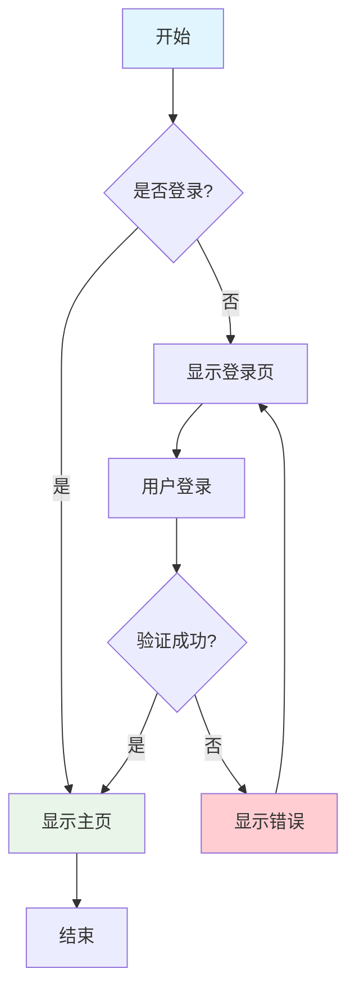
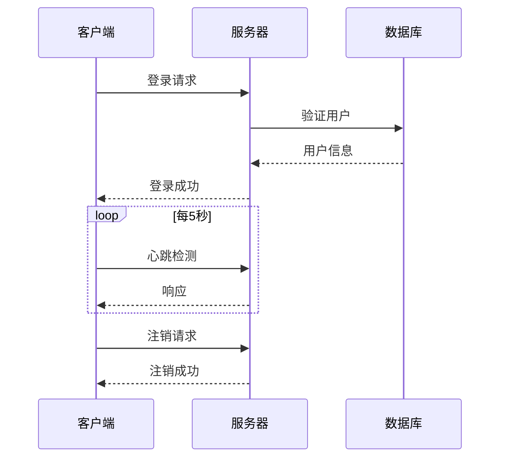
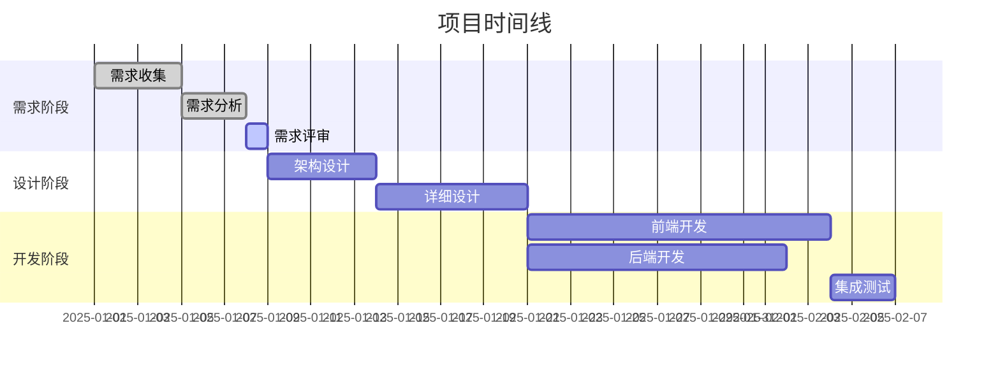
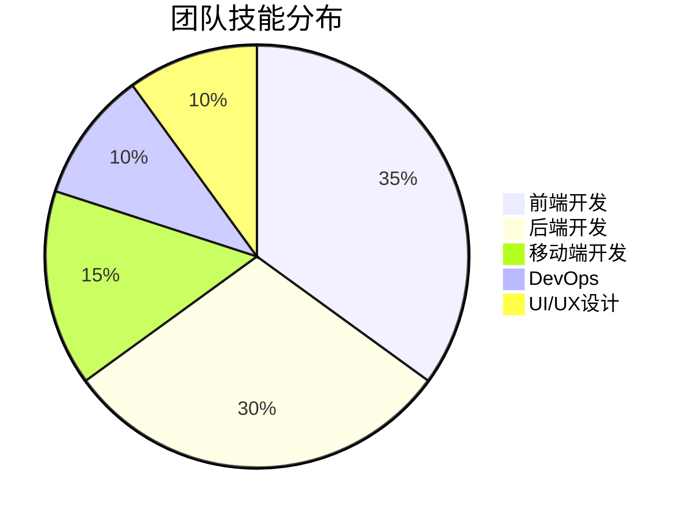
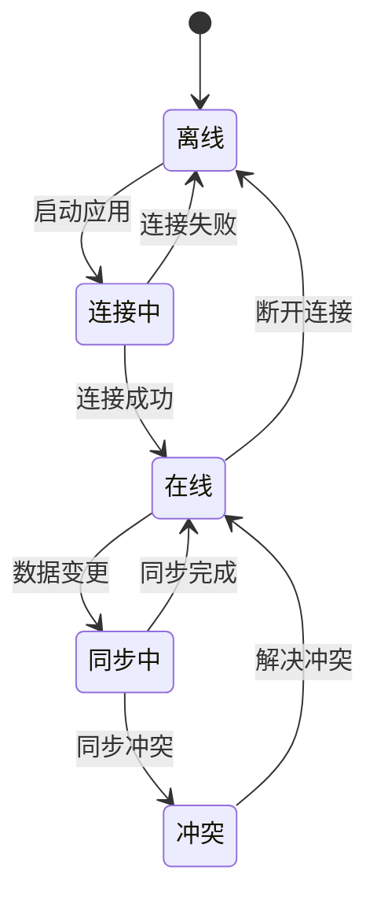
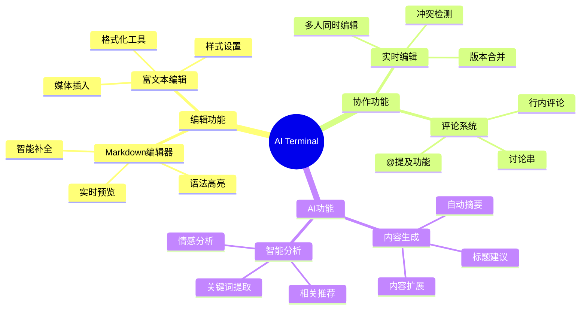
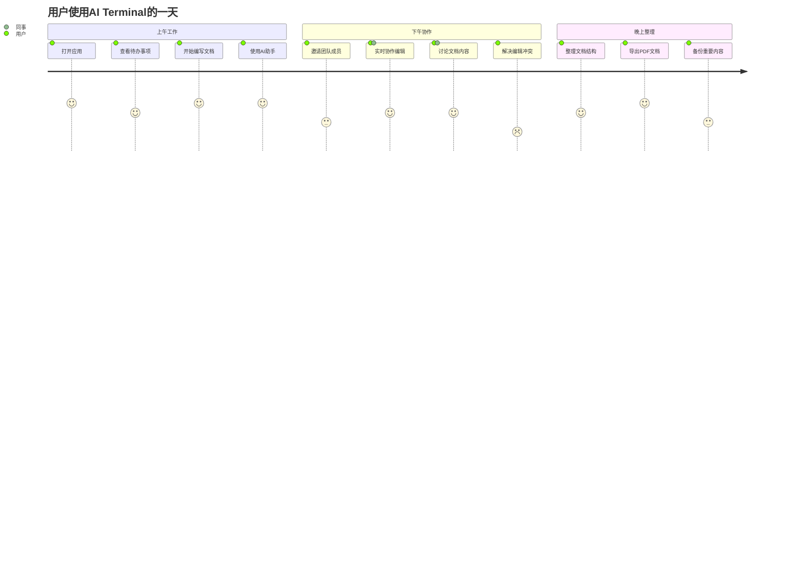

# Markdown 语法完整参考手册

> 📚 **参考手册**: Markdown完整语法指南  
> 🎯 **适用范围**: AI Terminal编辑器  
> 📖 **难度等级**: 初级到高级  
> ⏱️ **查阅时间**: 按需查阅

## 📑 语法目录

- [基础语法](#基础语法)
- [扩展语法](#扩展语法)  
- [AI Terminal特性](#ai-terminal特性)
- [图表和图形](#图表和图形)
- [数学公式](#数学公式)
- [实用技巧](#实用技巧)
- [语法速查表](#语法速查表)

## ✨ 基础语法

### 标题 (Headers)

```markdown
# 一级标题 (H1)
## 二级标题 (H2)  
### 三级标题 (H3)
#### 四级标题 (H4)
##### 五级标题 (H5)
###### 六级标题 (H6)
```

**效果展示**:
# 一级标题
## 二级标题
### 三级标题
#### 四级标题
##### 五级标题
###### 六级标题

**替代语法** (仅限H1和H2):
```markdown
一级标题
========

二级标题
--------
```

### 文本格式化

#### 强调和重点

| 语法 | 效果 | 说明 |
|------|------|------|
| `*斜体*` 或 `_斜体_` | *斜体* | 单个星号或下划线 |
| `**粗体**` 或 `__粗体__` | **粗体** | 双星号或双下划线 |
| `***粗斜体***` | ***粗斜体*** | 三个星号 |
| `~~删除线~~` | ~~删除线~~ | 双波浪号 |
| `==高亮==` | ==高亮== | 双等号(扩展语法) |
| `++下划线++` | ++下划线++ | 双加号(扩展语法) |

#### 代码标记

**行内代码**:
```markdown
这是 `行内代码` 的示例
```
效果: 这是 `行内代码` 的示例

**代码块**:
````markdown
```javascript
function hello() {
    console.log("Hello, World!");
}
```
````

效果:
```javascript
function hello() {
    console.log("Hello, World!");
}
```

**指定语言高亮**:
```python
def fibonacci(n):
    if n <= 1:
        return n
    return fibonacci(n-1) + fibonacci(n-2)
```

```css
.highlight {
    background-color: #ffeb3b;
    padding: 0.2em 0.4em;
    border-radius: 3px;
}
```

```sql
SELECT users.name, COUNT(orders.id) as order_count
FROM users 
LEFT JOIN orders ON users.id = orders.user_id
GROUP BY users.id
ORDER BY order_count DESC;
```

### 列表

#### 无序列表

```markdown
- 项目1
- 项目2
  - 嵌套项目2.1
  - 嵌套项目2.2
    - 深层嵌套2.2.1
- 项目3

* 也可以用星号
+ 或者用加号
```

效果:
- 项目1
- 项目2
  - 嵌套项目2.1
  - 嵌套项目2.2
    - 深层嵌套2.2.1
- 项目3

#### 有序列表

```markdown
1. 第一项
2. 第二项
   1. 嵌套第一项
   2. 嵌套第二项
3. 第三项

# 可以使用任意数字，会自动排序
5. 实际显示为1
1. 实际显示为2
9. 实际显示为3
```

效果:
1. 第一项
2. 第二项
   1. 嵌套第一项
   2. 嵌套第二项
3. 第三项

#### 任务列表

```markdown
- [x] 已完成的任务
- [ ] 未完成的任务
- [x] 另一个已完成的任务
  - [ ] 子任务1
  - [x] 子任务2
```

效果:
- [x] 已完成的任务
- [ ] 未完成的任务
- [x] 另一个已完成的任务
  - [ ] 子任务1
  - [x] 子任务2

### 链接和图片

#### 链接语法

```markdown
[链接文字](https://example.com)
[带标题的链接](https://example.com "鼠标悬停显示的标题")

# 参考式链接
[链接文字][reference-id]
[reference-id]: https://example.com "可选标题"

# 自动链接
<https://example.com>
<email@example.com>

# 锚点链接
[跳转到标题](#标题名称)
```

效果:
- [普通链接](https://example.com)
- [带标题的链接](https://example.com "这是标题")
- <https://example.com>

#### 图片语法

```markdown


# 参考式图片
![图片描述][image-ref]
[image-ref]: image-url.jpg "图片标题"

# 图片链接组合
[](https://example.com)
```

### 引用

#### 基础引用

```markdown
> 这是一个引用
> 可以包含多行

> 嵌套引用
>> 第二层引用
>>> 第三层引用
```

效果:
> 这是一个引用
> 可以包含多行

> 嵌套引用
>> 第二层引用
>>> 第三层引用

#### 复杂引用

```markdown
> **注意**: 这里包含格式化文本
> 
> 1. 引用中的列表
> 2. 第二项
> 
> ```javascript
> // 引用中的代码
> console.log("Hello");
> ```
```

效果:
> **注意**: 这里包含格式化文本
> 
> 1. 引用中的列表
> 2. 第二项
> 
> ```javascript
> // 引用中的代码
> console.log("Hello");
> ```

## 📊 扩展语法

### 表格

#### 基础表格

```markdown
| 标题1 | 标题2 | 标题3 |
|-------|-------|-------|
| 行1列1 | 行1列2 | 行1列3 |
| 行2列1 | 行2列2 | 行2列3 |
```

#### 对齐控制

```markdown
| 左对齐 | 居中对齐 | 右对齐 |
|:-------|:--------:|-------:|
| 内容   |   内容   |   内容 |
| 更长的内容 | 更长的内容 | 更长的内容 |
```

效果:
| 左对齐 | 居中对齐 | 右对齐 |
|:-------|:--------:|-------:|
| 内容   |   内容   |   内容 |
| 更长的内容 | 更长的内容 | 更长的内容 |

#### 复杂表格

```markdown
| 功能 | 基础版 | 专业版 | 企业版 |
|------|:------:|:------:|:------:|
| **存储空间** | 1GB | 10GB | 无限制 |
| **协作人数** | 3人 | 10人 | 无限制 |
| **AI功能** | ❌ | ✅ | ✅ |
| **优先支持** | ❌ | ❌ | ✅ |
| **价格** | 免费 | ¥99/月 | ¥299/月 |
```

效果:
| 功能 | 基础版 | 专业版 | 企业版 |
|------|:------:|:------:|:------:|
| **存储空间** | 1GB | 10GB | 无限制 |
| **协作人数** | 3人 | 10人 | 无限制 |
| **AI功能** | ❌ | ✅ | ✅ |
| **优先支持** | ❌ | ❌ | ✅ |
| **价格** | 免费 | ¥99/月 | ¥299/月 |

### 脚注

```markdown
这里有一个脚注[^1]，这里有另一个[^note2]。

[^1]: 这是第一个脚注的内容
[^note2]: 这是第二个脚注的内容，可以包含**格式化文本**
```

### 定义列表

```markdown
术语1
: 定义1

术语2
: 定义2a
: 定义2b

复杂术语
: 这是一个复杂的定义，可以包含
  多行内容和**格式化文本**
```

### 分割线

```markdown
三个或更多的连字符
---

三个或更多的星号
***

三个或更多的下划线
___
```

效果:
---

## 🎨 AI Terminal特性

### 提示框 (Admonitions)

```markdown
::: tip 提示
这是一个提示信息
:::

::: info 信息
这是一个信息提示
:::

::: warning 警告
这是一个警告信息
:::

::: danger 危险
这是一个危险警告
:::

::: details 详细信息
这是一个可折叠的详细信息
:::
```

效果:
::: tip 提示
这是一个提示信息
:::

::: warning 警告
这是一个警告信息
:::

::: danger 危险
这是一个危险警告
:::

### 自定义容器

```markdown
::: custom-block 自定义标题
自定义内容，支持**格式化**

- 列表项
- 另一项
:::
```

### 代码组

````markdown
::: code-group
```js [JavaScript]
function hello() {
  console.log('Hello from JavaScript!')
}
```

```py [Python]
def hello():
    print("Hello from Python!")
```

```go [Go]
package main
import "fmt"

func main() {
    fmt.Println("Hello from Go!")
}
```
:::
````

## 📈 图表和图形

### Mermaid 图表

#### 流程图



#### 序列图



#### 甘特图



#### 饼图



#### 状态图



#### 思维导图



#### 用户旅程图



### 数学公式 (KaTeX)

#### 行内公式

```markdown
这是一个行内公式: $E = mc^2$

勾股定理: $a^2 + b^2 = c^2$
```

效果: 这是一个行内公式: $E = mc^2$

#### 块级公式

```markdown
$$
\begin{align}
\nabla \times \vec{\mathbf{B}} -\, \frac1c\, \frac{\partial\vec{\mathbf{E}}}{\partial t} &= \frac{4\pi}{c}\vec{\mathbf{j}} \\
\nabla \cdot \vec{\mathbf{E}} &= 4 \pi \rho \\
\nabla \times \vec{\mathbf{E}}\, +\, \frac1c\, \frac{\partial\vec{\mathbf{B}}}{\partial t} &= \vec{\mathbf{0}} \\
\nabla \cdot \vec{\mathbf{B}} &= 0
\end{align}
$$
```

#### 常用数学符号

| 符号类型 | 语法 | 效果 |
|----------|------|------|
| **希腊字母** | `\alpha, \beta, \gamma` | $\alpha, \beta, \gamma$ |
| **运算符** | `\sum, \prod, \int` | $\sum, \prod, \int$ |
| **关系符** | `\leq, \geq, \neq` | $\leq, \geq, \neq$ |
| **箭头** | `\rightarrow, \Leftarrow` | $\rightarrow, \Leftarrow$ |
| **集合** | `\in, \subset, \cup` | $\in, \subset, \cup$ |

#### 矩阵

```markdown
$$
\begin{pmatrix}
a & b \\
c & d
\end{pmatrix}
\begin{pmatrix}
x \\
y
\end{pmatrix}
=
\begin{pmatrix}
ax + by \\
cx + dy
\end{pmatrix}
$$
```

## 🛠️ 实用技巧

### 转义字符

当需要显示Markdown语法字符时，使用反斜杠转义:

```markdown
\*这不是斜体\*
\[这不是链接\]
\`这不是代码\`
```

效果: \*这不是斜体\* \[这不是链接\] \`这不是代码\`

### HTML标签支持

```markdown
<kbd>Ctrl</kbd> + <kbd>C</kbd> 复制

<mark>高亮文本</mark>

<sub>下标</sub> 和 <sup>上标</sup>

<details>
<summary>点击展开</summary>
这里是折叠的内容
</details>
```

效果:
- <kbd>Ctrl</kbd> + <kbd>C</kbd> 复制
- <mark>高亮文本</mark>
- H<sub>2</sub>O 和 x<sup>2</sup>

### 换行技巧

```markdown
# 方法1: 行末两个空格
第一行末尾有两个空格  
第二行

# 方法2: 空行分段
第一段

第二段

# 方法3: HTML换行标签
第一行<br>第二行
```

### 注释

```markdown
<!-- 这是注释，不会在渲染结果中显示 -->

[//]: # (这也是注释)

[comment]: <> (另一种注释方式)
```

## 📚 语法速查表

### 常用语法

| 功能 | 语法 | 示例 |
|------|------|------|
| **标题** | `# ## ###` | `# 一级标题` |
| **粗体** | `**text**` | `**粗体文本**` |
| **斜体** | `*text*` | `*斜体文本*` |
| **删除线** | `~~text~~` | `~~删除的文本~~` |
| **行内代码** | `` `code` `` | `` `console.log()` `` |
| **链接** | `[text](url)` | `[Google](https://google.com)` |
| **图片** | `` | `` |
| **无序列表** | `- item` | `- 列表项` |
| **有序列表** | `1. item` | `1. 编号项` |
| **引用** | `> text` | `> 引用文本` |
| **表格** | `\| col \|` | `\| 表格 \| 列 \|` |
| **分割线** | `---` | `---` |

### 快捷键对照

| 功能 | Windows/Linux | Mac | 效果 |
|------|---------------|-----|------|
| **粗体** | `Ctrl + B` | `Cmd + B` | **Bold** |
| **斜体** | `Ctrl + I` | `Cmd + I` | *Italic* |
| **代码** | `Ctrl + \`` | `Cmd + \`` | `Code` |
| **链接** | `Ctrl + K` | `Cmd + K` | [Link]() |
| **标题** | `Ctrl + H` | `Cmd + H` | # Header |
| **列表** | `Ctrl + L` | `Cmd + L` | - List |
| **引用** | `Ctrl + Q` | `Cmd + Q` | > Quote |
| **表格** | `Ctrl + T` | `Cmd + T` | Table |

### Emoji 支持

```markdown
:smile: :heart: :thumbsup: :rocket: :fire:
:warning: :information_source: :bulb: :tada: :sparkles:

📝 📊 📈 📉 📋 📌 📍 📎 📄 📂
🎯 🎨 🎭 🎪 🎵 🎶 🎸 🎹 🎺 🎻
🚀 🚁 🚂 🚃 🚄 🚅 🚆 🚇 🚈 🚉
💡 💭 💬 💯 💢 💥 💪 💫 💬 💭
```

### 颜色代码

```markdown
支持的颜色名称:
- 红色: `red` `crimson` `darkred`
- 蓝色: `blue` `navy` `skyblue`
- 绿色: `green` `lime` `forestgreen`
- 黄色: `yellow` `gold` `orange`
- 紫色: `purple` `violet` `indigo`
- 灰色: `gray` `silver` `black`

十六进制颜色: `#FF0000` `#00FF00` `#0000FF`
RGB颜色: `rgb(255,0,0)` `rgba(0,255,0,0.5)`
```

## 🎯 最佳实践

### 文档结构

```markdown
# 文档标题

> 文档简介和元信息

## 目录
- [章节1](#章节1)
- [章节2](#章节2)

## 章节1
内容...

## 章节2  
内容...

## 总结
重点回顾...

---
文档信息: 作者、日期、版本等
```

### 性能优化

1. **图片优化**
   - 使用适当的图片格式 (WebP > JPEG > PNG)
   - 压缩图片大小
   - 使用CDN加速

2. **链接优化**
   - 使用相对路径引用内部资源
   - 外部链接添加 `target="_blank"`

3. **代码块优化**
   - 指定语言以启用语法高亮
   - 避免过长的代码块
   - 使用代码折叠功能

### 可访问性

```markdown
# 良好的标题层级
## 二级标题
### 三级标题

# 有意义的链接文本
[查看完整文档](url) <!-- 好 -->
[点击这里](url) <!-- 不好 -->

# 图片添加alt文本


# 表格添加标题行
| 名称 | 类型 | 描述 |
|------|------|------|
```

### 协作指南

1. **命名规范**
   - 文件名使用小写字母和连字符
   - 标题简洁明确
   - 标签统一格式

2. **版本控制**
   - 重要更改前创建备份
   - 记录修改原因
   - 使用版本号标记

3. **评论规范**
   - 具体指出问题位置
   - 提供建设性建议
   - 及时回复讨论

---

## 📞 技术支持

### 获取帮助

- 📧 **邮箱支持**: markdown@ai-terminal.com
- 💬 **在线客服**: 点击右下角客服图标
- 📚 **文档中心**: https://docs.ai-terminal.com
- 🎥 **视频教程**: https://video.ai-terminal.com

### 反馈和建议

- 🐛 **问题反馈**: https://github.com/ai-terminal/issues
- 💡 **功能建议**: https://feedback.ai-terminal.com
- 🌟 **评价评分**: https://reviews.ai-terminal.com

---

**文档信息**:
- 📝 **最后更新**: 2025-01-10
- 👤 **维护者**: AI Terminal 文档团队
- 📈 **版本**: 1.2.0
- 🔄 **更新频率**: 随产品功能更新

::: tip 提示
本参考手册会随着AI Terminal功能的更新而持续完善。建议收藏此页面以便随时查阅最新的语法支持。
:::

::: info 许可信息
本文档遵循 [CC BY 4.0](https://creativecommons.org/licenses/by/4.0/) 许可协议，允许在注明出处的情况下自由使用和分享。
:::