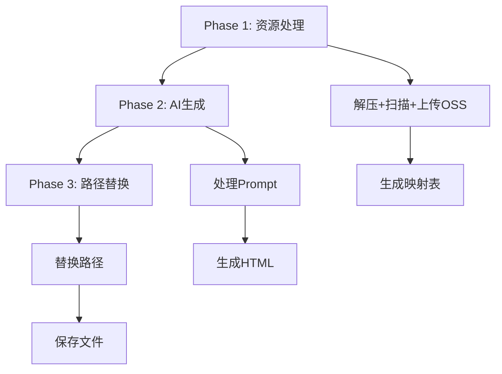

# 自定义模板OSS异步API设计方案

## 1. 概述

### 1.1 目标
创建一个新的接口 `/api/generate/custom/ossasync`，与现有的 `/api/generate/custom/async` 平行，主要区别在于：
- 不使用base64嵌入，而是将媒体资源上传到OSS
- 生成永久可访问的外部链接
- 创建资源映射文件，记录本地路径与OSS URL的对应关系

### 1.2 核心差异对比

| 特性 | custom/async (现有) | custom/ossasync (新增) |
|------|-------------------|---------------------|
| 图片处理 | Base64嵌入 | OSS上传 |
| HTML大小 | 较大（包含base64） | 较小（仅包含链接） |
| 加载速度 | 慢（一次性加载） | 快（按需加载） |
| 离线访问 | 支持 | 不支持 |
| CDN加速 | 不支持 | 支持 |
| 资源映射 | 无 | resources_mapping.jsonl |

## 2. API设计

### 2.1 提交接口
```
POST /api/generate/custom/ossasync
Content-Type: multipart/form-data
```

**请求参数**：与 `/api/generate/custom/async` 相同

**响应格式**：
```json
{
  "code": 200,
  "success": true,
  "data": {
    "taskId": "custom_oss_1234567890_abc123",
    "folderName": "custom_oss_template_1234567890",
    "mode": "oss",  // 标识处理模式
    "status": "submitted"
  }
}
```

### 2.2 状态查询
```
GET /api/generate/custom/ossstatus/{taskId}
```

**响应格式**：
```json
{
  "code": 200,
  "success": true,
  "status": "completed",
  "metadata": {
    "phases": {
      "extraction": "completed",
      "resourceUpload": "completed",  // OSS上传阶段
      "htmlGeneration": "completed",
      "pathReplacement": "completed"  // 路径替换阶段
    },
    "ossResources": {
      "uploaded": 25,
      "totalSize": "15.6MB",
      "cdnEnabled": true
    }
  }
}
```

## 3. 处理流程设计

### 3.1 简化的Workflow（3个主要阶段）



### 3.2 简化的阶段设计

#### **Phase 1: 资源处理** (preparing)
合并解压、扫描、上传、映射为一个阶段：
```javascript
// 一次性完成资源处理
async function prepareResources(zipFile, templatePath, userCardPath) {
  // 解压ZIP
  await zipProcessor.extract(zipFile, templatePath)
  
  // 扫描并上传OSS
  const uploadResults = await ossUploader.batchUpload(templatePath)
  
  // 生成映射文件
  await createMappingFile(uploadResults, userCardPath)
}
```

#### **Phase 2: AI生成** (generating)
保持原有AI生成逻辑：
- 使用本地路径的Prompt（不变）
- 生成HTML文件

#### **Phase 3: 路径替换** (post_processing)
后处理替换路径：
- 读取生成的HTML
- 替换为OSS URL
- 保存最终文件

**简化优势**：
- 减少状态跟踪复杂度
- 3个清晰的主要阶段
- 便于错误处理和重试

### 3.3 提示词策略对比

#### 方案A：后置替换策略（推荐）
**优势**：
- AI使用熟悉的本地路径，生成质量更高
- 与现有base64方案保持一致的生成逻辑
- 便于调试和问题排查

**Prompt示例**：
```text
阅读[播客小红书图文卡片需求文档.md]，
为[user]生成html文档。
需要使用的照片在[李静/第二期/照片]文件夹中。
需要使用的其他素材在[CDN]文件夹中。

注意：使用相对路径引用图片资源。
```

**处理流程**：
1. AI生成HTML（使用本地路径）
2. 后处理替换为OSS URL

#### 方案B：前置替换策略
**优势**：
- 一步到位，无需后处理
- 生成的HTML直接可用

**劣势**：
- Prompt会变得很长（包含所有OSS URL）
- AI可能对长URL处理不佳
- 调试困难

**Prompt示例**：
```text
阅读[播客小红书图文卡片需求文档.md]，
为[user]生成html文档。

可用资源列表：
- Logo: https://oss.example.com/custom/1234/CDN/logo.png
- 照片1: https://oss.example.com/custom/1234/李静/第二期/照片/photo1.jpg
- 照片2: https://oss.example.com/custom/1234/李静/第二期/照片/photo2.jpg
...（可能有几十个URL）

请直接使用上述URL链接。
```

### 3.4 推荐的执行时序

```javascript
async function processInBackground(taskId, templatePath, prompt, metadata) {
  const apiId = uuidv4()
  
  try {
    // ========== Phase 1: 资源准备 ==========
    metadata.updateStatus('preparing')
    
    // 1.1 解压文件（已完成）
    metadata.data.phases.extraction = 'completed'
    
    // 1.2 扫描并分类资源
    metadata.data.phases.analyzing = 'processing'
    const resources = await resourceScanner.scan(templatePath)
    
    // 1.3 上传到OSS（解压后立即上传）
    metadata.data.phases.uploading = 'processing'
    const uploadResults = await ossUploader.batchUpload(resources.toUpload)
    
    // 1.4 生成映射文件
    metadata.data.phases.mapping = 'processing'
    const mappingFile = await createMappingFile(uploadResults, userCardPath)
    
    // ========== Phase 2: AI生成 ==========
    metadata.updateStatus('generating')
    
    // 2.1 处理Prompt（使用本地路径）
    const processedPrompt = await promptProcessor.processPrompt(
      prompt, 
      templatePath, 
      userCardPath
    )
    
    // 2.2 AI生成HTML
    await apiTerminalService.createTerminalSession(apiId)
    const result = await generateWithAI(processedPrompt, userCardPath, { apiId })
    
    // ========== Phase 3: 后处理 ==========
    metadata.updateStatus('post_processing')
    
    // 3.1 替换路径为OSS URL
    metadata.data.phases.replacing = 'processing'
    const ossHtml = await pathReplacer.replace(
      result.htmlContent,
      mappingFile,
      templatePath
    )
    
    // 3.2 保存文件
    await fs.writeFile(`${result.fileName}`, result.htmlContent)  // 原始版本
    await fs.writeFile(`${result.fileName.replace('.html', '_oss.html')}`, ossHtml)  // OSS版本
    
    // 完成
    metadata.complete('success')
    await apiTerminalService.destroySession(apiId)
    
  } catch (error) {
    metadata.complete('error')
    if (apiId) await apiTerminalService.destroySession(apiId)
    throw error
  }
}
```

### 3.5 上传时机决策

#### **推荐：解压后立即上传**
**原因**：
1. **并行处理**：上传和AI生成可以部分并行
2. **失败快速反馈**：上传失败可以尽早发现
3. **资源就绪**：确保后续处理时资源已在OSS
4. **便于管理**：集中处理所有资源操作

**时序图**：
```
解压 ──> 扫描 ──> 上传OSS ──> AI生成 ──> 路径替换
         └─> 生成映射表 ─┘
```

#### 备选：生成后按需上传
**适用场景**：
- 只上传实际使用的资源
- 节省存储成本
- 但增加了复杂度

## 4. 文件结构

### 4.1 输出目录结构（简化版）
```
/workspace/card/custom_oss_template_1234567890/
├── .card_workspace_meta.json       # 元数据（包含所有状态和日志）
├── resources_mapping.jsonl         # 资源映射表
├── 原始文件名.html                 # 原始HTML（本地路径）
└── 原始文件名_oss.html            # OSS版本HTML（外部链接）
```

**简化说明**：
- 移除独立的 `upload_report.json` 和 `path_replacement_log.json`
- 所有状态、进度、日志信息都合并到 `.card_workspace_meta.json` 中
- 减少文件数量，降低管理复杂度

### 4.2 资源映射文件格式 (resources_mapping.jsonl)
每行一个JSON对象，记录一个资源的映射关系：
```json
{
  "localPath": "相对路径",
  "absolutePath": "绝对路径",
  "ossUrl": "OSS访问URL",
  "cdnUrl": "CDN加速URL（如果有）",
  "size": 文件大小,
  "type": "MIME类型",
  "md5": "文件MD5",
  "uploadTime": "上传时间",
  "expireTime": null  // null表示永久
}
```

### 4.3 元数据结构 (.card_workspace_meta.json) - 合并版本
```json
{
  "taskId": "custom_oss_1234567890_abc123",
  "mode": "oss",
  "status": "completed",
  "startTime": "2024-01-10T10:00:00Z",
  "endTime": "2024-01-10T10:05:00Z",
  "phases": {
    "preparing": "completed",    // 资源处理（包含解压、上传、映射）
    "generating": "completed",   // AI生成HTML
    "post_processing": "completed"  // 路径替换
  },
  "generatedFiles": {
    "original": "播客小红书图文卡片.html",
    "ossVersion": "播客小红书图文卡片_oss.html",
    "mapping": "resources_mapping.jsonl"
  },
  "statistics": {
    "totalFiles": 25,
    "uploadedFiles": 16,
    "replacedPaths": 16,
    "totalDuration": 63600,
    "ossSize": "15.6MB"
  },
  "logs": [
    {"time": "2024-01-10T10:00:00Z", "level": "info", "message": "开始处理任务"},
    {"time": "2024-01-10T10:00:02Z", "level": "info", "message": "上传16个文件到OSS"},
    {"time": "2024-01-10T10:01:30Z", "level": "info", "message": "AI生成完成"},
    {"time": "2024-01-10T10:01:31Z", "level": "info", "message": "路径替换完成，共替换16个"}
  ]
}
```

**简化优势**：
- 减少独立文件，所有信息集中管理
- phases只记录状态，详细信息在statistics和logs中
- 便于状态查询和调试

## 5. 路径替换策略

### 5.1 替换规则
1. **精确匹配**：完整路径完全匹配
2. **路径匹配**：匹配相对路径部分
3. **文件名匹配**：仅匹配文件名
4. **智能匹配**：处理路径分隔符差异、大小写等

### 5.2 替换示例
**原始HTML**：
```html


<video src="videos/intro.mp4">
```

**替换后HTML**：
```html


<video src="https://oss.example.com/custom/1234/videos/intro.mp4">
```

## 6. 优势与劣势分析

### 6.1 OSS方案优势
1. **性能优势**
   - HTML文件小，加载快
   - 支持CDN加速
   - 支持懒加载

2. **可维护性**
   - 资源可独立更新
   - 支持版本管理
   - 便于资源复用

3. **扩展性**
   - 支持大文件
   - 支持视频流媒体
   - 支持断点续传

### 6.2 OSS方案劣势
1. **依赖外部服务**
   - 需要网络连接
   - 存在服务可用性风险
   - 产生存储成本

2. **安全性考虑**
   - 需要处理访问权限
   - 可能暴露资源URL
   - 需要防盗链机制

## 7. 实现要点

### 7.1 关键技术点
1. **并发控制**：上传大量文件时的并发管理
2. **错误重试**：网络失败时的重试机制
3. **进度跟踪**：实时更新上传进度
4. **路径标准化**：处理不同操作系统的路径差异

### 7.2 性能优化
1. **批量上传**：减少API调用次数
2. **缓存机制**：避免重复上传相同文件
3. **压缩优化**：上传前压缩图片
4. **CDN预热**：主动预热常用资源

## 8. 与现有系统的关系

### 8.1 代码复用
- 复用 `zipProcessor.js` - ZIP处理
- 复用 `promptProcessor.js` - Prompt处理
- 扩展 `resourceUploader.js` - 增强OSS上传
- 新增 `htmlPathReplacer.js` - 专门的路径替换

### 8.2 并行存在
两个接口可以并行存在，用户根据需求选择：
- `/api/generate/custom/async` - 离线优先，适合分享
- `/api/generate/custom/ossasync` - 在线优先，适合发布

## 9. 配置选项

### 9.1 用户可配置项
```javascript
{
  "ossConfig": {
    "enableCDN": true,          // 是否启用CDN
    "compressImages": true,     // 是否压缩图片
    "maxFileSize": 50 * 1024 * 1024,  // 最大文件大小
    "publicRead": true,         // 是否公开可读
    "expireHours": null         // 过期时间（null为永久）
  }
}
```

### 9.2 系统配置
```javascript
{
  "ossUpload": {
    "concurrency": 5,           // 并发数
    "retryTimes": 3,           // 重试次数
    "chunkSize": 5 * 1024 * 1024,  // 分片大小
    "useMultipart": true       // 是否使用分片上传
  }
}
```

## 10. 测试方案

### 10.1 功能测试
- 各种媒体类型上传
- 中文路径处理
- 大文件上传
- 路径替换准确性

### 10.2 性能测试
- 并发上传性能
- CDN加速效果
- 总体处理时间

### 10.3 异常测试
- 网络中断恢复
- 部分上传失败
- OSS服务异常

## 11. 安全考虑

### 11.1 访问控制
- 使用STS临时凭证
- 设置合理的过期时间
- 实施防盗链策略

### 11.2 内容安全
- 文件类型校验
- 内容审核
- 敏感信息过滤

## 12. 总结

OSS方案适合需要在线访问、性能要求高、资源需要长期保存的场景。与base64方案形成互补，为用户提供更多选择。

### 选择建议
- **使用base64方案**：离线演示、邮件发送、临时分享
- **使用OSS方案**：在线发布、长期保存、需要CDN加速

两种方案可以根据实际需求灵活选择，甚至可以同时生成两个版本供用户选择。