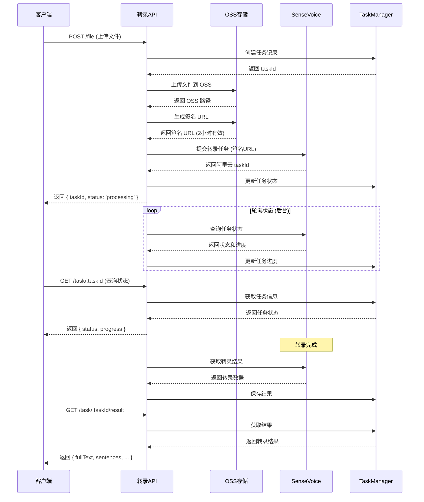

# 转录接口使用说明

## 概述
转录服务提供完整的音视频转文字功能，结合 OSS 存储和 SenseVoice 识别，实现高效、准确的转录服务。

## API 端点

### 基础路径
```
http://localhost:6009/api/transcription
```

### 接口列表
| 方法 | 路径 | 描述 |
|------|------|------|
| POST | `/file` | 上传文件并转录 |
| POST | `/url` | 从 URL 转录 |
| POST | `/batch` | 批量转录多个文件 |
| GET | `/task/:taskId` | 查询任务状态 |
| GET | `/task/:taskId/result` | 获取转录结果 |
| GET | `/tasks` | 获取任务列表 |
| GET | `/formats` | 获取支持的格式 |
| GET | `/statistics` | 获取统计信息 |

## 完整转录流程时序图



## 接口详细说明

### 1. 上传文件转录

**请求**
```http
POST /api/transcription/file
Content-Type: multipart/form-data

参数:
- file: 音视频文件 (必需)
- languages: JSON 数组，如 ["zh", "en"] (可选)
- enableWords: "true" 或 "false" (可选)
- enableTimestamp: "true" 或 "false" (可选，默认 true)
- enablePunctuation: "true" 或 "false" (可选，默认 true)
- removeDisfluency: "true" 或 "false" (可选，默认 false)
```

**响应**
```json
{
  "success": true,
  "taskId": "task-1234567890",
  "message": "Task submitted successfully",
  "status": "processing",
  "ossPath": "transcription/video/1234567890-abc123.mp4"
}
```

**示例代码**
```javascript
const formData = new FormData();
formData.append('file', fileInput.files[0]);
formData.append('languages', JSON.stringify(['zh', 'en']));
formData.append('enableTimestamp', 'true');

const response = await fetch('/api/transcription/file', {
  method: 'POST',
  body: formData
});

const result = await response.json();
console.log('任务ID:', result.taskId);
```

### 2. URL 转录

**请求**
```http
POST /api/transcription/url
Content-Type: application/json

{
  "url": "https://example.com/video.mp4",
  "languages": ["zh", "en"],
  "enableWords": true,
  "enableTimestamp": true
}
```

**响应**
```json
{
  "success": true,
  "taskId": "task-1234567890",
  "message": "Task submitted successfully",
  "status": "processing"
}
```

### 3. 批量转录

**请求**
```http
POST /api/transcription/batch
Content-Type: multipart/form-data

参数:
- files: 多个文件 (最多10个)
- 其他参数同单文件接口
```

**响应**
```json
{
  "success": true,
  "total": 3,
  "successful": 3,
  "failed": 0,
  "batchId": "batch-1234567890",
  "results": [
    {
      "filename": "audio1.mp3",
      "taskId": "task-001",
      "status": "processing"
    }
  ],
  "errors": []
}
```

### 4. 查询任务状态

**请求**
```http
GET /api/transcription/task/:taskId
```

**响应**
```json
{
  "success": true,
  "taskId": "task-1234567890",
  "status": "processing",  // pending | processing | succeeded | failed
  "progress": 75,
  "message": "Processing...",
  "createdAt": "2024-01-01T10:00:00Z",
  "updatedAt": "2024-01-01T10:01:00Z"
}
```

### 5. 获取转录结果

**请求**
```http
GET /api/transcription/task/:taskId/result
```

**响应 (成功)**
```json
{
  "success": true,
  "taskId": "task-1234567890",
  "status": "succeeded",
  "data": {
    "fullText": "完整的转录文本...",
    "sentences": [
      {
        "text": "第一句话",
        "startTime": 0,
        "endTime": 3.5,
        "words": []
      }
    ],
    "language": "zh",
    "duration": 122.5,
    "wordCount": 500,
    "sentenceCount": 20
  }
}
```

### 6. 获取任务列表

**请求**
```http
GET /api/transcription/tasks?status=succeeded&page=1&limit=20
```

**响应**
```json
{
  "success": true,
  "tasks": [...],
  "total": 100,
  "page": 1,
  "limit": 20
}
```

## 完整使用流程

### 步骤 1: 准备文件
```javascript
// 选择文件
const fileInput = document.getElementById('fileInput');
const file = fileInput.files[0];

// 检查文件格式和大小
if (file.size > 100 * 1024 * 1024) {
  alert('文件不能超过 100MB');
  return;
}
```

### 步骤 2: 上传并开始转录
```javascript
async function startTranscription(file) {
  const formData = new FormData();
  formData.append('file', file);
  formData.append('languages', JSON.stringify(['zh', 'en']));
  formData.append('enableTimestamp', 'true');
  formData.append('enableWords', 'true');

  const response = await fetch('/api/transcription/file', {
    method: 'POST',
    body: formData
  });

  if (!response.ok) {
    throw new Error('上传失败');
  }

  const result = await response.json();
  return result.taskId;
}
```

### 步骤 3: 轮询任务状态
```javascript
async function waitForCompletion(taskId) {
  const maxAttempts = 120; // 最多等待 10 分钟
  let attempts = 0;

  while (attempts < maxAttempts) {
    const response = await fetch(`/api/transcription/task/${taskId}`);
    const status = await response.json();

    if (status.status === 'succeeded') {
      return true;
    } else if (status.status === 'failed') {
      throw new Error(status.error || '转录失败');
    }

    // 显示进度
    updateProgress(status.progress);

    // 等待 5 秒后再次查询
    await new Promise(resolve => setTimeout(resolve, 5000));
    attempts++;
  }

  throw new Error('转录超时');
}
```

### 步骤 4: 获取结果
```javascript
async function getTranscriptionResult(taskId) {
  const response = await fetch(`/api/transcription/task/${taskId}/result`);
  
  if (!response.ok) {
    throw new Error('获取结果失败');
  }

  const result = await response.json();
  return result.data;
}
```

### 步骤 5: 处理结果
```javascript
function processResult(transcriptionData) {
  // 显示完整文本
  document.getElementById('fullText').innerText = transcriptionData.fullText;

  // 生成带时间戳的文本
  const timestampedText = transcriptionData.sentences.map(s => {
    const time = formatTime(s.startTime);
    return `[${time}] ${s.text}`;
  }).join('\n');

  // 生成 SRT 字幕
  const srt = generateSRT(transcriptionData.sentences);
  
  // 下载结果
  downloadAsFile(timestampedText, 'transcription.txt');
  downloadAsFile(srt, 'subtitles.srt');
}
```

## 完整示例

```javascript
// 完整的转录流程
async function transcribeFile(file) {
  try {
    // 1. 上传文件
    console.log('正在上传文件...');
    const taskId = await startTranscription(file);
    console.log(`任务已创建: ${taskId}`);

    // 2. 等待完成
    console.log('正在转录，请稍候...');
    await waitForCompletion(taskId);
    console.log('转录完成！');

    // 3. 获取结果
    console.log('正在获取结果...');
    const result = await getTranscriptionResult(taskId);

    // 4. 处理结果
    processResult(result);
    console.log('处理完成');

    return result;
  } catch (error) {
    console.error('转录失败:', error);
    alert(`转录失败: ${error.message}`);
    throw error;
  }
}

// 使用示例
document.getElementById('transcribeBtn').addEventListener('click', async () => {
  const file = document.getElementById('fileInput').files[0];
  if (!file) {
    alert('请选择文件');
    return;
  }

  const result = await transcribeFile(file);
  console.log('转录结果:', result);
});
```

## 错误处理

### 错误响应格式
```json
{
  "success": false,
  "error": "错误描述信息"
}
```

### 常见错误码
| 状态码 | 错误 | 说明 |
|--------|------|------|
| 400 | Bad Request | 请求参数错误 |
| 401 | Unauthorized | API Key 无效 |
| 413 | Payload Too Large | 文件太大 |
| 429 | Too Many Requests | 请求过于频繁 |
| 500 | Internal Server Error | 服务器内部错误 |

### 错误处理示例
```javascript
async function handleTranscriptionError(error, taskId) {
  if (error.status === 429) {
    // 限流：等待后重试
    console.log('请求过于频繁，60秒后重试...');
    await sleep(60000);
    return retryTranscription(taskId);
  } else if (error.status === 413) {
    // 文件太大：提示用户
    alert('文件太大，请选择小于 100MB 的文件');
  } else if (error.status === 401) {
    // 认证失败
    alert('认证失败，请检查 API 配置');
  } else {
    // 其他错误
    console.error('转录错误:', error);
    alert(`转录失败: ${error.message}`);
  }
}
```

## 性能优化建议

1. **文件预处理**
   - 压缩大文件
   - 转换为支持的格式
   - 分割长音频

2. **并发控制**
   - 批量任务使用队列
   - 控制并发数量
   - 实现重试机制

3. **缓存策略**
   - 缓存转录结果
   - 复用相同文件结果
   - 定期清理过期数据

4. **进度显示**
   - 实时更新进度条
   - 显示预计剩余时间
   - 提供取消选项

## 部署建议

1. **环境变量配置**
```bash
# .env.production
NODE_ENV=production
PORT=6009
ALIYUN_API_KEY=your_api_key
OSS_ACCESS_KEY_ID=your_oss_key_id
OSS_ACCESS_KEY_SECRET=your_oss_key_secret
OSS_BUCKET=your_bucket
OSS_REGION=oss-cn-hangzhou
```

2. **Nginx 配置**
```nginx
location /api/transcription {
    proxy_pass http://localhost:6009;
    proxy_http_version 1.1;
    proxy_set_header Upgrade $http_upgrade;
    proxy_set_header Connection 'upgrade';
    proxy_set_header Host $host;
    proxy_cache_bypass $http_upgrade;
    
    # 文件上传限制
    client_max_body_size 100M;
    proxy_read_timeout 600s;
}
```

3. **安全建议**
   - 使用 HTTPS
   - 实现请求签名
   - 限制文件类型
   - 设置访问频率限制

## 相关资源

- [OSS 服务使用说明](./oss-service-guide.md)
- [SenseVoice 服务使用说明](./sensevoice-service-guide.md)
- [API 测试脚本](../test-transcription-final.js)