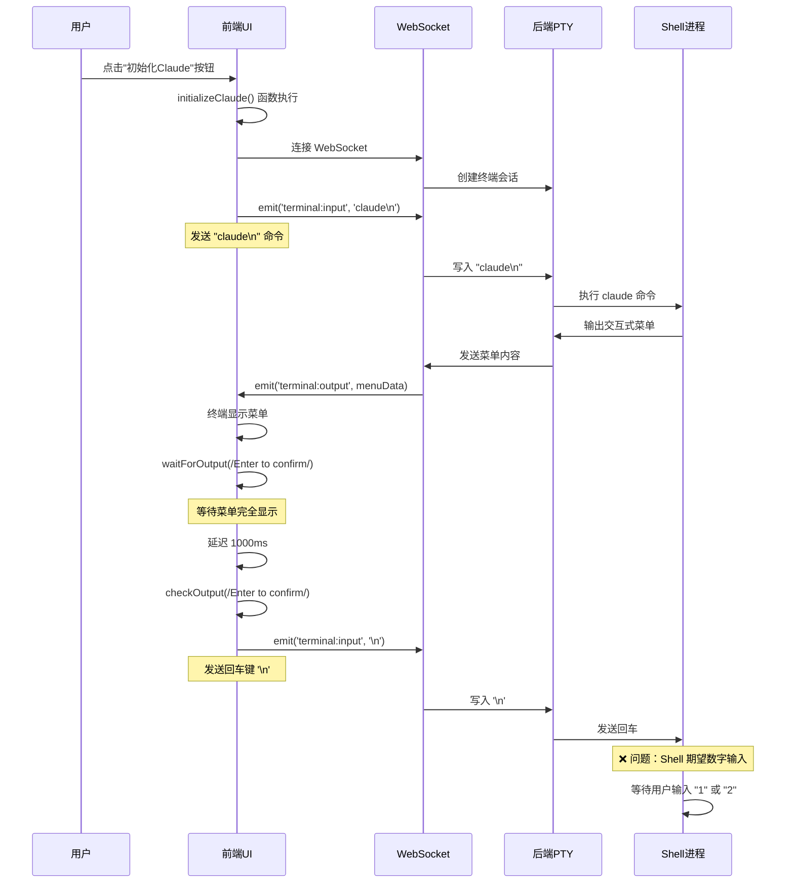
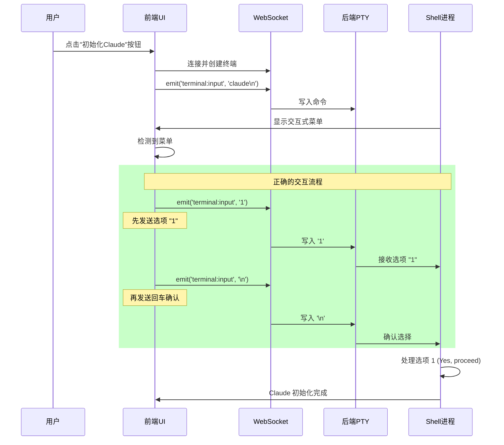

# Claude 初始化按钮操作时序分析

## 问题现象
点击"claude初始化"按钮后，终端显示了交互式菜单，但无法正确响应用户选择。

## 当前实现的操作时序



## 问题分析

### 1. 交互式菜单的工作原理
Claude CLI 使用交互式菜单，期望用户：
1. 先输入选项号码（"1" 或 "2"）
2. 然后按回车确认

### 2. 当前代码的问题

**文件**: `src/views/CardGenerator.vue:177`
```javascript
// 错误：只发送了回车，没有发送选项
terminalIntegration.sendCommand('\n')
```

**问题**：
- 代码只发送了 `\n`（回车键）
- 没有发送选项号码 "1"
- Shell 接收到空输入，继续等待

### 3. 正确的操作时序应该是



## 修复方案

### 方案 1：发送完整的选项+回车
```javascript
// 修改 CardGenerator.vue:177
if (needsMenuSelection) {
  console.log('Menu detected, sending option 1...')
  
  // 发送选项 "1" + 回车(CR)
  terminalIntegration.sendCommand('1\r')
  
  // 或者分两步发送
  // terminalIntegration.sendInput('1')
  // terminalIntegration.sendInput('\r')
  
  await new Promise(resolve => setTimeout(resolve, 2000))
}
```

### 方案 2：使用正确的终端输入序列
```javascript
if (needsMenuSelection) {
  // 使用 sendInput 而不是 sendCommand
  // sendInput 直接发送原始数据
  terminalIntegration.sendInput('1')  // 发送选项
  terminalIntegration.sendInput('\r')  // 发送回车 (CR)
}
```

### 方案 3：模拟真实的键盘输入
```javascript
if (needsMenuSelection) {
  // 模拟用户按键：先按 "1"，再按 Enter
  const socket = terminalIntegration.socket
  socket.emit('terminal:input', '1')     // 数字键 1
  socket.emit('terminal:input', '\r')    // Enter 键 (Carriage Return)
}
```

## 键盘事件对照

根据键盘事件规范：

| 用户操作 | 应发送的数据 | 说明 |
|---------|------------|------|
| 按下 "1" 键 | `'1'` (0x31) | ASCII 字符 1 |
| 按下 Enter 键 | `'\r'` (0x0D) | 回车符 (Carriage Return, CR) |
| 按下 Esc 键 | `'\x1B'` (0x1B) | 退出菜单 |

## 测试验证

### 手动测试步骤
1. 打开终端
2. 运行 `claude` 命令
3. 当菜单出现时，按键盘 "1"
4. 按 Enter 确认

### 自动化测试验证
```javascript
// 测试代码
async function testClaudeInit() {
  await terminalIntegration.connect()
  
  // 发送 claude 命令
  terminalIntegration.sendCommand('claude\n')
  
  // 等待菜单
  await terminalIntegration.waitForOutput(/Enter to confirm/, 10000)
  
  // 发送选项 1
  terminalIntegration.sendInput('1')
  
  // 发送回车
  terminalIntegration.sendInput('\r')
  
  // 验证初始化成功
  await terminalIntegration.waitForOutput(/Claude.*ready|initialized/, 5000)
}
```

## 总结

**核心问题**：代码只发送了回车键 `\r`，没有发送选项号码 "1"。

**解决方案**：先发送 "1"，再发送回车 `\r`。

**正确的发送顺序**：
1. `'1'` - 选择第一个选项
2. `'\r'` - 确认选择 (Carriage Return)