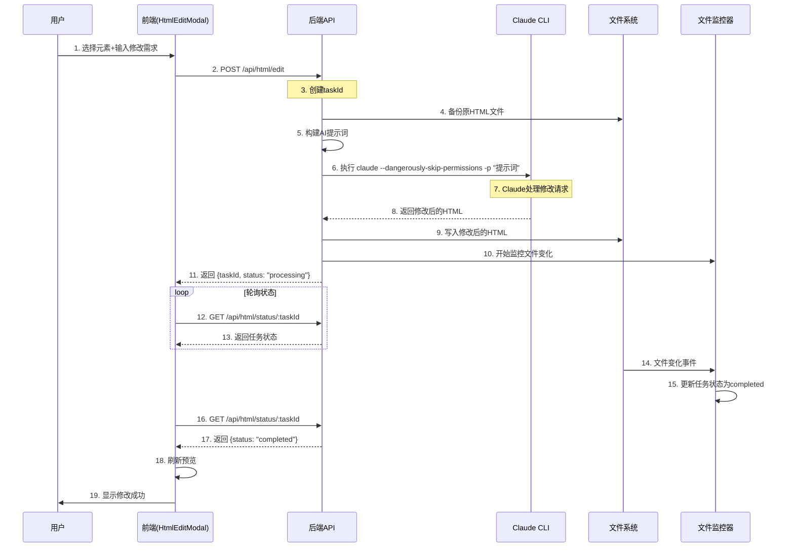
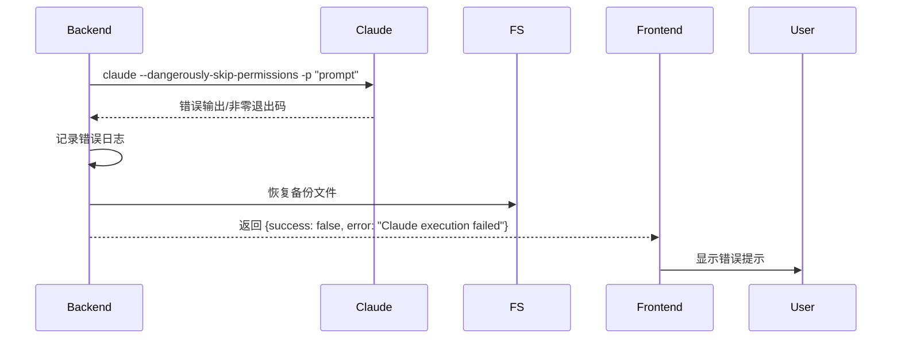
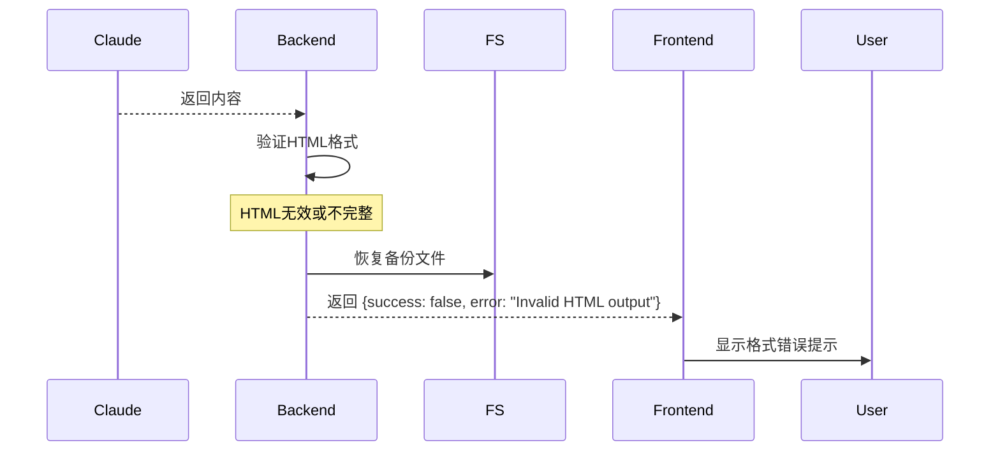

# 卡片修改接口调用时序图

## 一、完整时序流程



## 二、详细步骤说明

### 阶段1：用户操作（步骤1）
```javascript
// 用户在HtmlEditModal中：
// 1. 使用涂抹工具选择HTML元素
// 2. 在textarea中输入修改需求："将图标改为红色"
// 3. 点击"应用修改"按钮
```

### 阶段2：前端提交（步骤2）
```javascript
// Frontend: HtmlEditModal.vue
const handleApply = async () => {
  // 将绝对路径转换为相对路径
  const username = localStorage.getItem('username') || 'default'
  let relativePath = props.htmlPath
  const workspacePrefix = `/app/data/users/${username}/workspace/`
  if (relativePath.startsWith(workspacePrefix)) {
    relativePath = relativePath.substring(workspacePrefix.length)
  }

  const requestData = {
    htmlPath: relativePath,  // 例如："card/AI创作趋势/ai_creation_trends_style.html"
    fileId: props.fileId,
    folderId: props.folderId,
    elements: [
      {
        tagName: "I",
        className: "fas fa-brain",
        html: '<i class="fas fa-brain"></i>',
        coverage: 0.85
      }
    ],
    request: "将图标改为红色"
  };

  const response = await fetch('/api/html/edit', {
    method: 'POST',
    body: JSON.stringify(requestData)
  });
}
```

### 阶段3：后端处理（步骤3-11）

#### 3.1 创建任务和备份（步骤3-4）
```javascript
// Backend: HtmlEditService
async processEditRequest(request, userId) {
  // 步骤3: 创建唯一任务ID
  const taskId = `task_${Date.now()}_${uuidv4().substring(0, 8)}`;

  // 构建完整路径
  const userWorkspace = `/app/data/users/${userId || 'default'}/workspace/`;
  const fullPath = path.join(userWorkspace, request.htmlPath);

  // 步骤4: 备份原文件
  const backupPath = await this.backupFile(fullPath);

  // 读取原始HTML内容
  const originalContent = await fs.readFile(fullPath, 'utf-8');
```

#### 3.2 构建AI提示词（步骤5）
```javascript
  // 步骤5: 构建提示词
  buildPrompt(htmlPath, elements, userRequest, originalHtml) {
    const elementsJson = elements.map(el => ({
      selected_element: el.html,
      selection_coverage_percentage: (el.coverage * 100).toFixed(1)
    }));

    return `你是一个专业的HTML编辑器。请根据用户的要求精确修改HTML文件。

当前HTML文件的完整内容如下：
\`\`\`html
${originalHtml}
\`\`\`

用户通过界面选中了以下元素需要修改：
${JSON.stringify(elementsJson, null, 2)}

用户的修改需求：
${userRequest}

请按照以下要求返回内容：
1. 直接返回修改后的完整HTML代码
2. 不要包含任何markdown标记（如\`\`\`html）
3. 不要包含任何解释性文字
4. 只修改用户选中的元素，保持其他内容不变
5. 确保HTML结构的完整性和有效性

重要：只返回纯HTML代码，从<!DOCTYPE html>或<html>开始，到</html>结束。`;
  }
```

#### 3.3 调用Claude CLI（步骤6-8）【新方式】
```javascript
  // 步骤6-8: 直接调用Claude CLI
  async callClaude(prompt) {
    const { spawn } = require('child_process');

    return new Promise((resolve, reject) => {
      // 使用 -p 参数直接传递提示词
      const claude = spawn('claude', [
        '--dangerously-skip-permissions',
        '-p',
        prompt
      ], {
        env: {
          ...process.env,
          ANTHROPIC_AUTH_TOKEN: process.env.ANTHROPIC_AUTH_TOKEN
        }
      });

      let output = '';
      let errorOutput = '';

      claude.stdout.on('data', (data) => {
        output += data.toString();
      });

      claude.stderr.on('data', (data) => {
        errorOutput += data.toString();
      });

      claude.on('close', (code) => {
        if (code === 0 && output) {
          // 清理输出，只保留HTML内容
          const htmlContent = this.extractHtmlFromOutput(output);
          resolve(htmlContent);
        } else {
          reject(new Error(errorOutput || 'Claude execution failed'));
        }
      });

      claude.on('error', (error) => {
        reject(error);
      });
    });
  }

  // 提取纯HTML内容
  extractHtmlFromOutput(output) {
    // 移除可能的markdown标记
    let html = output.replace(/```html\n?/g, '').replace(/```\n?/g, '');

    // 查找HTML开始标签
    const htmlStart = html.match(/<!DOCTYPE html|<html/i);
    if (htmlStart) {
      html = html.substring(html.indexOf(htmlStart[0]));
    }

    // 查找HTML结束标签
    const htmlEnd = html.lastIndexOf('</html>');
    if (htmlEnd !== -1) {
      html = html.substring(0, htmlEnd + 7);
    }

    return html.trim();
  }
```

#### 3.4 写入文件并监控（步骤9-11）
```javascript
  // 步骤9: 写入修改后的HTML
  await fs.writeFile(fullPath, modifiedHtml, 'utf-8');

  // 步骤10: 开始监控文件变化
  this.monitor.watchFile(fullPath, taskId);

  // 步骤11: 返回任务ID给前端
  return {
    success: true,
    taskId: taskId,
    status: 'processing',
    backupPath,
    message: '修改任务已创建'
  };
}
```

### 阶段4：前端轮询（步骤12-13）
```javascript
// Frontend: 轮询任务状态
const pollTaskStatus = async (taskId) => {
  let retryCount = 0;
  const maxRetries = 30; // 最多轮询30次（60秒）
  const pollInterval = 2000; // 每2秒查询一次

  const checkStatus = async () => {
    // 步骤12: 查询状态
    const response = await fetch(`/api/html/status/${taskId}`);
    const data = await response.json();

    // 步骤13: 获得状态响应
    if (data.status === 'completed') {
      ElMessage.success('修改已完成');
      emit('apply', {
        status: 'completed',
        taskId,
        htmlPath: props.htmlPath
      });
      visible.value = false;
      return true;
    } else if (data.status === 'failed') {
      ElMessage.error(`修改失败: ${data.error || '未知错误'}`);
      isApplying.value = false;
      return true;
    } else if (retryCount >= maxRetries) {
      ElMessage.warning('修改超时，请稍后查看结果');
      isApplying.value = false;
      return true;
    }

    // 继续轮询
    retryCount++;
    setTimeout(checkStatus, pollInterval);
    return false;
  };

  checkStatus();
};
```

### 阶段5：文件监控（步骤14-15）
```javascript
// Backend: FileChangeMonitor
class FileChangeMonitor {
  constructor() {
    this.watchers = new Map();
    this.taskStatuses = new Map();
  }

  watchFile(filePath, taskId) {
    // 步骤14: 监听文件变化
    const watcher = fs.watch(filePath, (eventType) => {
      if (eventType === 'change') {
        // 步骤15: 更新任务状态
        this.taskStatuses.set(taskId, {
          status: 'completed',
          progress: 100,
          completedAt: new Date().toISOString()
        });

        // 清理监听器
        watcher.close();
        this.watchers.delete(taskId);
      }
    });

    this.watchers.set(taskId, watcher);

    // 设置超时
    setTimeout(() => {
      if (this.watchers.has(taskId)) {
        this.taskStatuses.set(taskId, {
          status: 'failed',
          error: 'Timeout waiting for file change'
        });
        watcher.close();
        this.watchers.delete(taskId);
      }
    }, 60000); // 60秒超时
  }

  getTaskStatus(taskId) {
    return this.taskStatuses.get(taskId) || {
      status: 'processing',
      progress: 50
    };
  }
}
```

## 三、Claude CLI 直接调用方式（新）

### 3.1 命令格式
```bash
claude --dangerously-skip-permissions -p "完整的提示词文本"
```

### 3.2 环境变量要求
```bash
ANTHROPIC_AUTH_TOKEN=your_api_key  # Claude API密钥
```

### 3.3 优势
1. **独立性**：不依赖 `/api/generate/cc` 接口
2. **直接性**：减少中间层，直接调用Claude
3. **可控性**：完全控制提示词格式和输出处理
4. **性能**：减少HTTP调用开销

### 3.4 实际调用示例
```javascript
// 完整的Claude调用实现
class ClaudeDirectExecutor {
  async executeHtmlEdit(prompt) {
    const startTime = Date.now();
    const sessionId = `html_edit_${Date.now()}_${Math.random().toString(36).substring(2, 6)}`;

    console.log(`[HTML_EDIT_CLAUDE] Starting Claude execution - Session: ${sessionId}`);
    console.log(`[HTML_EDIT_CLAUDE] Prompt length: ${prompt.length} chars`);

    const { spawn } = require('child_process');

    return new Promise((resolve, reject) => {
      const claude = spawn('claude', [
        '--dangerously-skip-permissions',
        '-p',
        prompt
      ], {
        env: {
          ...process.env,
          ANTHROPIC_AUTH_TOKEN: process.env.ANTHROPIC_AUTH_TOKEN,
          HOME: process.env.HOME || '/home/node'
        },
        maxBuffer: 10 * 1024 * 1024 // 10MB buffer for large HTML files
      });

      let output = '';
      let errorOutput = '';

      claude.stdout.on('data', (data) => {
        const chunk = data.toString();
        output += chunk;
        console.log(`[HTML_EDIT_CLAUDE] Received ${chunk.length} chars`);
      });

      claude.stderr.on('data', (data) => {
        errorOutput += data.toString();
        console.error(`[HTML_EDIT_CLAUDE] Error: ${data.toString()}`);
      });

      claude.on('close', (code) => {
        const executionTime = Date.now() - startTime;
        console.log(`[HTML_EDIT_CLAUDE] Execution completed in ${executionTime}ms`);

        if (code === 0 && output) {
          // 提取纯HTML内容
          const htmlContent = this.extractPureHtml(output);

          if (this.validateHtml(htmlContent)) {
            console.log(`[HTML_EDIT_CLAUDE] Valid HTML extracted: ${htmlContent.length} chars`);
            resolve({
              success: true,
              html: htmlContent,
              executionTime
            });
          } else {
            reject(new Error('Invalid HTML output from Claude'));
          }
        } else {
          reject(new Error(errorOutput || `Claude process exited with code ${code}`));
        }
      });

      claude.on('error', (error) => {
        console.error(`[HTML_EDIT_CLAUDE] Process error:`, error);
        reject(error);
      });
    });
  }

  extractPureHtml(output) {
    // 移除markdown代码块标记
    let html = output.replace(/^```html?\n?/gm, '').replace(/^```\n?/gm, '');

    // 移除可能的前导说明文字
    const htmlStartPatterns = [
      /<!DOCTYPE\s+html/i,
      /<html[\s>]/i,
      /<\?xml/i
    ];

    for (const pattern of htmlStartPatterns) {
      const match = html.match(pattern);
      if (match) {
        html = html.substring(html.indexOf(match[0]));
        break;
      }
    }

    // 确保以</html>结尾
    const htmlEndIndex = html.lastIndexOf('</html>');
    if (htmlEndIndex !== -1) {
      html = html.substring(0, htmlEndIndex + 7);
    }

    return html.trim();
  }

  validateHtml(html) {
    // 基本HTML验证
    if (!html || html.length < 100) return false;

    // 检查基本HTML结构
    const hasHtmlTag = /<html[\s>]/i.test(html) || /<!DOCTYPE\s+html/i.test(html);
    const hasClosingTag = /<\/html>/i.test(html);

    return hasHtmlTag || hasClosingTag;
  }
}
```

## 四、异常处理时序

### 4.1 Claude执行失败


### 4.2 HTML验证失败


## 五、关键改进点

### 5.1 从 `/api/generate/cc` 到直接Claude CLI

**之前（通过API）**：
- Backend → HTTP请求 → `/api/generate/cc` → Claude执行 → HTTP响应 → Backend
- 多层调用，增加延迟和复杂性

**现在（直接CLI）**：
- Backend → Claude CLI → Backend
- 直接调用，减少中间层

### 5.2 提示词优化

1. **明确输出格式**：强调只返回纯HTML，无markdown标记
2. **包含完整上下文**：提供原始HTML内容
3. **精确指令**：明确修改范围和要求

### 5.3 输出处理

1. **智能提取**：自动识别并提取HTML内容
2. **格式验证**：确保输出是有效HTML
3. **错误恢复**：失败时自动从备份恢复

## 六、性能指标

| 指标 | 目标值 | 说明 |
|------|--------|------|
| Claude执行时间 | < 10秒 | 单次修改请求 |
| 文件写入时间 | < 100ms | 本地文件系统 |
| 状态轮询间隔 | 2秒 | 平衡响应速度和服务器负载 |
| 总体完成时间 | < 15秒 | 从提交到完成 |
| 超时时间 | 60秒 | 防止无限等待 |

## 七、总结

通过直接使用 `claude --dangerously-skip-permissions -p` 命令，`/api/html/edit` 接口实现了：

1. **独立性**：不依赖其他API服务
2. **可靠性**：直接控制Claude调用和输出处理
3. **效率**：减少中间层，提高响应速度
4. **灵活性**：完全控制提示词格式和输出处理逻辑

这种方式特别适合HTML编辑这种需要精确输出控制的场景。