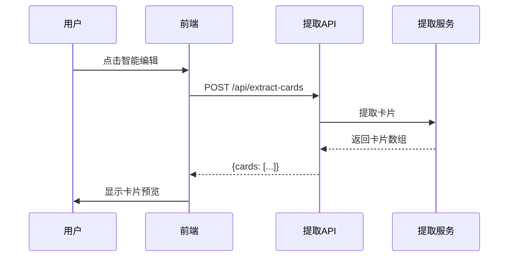
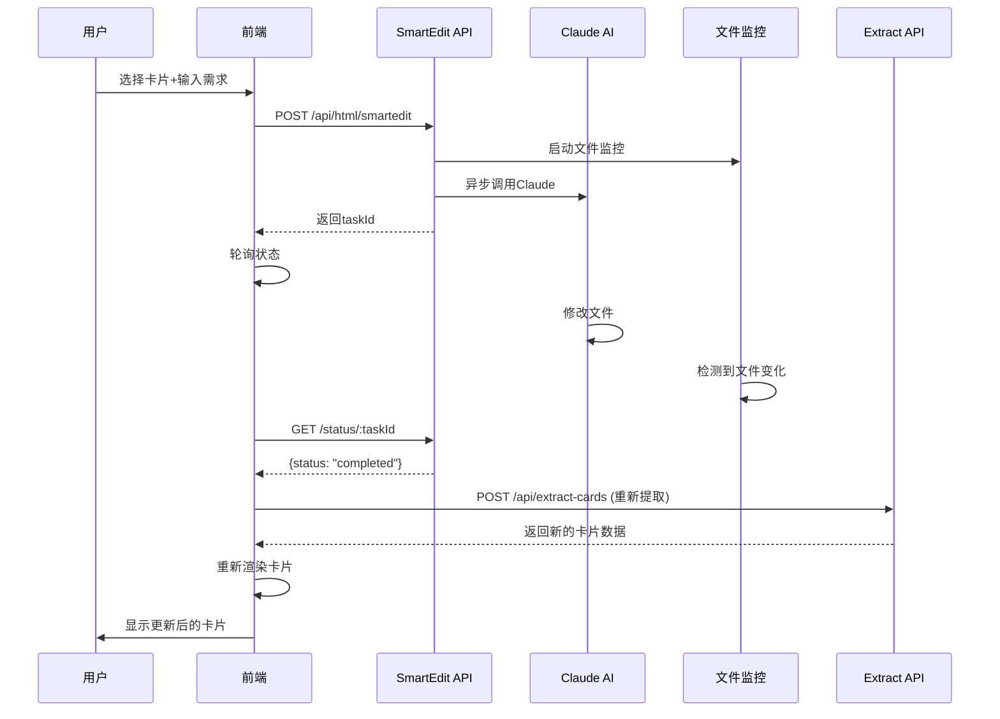

# 智能卡片编辑方案

## 1. 概述

本方案实现一个智能卡片编辑功能，允许用户：
1. 从HTML中提取卡片
2. 预览卡片效果
3. 选择特定卡片进行编辑
4. 使用自然语言描述修改需求
5. AI自动完成修改

## 2. 系统架构

```
┌─────────────────────────────────────────────────┐
│                   前端界面                        │
│  ┌──────────────────────────────────────────┐   │
│  │   PortfolioPage.vue                      │   │
│  │   ┌──────────┐  ┌──────────────────┐    │   │
│  │   │智能编辑按钮│  │  卡片预览区域     │    │   │
│  │   └──────────┘  └──────────────────┘    │   │
│  │                  ┌──────────────────┐    │   │
│  │                  │  修改输入框       │    │   │
│  │                  └──────────────────┘    │   │
│  └──────────────────────────────────────────┘   │
└─────────────────────────────────────────────────┘
                         ↓
┌─────────────────────────────────────────────────┐
│                   API层                          │
│  ┌──────────────────┐  ┌──────────────────┐    │
│  │/api/extract-cards│  │/api/html/smartedit│   │
│  └──────────────────┘  └──────────────────┘    │
└─────────────────────────────────────────────────┘
                         ↓
┌─────────────────────────────────────────────────┐
│                  服务层                          │
│  ┌──────────────────┐  ┌──────────────────┐    │
│  │CardExtractorService│ │SmartEditService  │   │
│  └──────────────────┘  └──────────────────┘    │
└─────────────────────────────────────────────────┘
```

## 3. 前端设计

### 3.1 PortfolioPage.vue 组件结构

```vue
<template>
  <div class="portfolio-page">
    <!-- 现有内容 -->

    <!-- 智能编辑功能区 -->
    <div class="smart-edit-section">
      <!-- 触发按钮 -->
      <button @click="startSmartEdit" class="smart-edit-btn">
        <icon-edit /> 智能编辑
      </button>

      <!-- 卡片预览对话框 -->
      <el-dialog v-model="showCardPreview" title="选择要编辑的卡片">
        <div class="cards-preview-grid">
          <div v-for="(card, index) in extractedCards"
               :key="index"
               @click="selectCard(index)"
               :class="{ selected: selectedCardIndex === index }">
            
            <div class="card-overlay" v-if="selectedCardIndex === index">
              <icon-check />
            </div>
          </div>
        </div>

        <!-- 编辑输入区 -->
        <div v-if="selectedCardIndex !== null" class="edit-input-section">
          <el-input
            v-model="editRequest"
            type="textarea"
            placeholder="请描述您的修改需求..."
            :rows="4"
          />
          <el-button @click="submitEdit" :loading="editing">
            提交修改
          </el-button>
        </div>
      </el-dialog>

      <!-- 状态显示 -->
      <div v-if="editTaskId" class="edit-status">
        <span>{{ editStatus }}</span>
        <el-progress :percentage="editProgress" />
      </div>
    </div>
  </div>
</template>
```

### 3.2 前端交互流程

1. **点击智能编辑按钮**
   - 获取当前HTML内容
   - 调用卡片提取API
   - 显示卡片预览对话框

2. **选择卡片**
   - 用户点击选择要编辑的卡片
   - 高亮显示选中状态
   - 显示修改输入框

3. **提交修改**
   - 发送选中的card_element和修改需求到后端
   - 显示进度状态
   - 轮询任务状态

4. **完成处理**
   - 显示修改成功提示
   - 刷新页面内容

## 4. 后端设计

### 4.1 API接口设计

#### `/api/html/smartedit` - 智能编辑接口

**请求方式**: POST

**请求参数**:
```json
{
  "htmlPath": "card/example/index.html",
  "cardElement": "<div class='card'>...</div>",
  "cardIndex": 3,
  "userRequest": "把标题改成更吸引人的",
  "fileId": "file_123",
  "folderId": "folder_456"
}
```

**响应结果**:
```json
{
  "success": true,
  "taskId": "task_1234567890_abc",
  "status": "processing",
  "backupPath": "/app/data/backups/2024-01-15_backup.html",
  "message": "修改任务已创建"
}
```

#### `/api/html/smartedit/status/:taskId` - 任务状态查询

**请求方式**: GET

**响应结果**:
```json
{
  "taskId": "task_1234567890_abc",
  "status": "completed|processing|failed",
  "progress": 75,
  "filePath": "/app/data/users/default/workspace/card/example/index.html",
  "completedAt": "2024-01-15T10:30:00Z",
  "duration": 5000,
  "error": null
}
```

### 4.2 SmartEditService 服务设计

```javascript
class SmartEditService {
  constructor() {
    this.monitor = new FileChangeMonitor();
    this.cardMatcher = new CardElementMatcher();
  }

  // 构建智能编辑提示词
  buildSmartEditPrompt(filePath, cardElement, userRequest) {
    return `用户需要修改这个卡片：

${cardElement}

用户的修改需求如下：
${userRequest}

需要监测目标html文件变化是否完成，以便于变更修改的状态，是进行中还是已完成

请执行以下操作：
1. 读取文件 ${filePath}
2. 找到用户要修改的卡片（使用模糊匹配，因为可能有细微差异）
3. 根据用户需求修改这个卡片
4. 保持其他内容完全不变
5. 保持原有格式和缩进
6. 直接覆盖原文件

重要：
- 只修改匹配到的卡片元素
- 确保修改后的HTML结构正确
- 保持其他卡片不变
- 直接修改文件，不要只输出内容`;
  }

  // 处理智能编辑请求
  async processSmartEditRequest(request, userId) {
    // 1. 生成任务ID
    // 2. 验证路径安全
    // 3. 备份文件
    // 4. 构建提示词
    // 5. 监控文件变化
    // 6. 调用Claude执行
    // 7. 返回任务信息
  }
}
```

## 5. 数据流设计

### 5.1 卡片提取流程



### 5.2 智能编辑流程



## 6. 关键技术点

### 6.1 卡片元素匹配

由于提取的card_element可能与实际HTML中的元素有细微差异（如空格、换行），需要实现模糊匹配：

```javascript
class CardElementMatcher {
  // 标准化HTML用于比较
  normalizeHtml(html) {
    return html
      .replace(/\s+/g, ' ')  // 多个空格合并为一个
      .replace(/>\s+</g, '><')  // 删除标签间空格
      .toLowerCase()
      .trim();
  }

  // 查找匹配的卡片
  findCardInHtml(fullHtml, cardElement) {
    // 1. 尝试精确匹配
    // 2. 尝试标准化匹配
    // 3. 尝试基于特征匹配（class、id、关键内容）
    // 4. 使用相似度算法
  }
}
```

### 6.2 文件监控优化

```javascript
class EnhancedFileMonitor {
  constructor() {
    this.watchers = new Map();
    this.contentHashes = new Map();  // 内容哈希缓存
  }

  // 基于内容哈希检测变化
  async detectContentChange(filePath) {
    const content = await fs.readFile(filePath, 'utf-8');
    const newHash = crypto.createHash('md5').update(content).digest('hex');
    const oldHash = this.contentHashes.get(filePath);

    if (oldHash && oldHash !== newHash) {
      this.contentHashes.set(filePath, newHash);
      return true;
    }

    this.contentHashes.set(filePath, newHash);
    return false;
  }
}
```

### 6.3 错误处理策略

1. **卡片未找到**：提供相似卡片建议
2. **修改失败**：自动回滚到备份
3. **超时处理**：5分钟自动终止任务
4. **并发控制**：限制同时编辑任务数

## 7. 用户体验优化

### 7.1 状态管理与反馈机制

#### 7.1.1 完整的状态流转

```javascript
// 状态定义
const EditState = {
  IDLE: 'idle',                    // 空闲状态
  EXTRACTING: 'extracting',        // 提取卡片中
  SELECTING: 'selecting',          // 选择卡片中
  EDITING: 'editing',              // 输入修改需求
  SUBMITTING: 'submitting',        // 提交中
  PROCESSING: 'processing',        // AI处理中
  RE_EXTRACTING: 're_extracting',  // 重新提取卡片中（AI处理完成后）
  RELOADING: 'reloading',          // 重新加载渲染中
  COMPLETED: 'completed',          // 完成
  ERROR: 'error'                   // 错误状态
}

// 状态管理器
class EditStateManager {
  constructor() {
    this.currentState = EditState.IDLE
    this.stateHistory = []
    this.listeners = new Map()
  }

  transition(newState, data = {}) {
    this.stateHistory.push({
      from: this.currentState,
      to: newState,
      timestamp: Date.now(),
      data
    })
    this.currentState = newState
    this.notifyListeners(newState, data)
  }

  canTransition(toState) {
    const validTransitions = {
      [EditState.IDLE]: [EditState.EXTRACTING],
      [EditState.EXTRACTING]: [EditState.SELECTING, EditState.ERROR],
      [EditState.SELECTING]: [EditState.EDITING, EditState.IDLE],
      [EditState.EDITING]: [EditState.SUBMITTING, EditState.SELECTING],
      [EditState.SUBMITTING]: [EditState.PROCESSING, EditState.ERROR],
      [EditState.PROCESSING]: [EditState.RE_EXTRACTING, EditState.ERROR],
      [EditState.RE_EXTRACTING]: [EditState.RELOADING, EditState.ERROR],
      [EditState.RELOADING]: [EditState.COMPLETED, EditState.ERROR],
      [EditState.COMPLETED]: [EditState.IDLE, EditState.SELECTING],
      [EditState.ERROR]: [EditState.IDLE]
    }
    return validTransitions[this.currentState]?.includes(toState)
  }
}
```

#### 7.1.2 UI状态控制

```vue
<template>
  <div class="smart-edit-container">
    <!-- 主按钮：根据状态禁用 -->
    <el-button
      @click="startSmartEdit"
      :loading="isExtracting"
      :disabled="!canStartEdit"
      type="primary"
    >
      <i class="el-icon-magic-stick" v-if="!isExtracting" />
      <span>{{ buttonText }}</span>
    </el-button>

    <!-- 状态提示条 -->
    <transition name="fade">
      <div v-if="showStatusBar" class="status-bar" :class="statusClass">
        <div class="status-content">
          <el-icon :size="16" class="status-icon">
            <Loading v-if="isProcessing" />
            <CircleCheck v-if="isCompleted" />
            <Warning v-if="isError" />
          </el-icon>
          <span class="status-text">{{ statusText }}</span>
          <el-progress
            v-if="showProgress"
            :percentage="progressPercentage"
            :status="progressStatus"
            :stroke-width="3"
            style="flex: 1; margin-left: 12px"
          />
        </div>
        <el-button
          v-if="canRetry"
          @click="retryLastAction"
          size="small"
          type="text"
        >
          重试
        </el-button>
      </div>
    </transition>

    <!-- 卡片选择对话框 -->
    <el-dialog
      v-model="showCardDialog"
      title="智能卡片编辑"
      width="90%"
      :close-on-click-modal="false"
      :close-on-press-escape="!isProcessing"
      :show-close="!isProcessing"
      @close="handleDialogClose"
    >
      <!-- 步骤指示器 -->
      <el-steps :active="currentStep" align-center style="margin-bottom: 30px">
        <el-step title="提取卡片" :icon="ExtractIcon" />
        <el-step title="选择卡片" :icon="SelectIcon" />
        <el-step title="输入需求" :icon="EditIcon" />
        <el-step title="处理中" :icon="ProcessIcon" />
        <el-step title="完成" :icon="SuccessIcon" />
      </el-steps>

      <!-- 卡片网格 -->
      <div class="cards-container" v-loading="isExtracting" element-loading-text="正在提取卡片...">
        <el-empty v-if="!isExtracting && cards.length === 0" description="未找到卡片" />

        <div v-else class="cards-grid">
          <div
            v-for="(card, index) in cards"
            :key="`card-${index}`"
            class="card-item"
            :class="{
              'card-selected': selectedCardIndex === index,
              'card-disabled': isProcessing,
              'card-modified': modifiedCards.has(index)
            }"
            @click="selectCard(index)"
          >
            <!-- 卡片预览 -->
            <div class="card-preview">
              
              <!-- 已修改标记 -->
              <div v-if="modifiedCards.has(index)" class="modified-badge">
                <el-icon><CircleCheck /></el-icon>
                已修改
              </div>
              <!-- 选中遮罩 -->
              <transition name="fade">
                <div v-if="selectedCardIndex === index" class="selection-overlay">
                  <el-icon :size="32"><Check /></el-icon>
                </div>
              </transition>
            </div>
            <div class="card-info">
              <span class="card-title">卡片 {{ index + 1 }}</span>
              <span class="card-size">{{ formatSize(card) }}</span>
            </div>
          </div>
        </div>
      </div>

      <!-- 编辑区域 -->
      <transition name="slide-up">
        <div v-if="selectedCardIndex !== null" class="edit-section">
          <div class="edit-header">
            <h4>修改卡片 {{ selectedCardIndex + 1 }}</h4>
            <el-tag type="info">{{ cards[selectedCardIndex]?.type || '未知类型' }}</el-tag>
          </div>

          <!-- 快捷修改模板 -->
          <div class="quick-templates">
            <el-button
              v-for="template in editTemplates"
              :key="template.id"
              @click="applyTemplate(template)"
              size="small"
              plain
            >
              {{ template.label }}
            </el-button>
          </div>

          <!-- 修改输入框 -->
          <el-input
            v-model="editRequest"
            type="textarea"
            :placeholder="editPlaceholder"
            :rows="4"
            :disabled="isProcessing"
            :maxlength="500"
            show-word-limit
          />

          <!-- 操作按钮组 -->
          <div class="action-buttons">
            <el-button
              @click="clearSelection"
              :disabled="isProcessing"
            >
              取消选择
            </el-button>
            <el-button
              @click="previewChanges"
              :disabled="!editRequest || isProcessing"
            >
              预览效果
            </el-button>
            <el-button
              @click="submitEdit"
              type="primary"
              :loading="isProcessing"
              :disabled="!editRequest"
            >
              {{ isProcessing ? processingText : '提交修改' }}
            </el-button>
          </div>

          <!-- 处理进度详情 -->
          <transition name="fade">
            <div v-if="isProcessing" class="process-details">
              <div class="process-timeline">
                <div v-for="(log, index) in processLogs" :key="index" class="log-item">
                  <span class="log-time">{{ formatTime(log.time) }}</span>
                  <span class="log-message">{{ log.message }}</span>
                </div>
              </div>
              <div class="estimated-time">
                预计剩余时间：{{ estimatedTime }}
              </div>
            </div>
          </transition>
        </div>
      </transition>

      <!-- 底部操作栏 -->
      <template #footer>
        <div class="dialog-footer">
          <div class="footer-left">
            <el-button
              v-if="hasModifications"
              @click="revertAll"
              :disabled="isProcessing"
              type="warning"
              plain
            >
              撤销所有修改
            </el-button>
          </div>
          <div class="footer-right">
            <el-button
              @click="handleDialogClose"
              :disabled="isProcessing"
            >
              {{ isProcessing ? '处理中...' : '关闭' }}
            </el-button>
            <el-button
              v-if="hasModifications"
              @click="saveAndClose"
              type="primary"
              :loading="isSaving"
            >
              保存并关闭
            </el-button>
          </div>
        </div>
      </template>
    </el-dialog>
  </div>
</template>

<script setup>
// 计算属性
const canStartEdit = computed(() => {
  return currentState.value === EditState.IDLE && htmlPath.value
})

const buttonText = computed(() => {
  const texts = {
    [EditState.EXTRACTING]: '正在提取卡片...',
    [EditState.PROCESSING]: '处理中...',
    [EditState.RELOADING]: '重新加载中...',
    [EditState.ERROR]: '重试'
  }
  return texts[currentState.value] || '智能编辑'
})

const processingText = computed(() => {
  const texts = {
    [EditState.SUBMITTING]: '提交中...',
    [EditState.PROCESSING]: `处理中(${processProgress.value}%)...`,
    [EditState.RELOADING]: '重新加载中...'
  }
  return texts[currentState.value] || '处理中...'
})

const estimatedTime = computed(() => {
  if (!startTime.value) return '计算中...'
  const elapsed = Date.now() - startTime.value
  const progress = processProgress.value || 1
  const total = elapsed / (progress / 100)
  const remaining = total - elapsed
  return formatDuration(remaining)
})
</script>
```

### 7.2 轮询与重试机制

```javascript
class TaskPoller {
  constructor(options = {}) {
    this.pollInterval = options.interval || 2000  // 默认2秒
    this.maxRetries = options.maxRetries || 150   // 最多150次（5分钟）
    this.backoffMultiplier = options.backoff || 1.5
    this.maxInterval = options.maxInterval || 10000
    this.onProgress = options.onProgress || (() => {})
    this.onComplete = options.onComplete || (() => {})
    this.onError = options.onError || (() => {})
  }

  async poll(taskId) {
    let retryCount = 0
    let currentInterval = this.pollInterval
    let consecutiveErrors = 0

    const executePoll = async () => {
      try {
        const response = await fetch(`/api/html/smartedit/status/${taskId}`)
        const data = await response.json()

        // 重置连续错误计数
        consecutiveErrors = 0
        currentInterval = this.pollInterval

        // 更新进度
        this.onProgress({
          progress: data.progress || 0,
          status: data.status,
          message: data.message,
          duration: data.duration
        })

        // 检查完成状态
        if (data.status === 'completed') {
          this.onComplete(data)
          return true
        }

        // 检查失败状态
        if (data.status === 'failed') {
          this.onError(new Error(data.error || '处理失败'))
          return true
        }

        // 检查超时
        if (retryCount >= this.maxRetries) {
          this.onError(new Error('处理超时'))
          return true
        }

        // 继续轮询
        retryCount++
        setTimeout(executePoll, currentInterval)

      } catch (error) {
        consecutiveErrors++

        // 实施退避策略
        currentInterval = Math.min(
          currentInterval * this.backoffMultiplier,
          this.maxInterval
        )

        // 连续错误过多，停止轮询
        if (consecutiveErrors > 5) {
          this.onError(new Error('网络错误，无法获取状态'))
          return true
        }

        // 重试
        setTimeout(executePoll, currentInterval)
      }
    }

    return executePoll()
  }
}
```

### 7.3 完整的编辑流程处理

```javascript
// 完整的智能编辑处理流程
class SmartEditHandler {
  constructor() {
    this.stateManager = new EditStateManager()
    this.taskPoller = new TaskPoller({
      onComplete: this.handleTaskComplete.bind(this),
      onProgress: this.handleTaskProgress.bind(this),
      onError: this.handleTaskError.bind(this)
    })
  }

  // 提交编辑请求
  async submitEdit(htmlPath, cardElement, userRequest) {
    try {
      // 1. 切换到提交状态
      this.stateManager.transition(EditState.SUBMITTING)

      // 2. 发送编辑请求
      const response = await fetch('/api/html/smartedit', {
        method: 'POST',
        headers: { 'Content-Type': 'application/json' },
        body: JSON.stringify({
          htmlPath,
          cardElement,
          userRequest
        })
      })

      const result = await response.json()

      // 3. 切换到处理中状态
      this.stateManager.transition(EditState.PROCESSING, {
        taskId: result.taskId
      })

      // 4. 开始轮询任务状态
      await this.taskPoller.poll(result.taskId)

    } catch (error) {
      this.stateManager.transition(EditState.ERROR, { error })
      throw error
    }
  }

  // 任务完成处理
  async handleTaskComplete(data) {
    try {
      // 1. AI处理完成，切换到重新提取状态
      this.stateManager.transition(EditState.RE_EXTRACTING, {
        filePath: data.filePath
      })

      // 2. 重新提取卡片
      const extractResponse = await fetch('/api/extract-cards-raw', {
        method: 'POST',
        headers: {
          'Content-Type': 'text/html',
          'X-Filename': data.filePath
        },
        body: await this.fetchUpdatedHTML(data.filePath)
      })

      const extractedData = await extractResponse.json()

      // 3. 切换到重新加载状态
      this.stateManager.transition(EditState.RELOADING, {
        cards: extractedData.cards
      })

      // 4. 渲染新的卡片数据
      await this.renderCards(extractedData.cards)

      // 5. 完成
      this.stateManager.transition(EditState.COMPLETED)

      // 显示成功消息
      ElMessage.success({
        message: '卡片修改成功并已更新显示',
        duration: 3000
      })

    } catch (error) {
      this.stateManager.transition(EditState.ERROR, { error })
      ElMessage.error('重新加载卡片失败')
    }
  }

  // 获取更新后的HTML内容
  async fetchUpdatedHTML(filePath) {
    // 从服务器获取修改后的HTML文件内容
    const response = await fetch(`/api/files/${encodeURIComponent(filePath)}`)
    return await response.text()
  }

  // 渲染卡片
  async renderCards(cards) {
    // 更新Vue组件的卡片数据
    this.cards = cards

    // 触发视图更新
    await nextTick()

    // 可选：添加动画效果
    this.animateCardUpdate()
  }

  // 任务进度更新
  handleTaskProgress(data) {
    // 更新进度显示
    this.processProgress = data.progress
    this.processMessage = data.message
  }

  // 错误处理
  handleTaskError(error) {
    this.stateManager.transition(EditState.ERROR, { error })

    // 显示错误信息
    ElMessage.error({
      message: error.message || '处理失败',
      duration: 5000,
      showClose: true
    })
  }
}
```

### 7.4 防抖与节流

```javascript
// 防抖处理
const debouncedSubmit = debounce(async (request) => {
  await submitEditRequest(request)
}, 500)

// 节流处理
const throttledExtract = throttle(async () => {
  await extractCards()
}, 3000)

// 并发控制
class ConcurrencyManager {
  constructor(maxConcurrent = 1) {
    this.maxConcurrent = maxConcurrent
    this.running = 0
    this.queue = []
  }

  async execute(fn) {
    if (this.running >= this.maxConcurrent) {
      await new Promise(resolve => {
        this.queue.push(resolve)
      })
    }

    this.running++
    try {
      return await fn()
    } finally {
      this.running--
      if (this.queue.length > 0) {
        const resolve = this.queue.shift()
        resolve()
      }
    }
  }
}
```

### 7.4 缓存策略

```javascript
class CardCache {
  constructor() {
    this.cache = new Map()
    this.maxSize = 50
    this.ttl = 5 * 60 * 1000  // 5分钟过期
  }

  set(key, value) {
    // LRU策略
    if (this.cache.size >= this.maxSize) {
      const firstKey = this.cache.keys().next().value
      this.cache.delete(firstKey)
    }

    this.cache.set(key, {
      value,
      timestamp: Date.now()
    })
  }

  get(key) {
    const item = this.cache.get(key)
    if (!item) return null

    // 检查过期
    if (Date.now() - item.timestamp > this.ttl) {
      this.cache.delete(key)
      return null
    }

    // 移到末尾（LRU）
    this.cache.delete(key)
    this.cache.set(key, item)
    return item.value
  }

  clear() {
    this.cache.clear()
  }
}
```

### 7.5 错误恢复机制

```javascript
class ErrorRecovery {
  constructor() {
    this.errorHandlers = new Map()
    this.recoveryStrategies = new Map()
  }

  registerHandler(errorType, handler) {
    this.errorHandlers.set(errorType, handler)
  }

  registerRecovery(errorType, strategy) {
    this.recoveryStrategies.set(errorType, strategy)
  }

  async handle(error, context) {
    const errorType = this.classifyError(error)
    const handler = this.errorHandlers.get(errorType)
    const recovery = this.recoveryStrategies.get(errorType)

    // 执行错误处理
    if (handler) {
      await handler(error, context)
    }

    // 尝试恢复
    if (recovery) {
      return await recovery(error, context)
    }

    // 默认处理
    return this.defaultHandler(error, context)
  }

  classifyError(error) {
    if (error.message?.includes('timeout')) return 'TIMEOUT'
    if (error.message?.includes('network')) return 'NETWORK'
    if (error.message?.includes('permission')) return 'PERMISSION'
    if (error.message?.includes('not found')) return 'NOT_FOUND'
    return 'UNKNOWN'
  }

  defaultHandler(error, context) {
    console.error('Unhandled error:', error)
    ElMessage.error({
      message: '操作失败，请重试',
      duration: 5000,
      showClose: true
    })
  }
}

// 注册恢复策略
recovery.registerRecovery('TIMEOUT', async (error, context) => {
  const result = await ElMessageBox.confirm(
    '操作超时，是否重试？',
    '提示',
    {
      confirmButtonText: '重试',
      cancelButtonText: '取消',
      type: 'warning'
    }
  )

  if (result === 'confirm') {
    return await context.retry()
  }
  return null
})

recovery.registerRecovery('NETWORK', async (error, context) => {
  // 自动重试3次
  for (let i = 0; i < 3; i++) {
    await sleep(2000 * (i + 1))  // 退避重试
    try {
      return await context.retry()
    } catch (e) {
      continue
    }
  }
  throw error
})
```

## 8. 安全性考虑

1. **路径验证**
   - 限制在用户工作空间
   - 防止路径遍历攻击

2. **内容验证**
   - HTML结构完整性检查
   - XSS防护

3. **权限控制**
   - 用户只能编辑自己的文件
   - 操作审计日志

4. **资源限制**
   - 限制文件大小
   - 限制并发任务数
   - 超时自动清理

## 9. 性能优化

1. **缓存策略**
   - 卡片提取结果缓存
   - 文件内容缓存
   - Claude响应缓存

2. **异步处理**
   - 非阻塞API设计
   - 任务队列管理
   - 批量处理支持

3. **资源管理**
   - 自动清理过期任务
   - 内存使用监控
   - 连接池管理

## 10. 扩展性设计

### 10.1 插件化架构

- 支持自定义编辑规则
- 可扩展的卡片识别算法
- 多AI模型支持

### 10.2 批量操作

- 批量卡片编辑
- 模板化修改
- 规则批处理

### 10.3 协作功能

- 多人同时编辑
- 冲突解决机制
- 版本合并

## 11. 测试策略

### 11.1 单元测试

- 卡片匹配算法测试
- 提示词生成测试
- 文件监控测试

### 11.2 集成测试

- API端到端测试
- 并发处理测试
- 错误恢复测试

### 11.3 性能测试

- 大文件处理
- 高并发场景
- 内存泄漏检测

## 12. 部署考虑

1. **Docker化部署**
   - 环境隔离
   - 资源限制
   - 健康检查

2. **监控告警**
   - 任务成功率
   - 响应时间
   - 错误率监控

3. **备份恢复**
   - 自动备份
   - 快速恢复
   - 数据一致性

## 13. 实施计划

### Phase 1: 基础功能（1周）
- [ ] 后端SmartEditService实现
- [ ] 前端智能编辑按钮
- [ ] 基础卡片预览功能

### Phase 2: 核心功能（1周）
- [ ] 卡片选择交互
- [ ] 修改提交功能
- [ ] 状态监控实现

### Phase 3: 优化完善（1周）
- [ ] 错误处理完善
- [ ] 用户体验优化
- [ ] 性能优化

### Phase 4: 高级功能（1周）
- [ ] 批量编辑
- [ ] 历史版本
- [ ] 智能提示

## 14. 风险管理

| 风险 | 影响 | 缓解措施 |
|------|------|----------|
| Claude API响应慢 | 用户体验差 | 异步处理+进度反馈 |
| 卡片匹配失败 | 功能不可用 | 多种匹配算法+手动选择 |
| 文件损坏 | 数据丢失 | 自动备份+版本控制 |
| 并发冲突 | 数据不一致 | 锁机制+冲突检测 |

## 15. 总结

本方案提供了一个完整的智能卡片编辑解决方案，通过结合卡片提取、AI编辑、实时监控等技术，实现了直观、高效的编辑体验。系统设计考虑了安全性、性能、扩展性等多个方面，确保方案的可行性和可持续性。