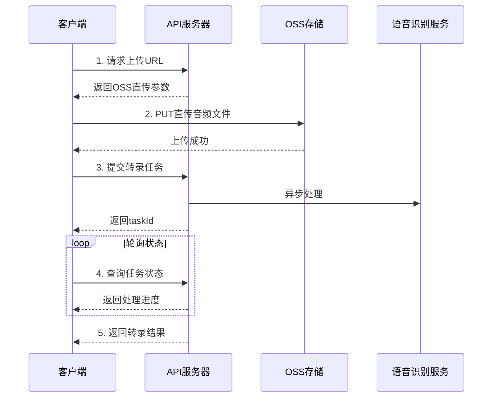

# 音频转录API开发文档 V2

## 📌 服务概述

音频转录API服务提供高质量的语音转文字功能，支持多种音频/视频格式，可生成带时间戳的转录结果。服务采用异步处理模式，通过OSS直传优化大文件传输，支持中英文混合识别。

### 🎯 核心特性
- ✅ **多格式支持**: 支持MP3、WAV、M4A、MP4等音频视频格式
- ✅ **时间戳标注**: 提供精确到毫秒的时间戳分段
- ✅ **OSS直传**: 大文件通过OSS PUT直传，支持进度监控
- ✅ **异步处理**: 任务队列处理，支持长音频转录
- ✅ **多语言识别**: 支持中文、英文及混合语言识别
- ✅ **实时状态查询**: 提供任务进度和状态查询接口
- 🆕 **视频支持**: 支持视频文件音轨提取和转录
- 🆕 **权限优化**: 解决OSS权限问题，确保文件可访问

## 🔗 API端点列表

| 端点 | 方法 | 描述 | 响应格式 |
|-----|------|------|---------|
| `/api/oss-direct/upload-url` | POST | 获取OSS直传URL | JSON |
| `/api/transcription/url` | POST | 提交URL转录任务 | JSON |
| `/api/transcription/task/:taskId/result` | GET | 查询任务结果 | JSON |

## 🚀 快速开始

### 环境配置

#### 服务器地址
- **开发环境**: `http://localhost:8098/api`
- **生产环境**: 请根据实际部署配置

### 完整转录流程



## 📤 获取上传URL

### 端点
```
POST /api/oss-direct/upload-url
```

### 请求格式
```json
{
  "fileName": "audio_sample.mp3",
  "fileType": "audio",  // 或 "video" 
  "contentType": "audio/mpeg"
}
```

### 请求参数说明
| 参数 | 类型 | 必需 | 描述 |
|-----|------|------|------|
| fileName | string | 是 | 文件名称 |
| fileType | string | 是 | 文件类型（"audio" 或 "video"） |
| contentType | string | 是 | MIME类型 |

### 响应格式
```json
{
  "success": true,
  "uploadUrl": "https://your-bucket.oss-cn-hangzhou.aliyuncs.com/audio/...",
  "ossUrl": "https://your-bucket.oss-cn-hangzhou.aliyuncs.com/audio/2025/01/audio_sample.mp3",
  "ossKey": "audio/2025/01/audio_sample.mp3",
  "expires": 1800
}
```

### 响应字段说明
| 字段 | 类型 | 描述 |
|-----|------|------|
| uploadUrl | string | OSS上传端点（PUT方式） |
| ossUrl | string | 文件最终访问URL |
| ossKey | string | OSS文件路径 |
| expires | number | URL有效期（秒） |

## 📁 上传文件到OSS

### 使用PUT方式直传（推荐）
```javascript
// 使用XMLHttpRequest支持上传进度
const xhr = new XMLHttpRequest();

// 监听上传进度
xhr.upload.addEventListener('progress', (e) => {
    if (e.lengthComputable) {
        const percentComplete = Math.round((e.loaded / e.total) * 100);
        console.log(`上传进度: ${percentComplete}%`);
    }
});

// 上传完成
xhr.addEventListener('load', () => {
    if (xhr.status === 200 || xhr.status === 201 || xhr.status === 204) {
        console.log('上传成功');
    }
});

// 发送PUT请求
xhr.open('PUT', uploadData.uploadUrl);
xhr.setRequestHeader('Content-Type', file.type || 'application/octet-stream');
xhr.setRequestHeader('x-oss-object-acl', 'public-read'); // 设置公共读权限
xhr.send(file);
```

### 注意事项
- ⚠️ **推荐使用PUT方式**：更简单，支持进度监控
- ⚠️ **权限设置**：添加`x-oss-object-acl: public-read`头确保文件可被访问
- ⚠️ **Content-Type**：设置正确的Content-Type
- ⚠️ **URL处理**：如果uploadUrl是对象，使用`uploadUrl.url`
- ⚠️ 上传URL有时效性（30分钟），请尽快使用

## 🎯 提交转录任务

### 端点
```
POST /api/transcription/url
```

### 请求格式
```json
{
  "url": "https://your-bucket.oss-cn-hangzhou.aliyuncs.com/audio/2025/01/audio_sample.mp3",
  "ossPath": "audio/2025/01/audio_sample.mp3",
  "enableTimestamp": true,
  "enablePunctuation": true
}
```

### 请求参数说明
| 参数 | 类型 | 必需 | 描述 |
|-----|------|------|------|
| url | string | 是 | 音频文件URL（带签名） |
| ossPath | string | 否 | OSS文件路径 |
| enableTimestamp | boolean | 否 | 是否返回时间戳（默认true） |
| enablePunctuation | boolean | 否 | 是否添加标点（默认true） |

### 响应格式
```json
{
  "success": true,
  "taskId": "task_1234567890_abcdef",
  "message": "任务已提交",
  "estimatedTime": 120
}
```

## 📊 查询任务状态和结果

### 端点
```
GET /api/transcription/task/:taskId/result
```

### 响应格式（处理中）
```json
{
  "success": false,
  "status": "processing",
  "progress": 45,
  "message": "正在处理中..."
}
```

### 响应格式（完成）
```json
{
  "success": true,
  "status": "succeeded",
  "taskId": "task_1234567890_abcdef",
  "transcription": "完整的转录文本内容...",
  "details": {
    "segments": [
      {
        "text": "大家好，欢迎收听本期节目",
        "start": 0.520,
        "end": 2.840,
        "speaker": "Speaker 1"
      },
      {
        "text": "今天我们要讨论的话题是人工智能",
        "start": 3.120,
        "end": 5.680,
        "speaker": "Speaker 1"
      }
    ]
  },
  "metadata": {
    "duration": 180.5,
    "language": "zh-CN",
    "speakers": 2,
    "processTime": 45.2
  }
}
```

### 响应字段说明
| 字段 | 类型 | 描述 |
|-----|------|------|
| status | string | 任务状态(processing/succeeded/failed) |
| transcription | string | 完整转录文本 |
| details.segments | array | 时间戳分段数组 |
| metadata | object | 音频元信息 |

### 句段字段说明
| 字段 | 类型 | 描述 |
|-----|------|------|
| text | string | 句段文本内容 |
| start | number | 开始时间（秒） |
| end | number | 结束时间（秒） |
| speaker | string | 说话人标识 |

## 💻 JavaScript SDK示例

### 完整的转录流程实现

```javascript
class AudioTranscriptionClient {
  constructor(apiEndpoint = 'http://localhost:8098/api') {
    this.apiEndpoint = apiEndpoint;
  }

  // 步骤1: 获取上传URL
  async getUploadUrl(file) {
    // 判断文件类型
    const fileExt = file.name.split('.').pop().toLowerCase();
    const isVideo = ['mp4', 'avi', 'mov', 'mkv', 'wmv', 'flv', 'webm'].includes(fileExt);
    
    const response = await fetch(`${this.apiEndpoint}/oss-direct/upload-url`, {
      method: 'POST',
      headers: {
        'Content-Type': 'application/json'
      },
      body: JSON.stringify({
        fileName: file.name,
        fileType: isVideo ? 'video' : 'audio',
        contentType: file.type || 'application/octet-stream'
      })
    });
    
    const data = await response.json();
    if (!data.success) {
      throw new Error(data.error || '获取上传URL失败');
    }
    
    return data;
  }

  // 步骤2: 上传到OSS（使用PUT方式）
  async uploadToOSS(uploadData, file, onProgress = null) {
    return new Promise((resolve, reject) => {
      const xhr = new XMLHttpRequest();
      
      // 监听上传进度
      xhr.upload.addEventListener('progress', (e) => {
        if (e.lengthComputable && onProgress) {
          const percentComplete = Math.round((e.loaded / e.total) * 100);
          onProgress(percentComplete);
        }
      });
      
      // 上传完成
      xhr.addEventListener('load', () => {
        if (xhr.status === 200 || xhr.status === 201 || xhr.status === 204) {
          resolve(uploadData.ossUrl);
        } else {
          reject(new Error(`上传失败: HTTP ${xhr.status}`));
        }
      });
      
      // 上传错误
      xhr.addEventListener('error', () => {
        reject(new Error('网络错误'));
      });
      
      // 处理uploadUrl可能是对象的情况
      let uploadUrl = uploadData.uploadUrl;
      if (typeof uploadUrl === 'object' && uploadUrl.url) {
        uploadUrl = uploadUrl.url;
      }
      
      // 发送PUT请求
      xhr.open('PUT', uploadUrl);
      xhr.setRequestHeader('Content-Type', file.type || 'application/octet-stream');
      xhr.setRequestHeader('x-oss-object-acl', 'public-read');
      xhr.send(file);
    });
  }

  // 步骤3: 提交转录任务
  async submitTranscription(ossUrl, ossKey, options = {}) {
    const response = await fetch(`${this.apiEndpoint}/transcription/url`, {
      method: 'POST',
      headers: {
        'Content-Type': 'application/json'
      },
      body: JSON.stringify({
        url: ossUrl,  // 使用带签名的URL
        ossPath: ossKey,
        enableTimestamp: options.enableTimestamp !== false,
        enablePunctuation: options.enablePunctuation !== false,
        ...options
      })
    });
    
    const data = await response.json();
    if (!data.success) {
      throw new Error(data.error || '提交任务失败');
    }
    
    return data.taskId;
  }

  // 步骤4: 轮询结果
  async pollResult(taskId, maxAttempts = 120, interval = 5000) {
    for (let i = 0; i < maxAttempts; i++) {
      const response = await fetch(`${this.apiEndpoint}/transcription/task/${taskId}/result`);
      const data = await response.json();
      
      if (data.success && data.status === 'succeeded') {
        return data;
      }
      
      if (data.status === 'failed') {
        // 特殊处理OSS权限错误
        if (data.error && data.error.includes('cannot be downloaded')) {
          throw new Error('文件无法被阿里云下载，请检查OSS权限设置');
        }
        throw new Error(data.error || '转录失败');
      }
      
      // 等待后继续轮询
      await new Promise(resolve => setTimeout(resolve, interval));
    }
    
    throw new Error('转录超时');
  }

  // 完整的转录流程
  async transcribeAudio(file, options = {}, callbacks = {}) {
    try {
      // 进度回调
      const { onProgress, onStageChange } = callbacks;
      
      if (onStageChange) onStageChange('获取上传URL');
      const uploadData = await this.getUploadUrl(file);
      
      if (onStageChange) onStageChange('上传文件到OSS');
      const ossUrl = await this.uploadToOSS(uploadData, file, onProgress);
      
      if (onStageChange) onStageChange('提交转录任务');
      const taskId = await this.submitTranscription(ossUrl, uploadData.ossKey, options);
      
      if (onStageChange) onStageChange('等待转录完成');
      const result = await this.pollResult(taskId);
      
      if (onStageChange) onStageChange('转录完成');
      return result;
      
    } catch (error) {
      console.error('转录失败:', error);
      throw error;
    }
  }

  // 格式化时间戳
  formatTimestamp(seconds) {
    const hours = Math.floor(seconds / 3600);
    const minutes = Math.floor((seconds % 3600) / 60);
    const secs = Math.floor(seconds % 60);
    const millis = Math.floor((seconds % 1) * 1000);
    
    if (hours > 0) {
      return `${hours.toString().padStart(2, '0')}:${minutes.toString().padStart(2, '0')}:${secs.toString().padStart(2, '0')}.${millis.toString().padStart(3, '0')}`;
    } else {
      return `${minutes.toString().padStart(2, '0')}:${secs.toString().padStart(2, '0')}.${millis.toString().padStart(3, '0')}`;
    }
  }

  // 导出带时间戳的文本
  exportWithTimestamps(result) {
    let content = '音频转录文本（带时间戳）\n';
    content += '=' .repeat(50) + '\n\n';
    
    const segments = result.details?.segments || result.sentences || [];
    
    segments.forEach(segment => {
      const startTime = this.formatTimestamp(segment.start || segment.startTime || 0);
      const endTime = this.formatTimestamp(segment.end || segment.endTime || 0);
      const text = segment.text || '';
      
      content += `[${startTime} → ${endTime}]\n`;
      content += `${text}\n\n`;
    });
    
    return content;
  }
}

// 使用示例
const client = new AudioTranscriptionClient();

// HTML文件输入
const fileInput = document.getElementById('audioFile');
fileInput.addEventListener('change', async (e) => {
  const file = e.target.files[0];
  
  try {
    const result = await client.transcribeAudio(file, {
      enableTimestamp: true,
      enablePunctuation: true
    }, {
      onProgress: (percent) => {
        console.log(`上传进度: ${percent}%`);
        document.getElementById('uploadProgress').style.width = `${percent}%`;
      },
      onStageChange: (stage) => {
        console.log(`当前阶段: ${stage}`);
        document.getElementById('currentStage').textContent = stage;
      }
    });
    
    // 处理结果
    console.log('转录结果:', result.transcription);
    
    // 显示带时间戳的内容
    if (result.details?.segments) {
      const timestampText = client.exportWithTimestamps(result);
      document.getElementById('resultContent').textContent = timestampText;
    }
    
    // 下载结果
    const blob = new Blob([client.exportWithTimestamps(result)], { 
      type: 'text/plain;charset=utf-8' 
    });
    const url = URL.createObjectURL(blob);
    const a = document.createElement('a');
    a.href = url;
    a.download = `transcription_${Date.now()}.txt`;
    a.click();
    
  } catch (error) {
    console.error('转录失败:', error);
    alert('转录失败: ' + error.message);
  }
});
```

## 🔧 高级功能

### 批量转录
```javascript
async function batchTranscribe(files, client) {
  const results = [];
  
  for (const file of files) {
    try {
      console.log(`处理文件: ${file.name}`);
      const result = await client.transcribeAudio(file);
      results.push({
        file: file.name,
        success: true,
        data: result
      });
    } catch (error) {
      results.push({
        file: file.name,
        success: false,
        error: error.message
      });
    }
  }
  
  return results;
}
```

### 视频音轨提取
```javascript
// 视频文件会自动提取音轨进行转录
const videoFile = document.getElementById('videoFile').files[0];
const result = await client.transcribeAudio(videoFile, {
  enableTimestamp: true,
  // 视频特定选项
  extractAudio: true
});
```

## 📊 输出格式说明

### 时间戳格式
时间戳使用浮点数表示秒数，精确到毫秒：
- `0.520` = 520毫秒
- `65.840` = 1分5秒840毫秒

### 文本格式导出

#### 带时间戳格式
```text
[00:00.520 → 00:02.840]
大家好，欢迎收听本期节目

[00:03.120 → 00:05.680]
今天我们要讨论的话题是人工智能
```

#### SRT字幕格式（扩展功能）
```srt
1
00:00:00,520 --> 00:00:02,840
大家好，欢迎收听本期节目

2
00:00:03,120 --> 00:00:05,680
今天我们要讨论的话题是人工智能
```

## 🚨 错误处理

### 常见错误及解决方案

| 错误信息 | 原因 | 解决方案 |
|---------|------|---------|
| "cannot be downloaded" | OSS权限问题 | 设置`x-oss-object-acl: public-read` |
| "获取上传URL失败" | 服务端配置问题 | 检查OSS配置 |
| "上传失败: HTTP 403" | 签名过期或无效 | 重新获取上传URL |
| "转录超时" | 文件过大或网络慢 | 增加轮询次数或优化文件 |

### 错误响应格式
```json
{
  "success": false,
  "error": "文件无法被阿里云下载",
  "errorCode": "OSS_ACCESS_DENIED",
  "details": {
    "suggestion": "请确保文件具有公共读权限",
    "ossPath": "audio/2025/01/sample.mp3"
  }
}
```

## 🎯 性能指标

### 处理时间预估
| 音频时长 | 预计处理时间 |
|---------|-------------|
| < 5分钟 | 30-60秒 |
| 5-30分钟 | 1-5分钟 |
| 30-60分钟 | 5-10分钟 |
| > 60分钟 | 10-20分钟 |

### 文件限制
- **最大文件大小**: 500MB
- **最长音频时长**: 3小时
- **支持采样率**: 8kHz - 48kHz
- **支持格式**: MP3, WAV, M4A, FLAC, MP4, AVI, MOV等

### 并发限制
- **每用户并发任务**: 5个
- **每分钟请求数**: 60次
- **每日配额**: 1000个任务

## 🔐 安全考虑

### OSS安全配置
1. **CORS设置**
   ```json
   {
     "AllowedOrigin": ["*"],
     "AllowedMethod": ["GET", "PUT", "POST"],
     "AllowedHeader": ["*"],
     "ExposeHeader": ["ETag"],
     "MaxAgeSeconds": 300
   }
   ```

2. **Bucket权限**
   - 设置合理的读写权限
   - 使用STS临时凭证
   - 定期轮换AccessKey

3. **文件访问控制**
   - 使用签名URL限制访问时间
   - 设置合理的ACL权限
   - 监控异常访问

## 📝 最佳实践

1. **文件预处理**
   - 音频建议使用MP3格式，128kbps以上
   - 视频建议使用MP4格式
   - 降噪处理可提高识别准确率

2. **错误重试策略**
   ```javascript
   async function retryableTranscribe(file, maxRetries = 3) {
     for (let i = 0; i < maxRetries; i++) {
       try {
         return await client.transcribeAudio(file);
       } catch (error) {
         if (i === maxRetries - 1) throw error;
         
         // 指数退避
         const delay = Math.pow(2, i) * 1000;
         await new Promise(resolve => setTimeout(resolve, delay));
       }
     }
   }
   ```

3. **进度显示优化**
   - 分阶段显示进度
   - 提供预估完成时间
   - 实时更新状态信息

4. **结果缓存**
   - 本地缓存转录结果
   - 使用IndexedDB存储大文件
   - 实现离线查看功能

## 🔄 版本更新记录

### v2.0.0 (2025-01-12)
- 🆕 支持PUT方式直传，提升上传性能
- 🆕 添加视频文件支持
- 🔧 修复OSS权限问题
- 🔧 优化错误处理机制
- 📝 更新API文档和示例代码

### v1.0.0 (2025-01-10)
- 初始版本发布
- 基础转录功能
- 时间戳支持

## 📞 技术支持

如有问题，请联系技术团队：
- API文档：本文档
- 问题反馈：GitHub Issues
- 技术支持：support@example.com
- 服务状态：status.example.com

---

**文档版本**: v2.0.0  
**更新时间**: 2025-01-12  
**适用环境**: 开发/生产环境