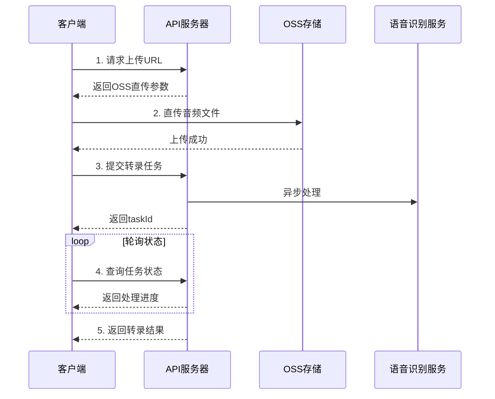

# 音频转录API开发文档

## 📌 服务概述

音频转录API服务提供高质量的语音转文字功能，支持多种音频格式，可生成带时间戳的转录结果。服务采用异步处理模式，通过OSS直传优化大文件传输，支持中英文混合识别。

### 🎯 核心特性
- ✅ **多格式支持**: 支持MP3、WAV、M4A等主流音频格式
- ✅ **时间戳标注**: 提供精确到毫秒的时间戳分段
- ✅ **OSS直传**: 大文件通过OSS直传，避免服务器压力
- ✅ **异步处理**: 任务队列处理，支持长音频转录
- ✅ **多语言识别**: 支持中文、英文及混合语言识别
- ✅ **实时状态查询**: 提供任务进度和状态查询接口

## 🔗 API端点列表

| 端点 | 方法 | 描述 | 响应格式 |
|-----|------|------|---------|
| `/api/oss-direct/upload-url` | POST | 获取OSS直传URL | JSON |
| `/api/transcription/url` | POST | 提交URL转录任务 | JSON |
| `/api/transcription/task/:taskId/result` | GET | 查询任务结果 | JSON |

## 🚀 快速开始

### 环境配置

#### 服务器地址
- **开发环境**: `http://localhost:3000/api`
- **生产环境**: 请根据实际部署配置

### 完整转录流程



## 📤 获取上传URL

### 端点
```
POST /api/oss-direct/upload-url
```

### 请求格式
```json
{
  "fileName": "audio_sample.mp3",
  "fileType": "audio",  // 或 "video" 
  "contentType": "audio/mpeg"
}
```

### 请求参数说明
| 参数 | 类型 | 必需 | 描述 |
|-----|------|------|------|
| fileName | string | 是 | 文件名称 |
| fileType | string | 是 | 文件类型（"audio" 或 "video"） |
| contentType | string | 是 | MIME类型 |
| fileSize | number | 否 | 文件大小（字节） |

### 响应格式
```json
{
  "success": true,
  "data": {
    "uploadUrl": "https://your-bucket.oss-cn-hangzhou.aliyuncs.com",
    "ossUrl": "https://your-bucket.oss-cn-hangzhou.aliyuncs.com/audio/2025/01/audio_sample.mp3",
    "formData": {
      "key": "audio/2025/01/audio_sample.mp3",
      "policy": "eyJleHBpcmF0aW9uIjo...",
      "OSSAccessKeyId": "LTAI5t...",
      "signature": "kZoYN...",
      "success_action_status": "200"
    },
    "expires": 1800
  }
}
```

### 响应字段说明
| 字段 | 类型 | 描述 |
|-----|------|------|
| uploadUrl | string | OSS上传端点 |
| ossUrl | string | 文件最终访问URL |
| formData | object | OSS上传所需表单数据 |
| expires | number | URL有效期（秒） |

## 📁 上传文件到OSS

### 使用PUT方式直传（推荐）
```javascript
// 使用XMLHttpRequest支持上传进度
const xhr = new XMLHttpRequest();

// 监听上传进度
xhr.upload.addEventListener('progress', (e) => {
    if (e.lengthComputable) {
        const percentComplete = Math.round((e.loaded / e.total) * 100);
        console.log(`上传进度: ${percentComplete}%`);
    }
});

// 上传完成
xhr.addEventListener('load', () => {
    if (xhr.status === 200 || xhr.status === 201 || xhr.status === 204) {
        console.log('上传成功');
    }
});

// 发送PUT请求
xhr.open('PUT', uploadData.uploadUrl);
xhr.setRequestHeader('Content-Type', file.type || 'application/octet-stream');
xhr.setRequestHeader('x-oss-object-acl', 'public-read'); // 设置公共读权限
xhr.send(file);
```

### 使用FormData上传（备选）
```javascript
const formData = new FormData();
// 注意：先添加所有OSS参数，最后添加文件
Object.keys(uploadData.formData).forEach(key => {
    if (key !== 'file') {
        formData.append(key, uploadData.formData[key]);
    }
});
formData.append('file', audioFile);

const response = await fetch(uploadData.uploadUrl, {
    method: 'POST',
    body: formData
});
```

### 注意事项
- ⚠️ **推荐使用PUT方式**：更简单，支持进度监控
- ⚠️ **权限设置**：添加`x-oss-object-acl: public-read`头确保文件可被访问
- ⚠️ **Content-Type**：PUT方式需要设置正确的Content-Type
- ⚠️ 上传URL有时效性，请在获取后尽快使用

## 🎯 提交转录任务

### 端点
```
POST /api/transcription/url
```

### 请求格式
```json
{
  "url": "https://your-bucket.oss-cn-hangzhou.aliyuncs.com/audio/2025/01/audio_sample.mp3",
  "ossPath": "audio/2025/01/audio_sample.mp3",
  "enableTimestamp": true,
  "enablePunctuation": true,
  "options": {
    "languages": ["zh", "en"],
    "maxSpeakers": 2,
    "format": "segments"
  }
}
```

### 请求参数说明
| 参数 | 类型 | 必需 | 描述 |
|-----|------|------|------|
| url | string | 是 | 音频文件URL（带签名） |
| ossPath | string | 否 | OSS文件路径 |
| enableTimestamp | boolean | 否 | 是否返回时间戳 |
| enablePunctuation | boolean | 否 | 是否添加标点 |
| options | object | 否 | 其他转录选项 |

### 转录选项说明
| 选项 | 类型 | 默认值 | 描述 |
|-----|------|--------|------|
| enableTimestamp | boolean | true | 是否返回时间戳 |
| enableWords | boolean | false | 是否返回词级别时间戳 |
| languages | array | ["zh"] | 识别语言列表 |
| maxSpeakers | number | 1 | 最大说话人数 |
| format | string | "segments" | 输出格式(segments/plain) |

### 响应格式
```json
{
  "success": true,
  "taskId": "task_1234567890_abcdef",
  "message": "任务已提交",
  "estimatedTime": 120
}
```

## 📊 查询任务状态和结果

### 端点
```
GET /api/transcription/task/:taskId/result
```

### 响应格式（处理中）
```json
{
  "success": false,
  "status": "processing",
  "progress": 45,
  "message": "正在处理中..."
}
```

### 响应格式（完成）
```json
{
  "success": true,
  "status": "succeeded",
  "taskId": "task_1234567890_abcdef",
  "transcription": "完整的转录文本内容...",
  "sentences": [
    {
      "text": "大家好，欢迎收听本期节目",
      "startTime": 0.520,
      "endTime": 2.840,
      "speaker": 1,
      "confidence": 0.95
    },
    {
      "text": "今天我们要讨论的话题是人工智能",
      "startTime": 3.120,
      "endTime": 5.680,
      "speaker": 1,
      "confidence": 0.92
    }
  ],
  "metadata": {
    "duration": 180.5,
    "language": "zh-CN",
    "speakers": 2,
    "processTime": 45.2
  }
}
```

### 响应字段说明
| 字段 | 类型 | 描述 |
|-----|------|------|
| status | string | 任务状态(processing/succeeded/failed) |
| transcription | string | 完整转录文本 |
| sentences | array | 时间戳分段数组 |
| metadata | object | 音频元信息 |

### 句段字段说明
| 字段 | 类型 | 描述 |
|-----|------|------|
| text | string | 句段文本内容 |
| startTime | number | 开始时间（秒） |
| endTime | number | 结束时间（秒） |
| speaker | number | 说话人标识 |
| confidence | number | 置信度(0-1) |

## 💻 JavaScript SDK示例

### 完整的转录流程实现

```javascript
class AudioTranscriptionClient {
  constructor(apiEndpoint = 'http://localhost:3000/api') {
    this.apiEndpoint = apiEndpoint;
  }

  // 步骤1: 获取上传URL
  async getUploadUrl(file) {
    // 判断文件类型
    const fileExt = file.name.split('.').pop().toLowerCase();
    const isVideo = ['mp4', 'avi', 'mov', 'mkv', 'wmv', 'flv', 'webm'].includes(fileExt);
    
    const response = await fetch(`${this.apiEndpoint}/oss-direct/upload-url`, {
      method: 'POST',
      headers: {
        'Content-Type': 'application/json'
      },
      body: JSON.stringify({
        fileName: file.name,
        fileType: isVideo ? 'video' : 'audio',
        contentType: file.type || 'application/octet-stream'
      })
    });
    
    const data = await response.json();
    if (!data.success) {
      throw new Error(data.error || '获取上传URL失败');
    }
    
    return data;
  }

  // 步骤2: 上传到OSS（使用PUT方式）
  async uploadToOSS(uploadData, file, onProgress = null) {
    return new Promise((resolve, reject) => {
      const xhr = new XMLHttpRequest();
      
      // 监听上传进度
      xhr.upload.addEventListener('progress', (e) => {
        if (e.lengthComputable && onProgress) {
          const percentComplete = Math.round((e.loaded / e.total) * 100);
          onProgress(percentComplete);
        }
      });
      
      // 上传完成
      xhr.addEventListener('load', () => {
        if (xhr.status === 200 || xhr.status === 201 || xhr.status === 204) {
          resolve(uploadData.ossUrl);
        } else {
          reject(new Error(`上传失败: HTTP ${xhr.status}`));
        }
      });
      
      // 上传错误
      xhr.addEventListener('error', () => {
        reject(new Error('网络错误'));
      });
      
      // 发送PUT请求
      let uploadUrl = uploadData.uploadUrl;
      if (typeof uploadUrl === 'object' && uploadUrl.url) {
        uploadUrl = uploadUrl.url;
      }
      
      xhr.open('PUT', uploadUrl);
      xhr.setRequestHeader('Content-Type', file.type || 'application/octet-stream');
      xhr.setRequestHeader('x-oss-object-acl', 'public-read');
      xhr.send(file);
    });
  }

  // 步骤3: 提交转录任务
  async submitTranscription(ossUrl, ossKey, options = {}) {
    const response = await fetch(`${this.apiEndpoint}/transcription/url`, {
      method: 'POST',
      headers: {
        'Content-Type': 'application/json'
      },
      body: JSON.stringify({
        url: ossUrl,  // 使用带签名的URL
        ossPath: ossKey,
        enableTimestamp: options.enableTimestamp !== false,
        enablePunctuation: options.enablePunctuation !== false,
        ...options
      })
    });
    
    const data = await response.json();
    if (!data.success) {
      throw new Error(data.error || '提交任务失败');
    }
    
    return data.taskId;
  }

  // 步骤4: 轮询结果
  async pollResult(taskId, maxAttempts = 120, interval = 2000) {
    for (let i = 0; i < maxAttempts; i++) {
      const response = await fetch(`${this.apiEndpoint}/transcription/task/${taskId}/result`);
      const data = await response.json();
      
      if (data.success && data.status === 'succeeded') {
        return data;
      }
      
      if (data.status === 'failed') {
        throw new Error(data.error || '转录失败');
      }
      
      // 等待后继续轮询
      await new Promise(resolve => setTimeout(resolve, interval));
    }
    
    throw new Error('转录超时');
  }

  // 完整的转录流程
  async transcribeAudio(file, options = {}, onProgress = null) {
    try {
      // 进度回调
      const updateProgress = (step, message) => {
        if (onProgress) {
          onProgress({ step, message });
        }
      };
      
      updateProgress(1, '获取上传URL...');
      const uploadData = await this.getUploadUrl(file);
      
      updateProgress(2, '上传音频文件...');
      const audioUrl = await this.uploadToOSS(uploadData, file);
      
      updateProgress(3, '提交转录任务...');
      const taskId = await this.submitTranscription(audioUrl, options);
      
      updateProgress(4, '等待转录完成...');
      const result = await this.pollResult(taskId);
      
      updateProgress(5, '转录完成！');
      return result;
      
    } catch (error) {
      console.error('转录失败:', error);
      throw error;
    }
  }
}

// 使用示例
const client = new AudioTranscriptionClient();

// HTML文件输入
const fileInput = document.getElementById('audioFile');
fileInput.addEventListener('change', async (e) => {
  const file = e.target.files[0];
  
  try {
    const result = await client.transcribeAudio(file, {
      enableTimestamp: true,
      languages: ['zh', 'en']
    }, (progress) => {
      console.log(`步骤 ${progress.step}: ${progress.message}`);
    });
    
    // 处理结果
    console.log('转录结果:', result.transcription);
    
    // 显示带时间戳的内容
    if (result.sentences) {
      result.sentences.forEach(segment => {
        console.log(`[${segment.startTime}s - ${segment.endTime}s] ${segment.text}`);
      });
    }
  } catch (error) {
    console.error('转录失败:', error);
  }
});
```

## 🔧 高级功能

### 批量转录
支持批量提交多个音频文件进行转录：

```javascript
async function batchTranscribe(files) {
  const tasks = files.map(file => client.transcribeAudio(file));
  const results = await Promise.allSettled(tasks);
  
  return results.map((result, index) => ({
    file: files[index].name,
    success: result.status === 'fulfilled',
    data: result.value || result.reason
  }));
}
```

### 断点续传
对于大文件，支持断点续传：

```javascript
// 待实现：需要服务端支持分片上传
```

## 📊 输出格式说明

### 时间戳格式
时间戳使用浮点数表示秒数，精确到毫秒：
- `0.520` = 520毫秒
- `65.840` = 1分5秒840毫秒

### 文本格式导出

#### 带时间戳格式
```text
[00:00.520 → 00:02.840]
大家好，欢迎收听本期节目

[00:03.120 → 00:05.680]
今天我们要讨论的话题是人工智能
```

#### SRT字幕格式
```srt
1
00:00:00,520 --> 00:00:02,840
大家好，欢迎收听本期节目

2
00:00:03,120 --> 00:00:05,680
今天我们要讨论的话题是人工智能
```

## 🚨 错误处理

### 错误码说明
| 错误码 | 描述 | 解决方案 |
|-------|------|---------|
| 400 | 请求参数错误 | 检查请求参数格式 |
| 401 | 认证失败 | 检查API密钥 |
| 413 | 文件过大 | 文件大小不能超过500MB |
| 422 | 不支持的格式 | 检查音频格式是否支持 |
| 429 | 请求过于频繁 | 降低请求频率 |
| 500 | 服务器内部错误 | 稍后重试或联系支持 |

### 错误响应格式
```json
{
  "success": false,
  "error": "文件格式不支持",
  "errorCode": "UNSUPPORTED_FORMAT",
  "details": {
    "supportedFormats": ["mp3", "wav", "m4a", "flac"],
    "receivedFormat": "wma"
  }
}
```

## 🎯 性能指标

### 处理时间预估
| 音频时长 | 预计处理时间 |
|---------|-------------|
| < 5分钟 | 30-60秒 |
| 5-30分钟 | 1-5分钟 |
| 30-60分钟 | 5-10分钟 |
| > 60分钟 | 10-20分钟 |

### 文件限制
- **最大文件大小**: 500MB
- **最长音频时长**: 3小时
- **支持采样率**: 8kHz - 48kHz
- **支持声道**: 单声道/立体声

### 并发限制
- **每用户并发任务**: 5个
- **每分钟请求数**: 60次
- **每日配额**: 1000个任务

## 🔐 安全考虑

### 数据安全
- 所有音频文件通过HTTPS传输
- OSS上传URL具有时效性（30分钟）
- 转录结果缓存7天后自动删除
- 支持客户端加密上传

### 访问控制
- API密钥认证（生产环境）
- IP白名单（可选）
- 请求签名验证（可选）

## 📝 最佳实践

1. **文件预处理**
   - 建议使用MP3或WAV格式
   - 比特率建议：128kbps以上
   - 降噪处理可提高识别准确率

2. **错误重试**
   - 网络错误：立即重试3次
   - 服务器错误：指数退避重试
   - 任务失败：检查音频质量后重新提交

3. **性能优化**
   - 大文件先压缩再上传
   - 使用任务队列批量处理
   - 缓存转录结果避免重复请求

4. **用户体验**
   - 显示实时进度条
   - 提供预估完成时间
   - 支持后台处理和通知

## 📞 技术支持

如有问题，请联系技术团队：
- API文档：本文档
- 问题反馈：GitHub Issues
- 技术支持：support@example.com

---

**文档版本**: v1.0.0  
**更新时间**: 2025-01-12  
**适用环境**: 开发/生产环境